# LEXA DERMS — Engineering Handbook

*The definitive technical reference for the LEXA Distributed Energy Resource Management System: the `lexa-hub` gateway firmware, the `csip-tls-test` bench, the `lexa-proto` shared library, and the `lexa-app` mobile companion.*

**Compiled 2026-07-11** from a multi-repository architecture audit. Repository state at compile time: `lexa-hub` `main` @ `d6ac263`; `csip-tls-test` `main` @ `35decfc`; `lexa-proto` `main` @ `6922865`; `lexa-app` `main` @ `2d58747`; `meta-lexa` `master` @ `a8b4178`. Every load-bearing claim is anchored to a file, a commit, or a live observation; where a conclusion is inferred rather than documented, it says so.

---

## Executive Summary

**What this is.** LEXA is a Distributed Energy Resource Management System (DERMS) gateway — an embedded Linux device (NXP i.MX93) that sits between a utility and a home's energy hardware, speaking IEEE 2030.5 / CSIP to the grid and SunSpec Modbus + OCPP 2.0.1 to solar inverters, batteries, meters, and EV chargers. It follows utility control signals (export caps, curtailment, cease-to-energize, pricing), runs a cost-optimal energy plan against a time-of-use tariff, enforces hard safety invariants, and reports compliance back to the grid. A mobile app commissions and monitors it; a bench of simulators and an adversarial QA engine validate it against real hardware behavior.

**Current maturity.** The *engineering* is well ahead of the *productization*. The control architecture, protocol handling, safety design, error handling, and documentation are at or near commercial grade. What is not yet in place is the envelope around that core: a finished field-update pipeline, a manufacturing/PKI provisioning flow, a product cloud backend, and closure on a short list of concrete safety/security fixes. This is a device that is *engineered* like a shipping product before it is *packaged* like one — which is the right order, but it means "field-ready" is a bounded list of remaining work, not a question mark.

**Architectural strengths.** Four stand out. (1) A **distributed-services topology that was challenged and survived on measurement** — ADR-0001 traces the safety-reaction latency budget and shows process separation costs under 0.1% of reaction time, then keeps the fault isolation (a TLS cgo crash can't take down the battery-disconnect path) that a monolith would sacrifice. (2) A **three-tier fail-closed safety hierarchy** — a per-poll edge interlock under a 1-second protection reflex under a 15-second economic optimizer — built on the principle *trust measurement, not command* (success is judged against the meter, never the issued command). (3) A **lock-free single-writer orchestrator** that is fully unit-testable because it does no I/O. (4) A **hardware-in-the-loop QA discipline** — 69 adversarial scenarios with a verdict taxonomy that includes BLIND ("the harness refuses to certify compliance it never measured") — that is the actual oracle for correctness and is rare to find at any company.

**Major risks.** Three fix-before-field items: the edge battery interlock fails *open* when state-of-charge reads NaN (H2); the cease-to-energize path errors on IEEE-1547-2018-only inverters because it only writes the legacy Modbus model (H1); and the BLE commissioning default credential has no production guard, making a mis-built factory image remotely claimable (H3). Beyond those, the field-update (OTA) pipeline is mid-pivot and unfinished, there is no product cloud in the compliance path, and the bench carries an acknowledged *self-confirmation* ceiling — the simulators share codec lineage with the hub, so a shared misunderstanding is invisible until tested against real vendor hardware. None of these is a rewrite; all are enumerable.

**A note on repository state.** The V1.0 refactor program (an 82-task effort that rebuilt the control core as a tier-arbitrated constraint stack) closed 2026-07-10 on a branch, `refactor-endgame`, while a concurrent extension program owned `main`. **Verified for this handbook: that branch has since been merged into `main`, and the constraint stack is active on all five control axes on the live bench hub** (the committed config still ships a conservative legacy-cascade default; the deployed config activates the stack). The legacy optimizer remains in the tree as suppressed-but-present fallback until the multi-device work (TASK-065/066) lets it be deleted. This dual-implementation state is the single most confusing thing about the current code, and Part III §3.4 is written to navigate it.

**Overall recommendation.** Continue on the current architecture — it is sound and does not need reconsidering. Sequence the work as: close the three safety/security blockers and restore cert rotation (a small first sprint, all low-risk); finish the SWUpdate OTA pipeline and the manufacturing/PKI flow; then complete the architecture (multi-device, delete the legacy cascade, finish the lexa-proto hosted flip, stand up the cloud). The app is on its own healthy track and should be kept in sync with the hub contract, not accelerated.

**Confidence in production readiness.** For a *bench/pilot* deployment: high — the system demonstrably works end-to-end and is validated continuously. For a *commercial field* deployment to customer homes on a utility program: not yet, and honestly so — Phase 1 of the roadmap (Part VIII) is the gate, and it is measured in weeks of focused work plus a hardware-and-time-bound soak, not in quarters of rearchitecting.

### How to read this handbook

- **Part I** — the product and its protocols, from the outside in.
- **Part II** — the four repositories, how they relate, and why the shared library exists.
- **Part III** — the hub's architecture: services, the bus, the control core, resilience. *Start here if you are touching the hub.*
- **Part IV** — five end-to-end walkthroughs (boot, utility, EV, battery, app).
- **Part V** — per-repository deep dives.
- **Part VI** — the bench, the testing pyramid, CI/CD, certificates, config ownership.
- **Part VII** — the graded quality assessment and the two report cards.
- **Part VIII** — the phased roadmap and the technical-debt register.
- **Part IX** — a code-level reference: the actual goroutines, interfaces, structs, and cross-repository type flow, written to be read with a checkout open. *Start here if you are about to change code, not just understand it.*
- **Appendices** — port/IP map, glossary, and a cross-repository document index.

# Part I — The Product

## 1.1 What is this?

LEXA is a **Distributed Energy Resource Management System (DERMS) gateway** — a small embedded Linux box (an NXP i.MX93, currently a Digi ConnectCore 93 dev kit) that sits between a utility and the energy hardware in a home or small commercial site. It speaks three industry protocols simultaneously:

- **IEEE 2030.5 / CSIP** (northbound, to the utility): the hub is a 2030.5 *client*. It discovers the utility server, registers itself by certificate-derived identity, walks the resource tree, and subscribes to DER control programs — export caps, curtailment events, pricing signals.
- **SunSpec Modbus** (southbound, to devices): solar inverters, batteries, and revenue meters expose SunSpec register models (1, 103, 121/123, 701–714, 802, 201x) over Modbus TCP/RTU. The hub polls measurements and writes controls.
- **OCPP 2.0.1** (southbound, to EV chargers): the hub embeds a CSMS (Charging Station Management System); chargers connect to it over WebSocket (Security Profile 2 — TLS + Basic Auth — in the product configuration).

Between those two faces sits the **orchestrator**: a constraint controller and economic optimizer that decides, every few seconds, what each device should do — honoring utility envelopes and safety invariants first, then optimizing cost against a tariff (time-of-use arbitrage, peak shaving, EV charging plans, battery reserve management).

A **Flutter mobile app** commissions the hub over BLE and monitors/controls it over a fingerprint-pinned local HTTPS API. A **cloud link** service exists as a stub for future remote access.

The system's development methodology is its most distinctive feature: the product is continuously validated against a **physical hardware-in-the-loop bench** — a desktop-hosted utility simulator plus four Raspberry Pis running device simulators — driven by an adversarial fault-injection QA engine ("Mayhem") with 69 hostile scenarios and a five-value verdict taxonomy that includes *BLIND* ("the harness refuses to certify compliance it never measured"). Most of the product's hardening history is the direct record of what this bench caught.

## 1.2 System context

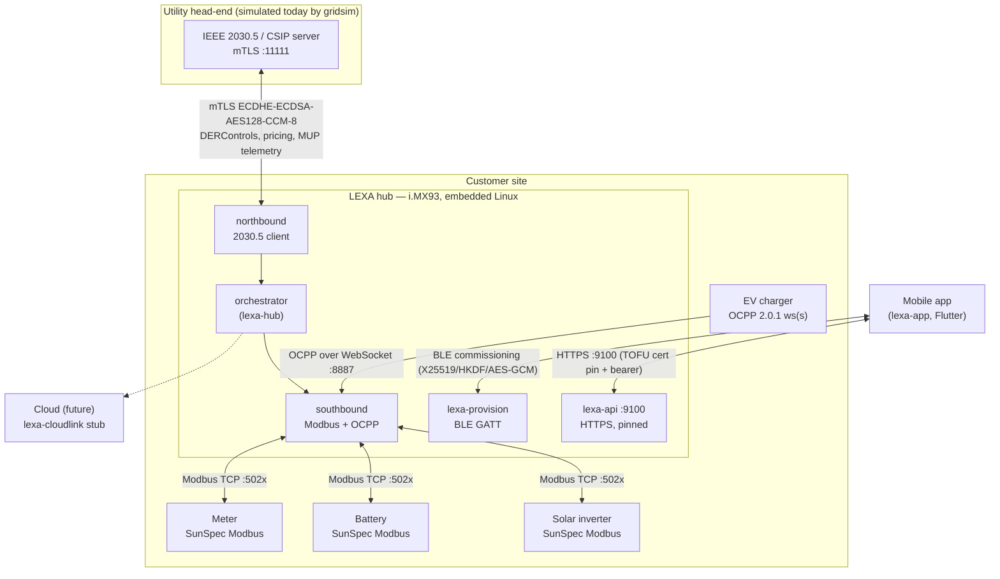

## 1.3 Protocol stack

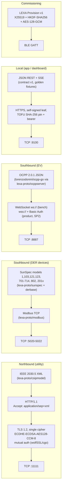

Two protocol facts are treated as inviolable across all repositories, and both are enforced by code rather than convention:

1. **The CSIP cipher is pinned.** CSIP §5.2.1.1 mandates exactly `ECDHE-ECDSA-AES128-CCM-8` on TLS 1.2. Go's `crypto/tls` does not implement CCM-8, which is why the northbound TLS path is wolfSSL behind cgo — in both the product and the bench — and why the conformance suite greps the actual wire capture for cipher suite `0xC0AE`.
2. **Client identity is the certificate.** LFDI = the leftmost 160 bits of SHA-256 over the full DER client certificate; SFDI is derived from it with a checksum digit. Reissuing a certificate therefore *changes the device's utility-facing identity* — which shapes the certificate-rotation runbook (probe-then-swap, LFDI pre-check, no restart).

# Part II — The Four Repositories

## 2.1 The one-paragraph map

**`lexa-hub`** is the product: ten Go services (eight pure Go, two cgo/wolfSSL) that run on the i.MX93 hub. **`csip-tls-test`** is the adversary and referee: the utility simulator, four device simulators, two conformance suites, and the Mayhem hostile-QA engine that drives the real bench. **`lexa-proto`** is the shared protocol library both of them consume at a CI-enforced pinned commit — it exists because the first two repos *provably* diverged while duplicating this code. **`lexa-app`** is the Flutter companion app; it shares no code with the others and couples to the hub only through the HTTP/BLE contract. A fifth repository, **`meta-lexa`**, is the Yocto layer that builds the hub's embedded Linux image; it is small but load-bearing for deployment.

## 2.2 Repository relationship diagram

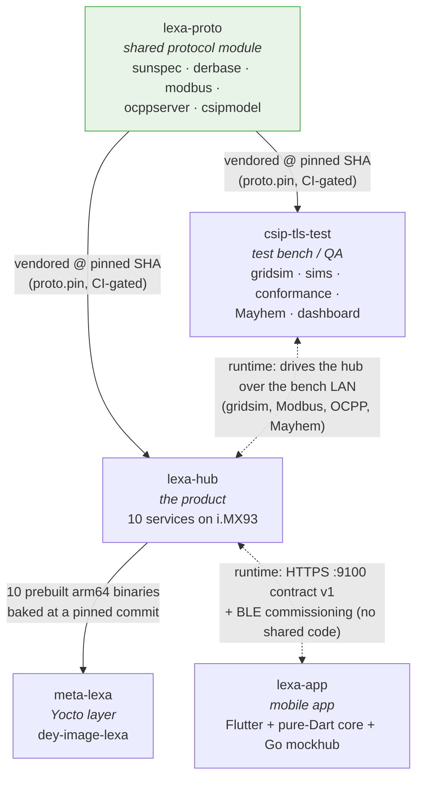

Three different coupling mechanisms are in play, and understanding which applies where is the key to navigating the codebase:

| Coupling | Between | Mechanism | Enforcement |
|---|---|---|---|
| **Shared source** | lexa-proto → hub, bench | `require lexa-proto v0.0.0` + `replace => ../lexa-proto` + committed `vendor/lexa-proto/`; one-line `proto.pin` SHA at each consumer root | `scripts/check-proto-pin.sh` run as a `proto-pin` CI job in *both* consumers (each checks out the other) |
| **Wire contract** | hub → app, dashboard | JSON contract v1: golden fixtures in `lexa-hub/internal/apicontract/http_v1/*.json` + `apicontract.Version` | `make contract` gate in hub CI (hub-side only; app models, mockhub, and `docs/HUB_API.md` are hand-mirrored) |
| **Deploy lockstep** | hub ↔ bench sims | Both sides of every Modbus/OCPP conversation embed the same `lexa-proto` codec; a version bump must deploy to hub *and* Pis together | Operational discipline only (documented in `docs/BENCH.md`); the code half is CI-gated, the deploy half is not |

## 2.3 Why lexa-proto exists (documented, not inferred)

The 2026-06 audit (finding **MTR-4**) discovered that `csip-tls-test` and `lexa-hub` each carried private copies of the SunSpec codec, the DER control mapping, the OCPP CSMS, and the 2030.5 XML model — kept in sync by a documented convention that had *already failed* (a raw `diff -rq` showed real divergence). Because the simulators sit on the other end of every wire the product speaks, codec divergence here is uniquely dangerous: a register-map bug present on both sides is bilaterally invisible ("self-confirmation").

AD-003 in the refactor program (`csip-tls-test/docs/refactor/02_ARCHITECTURE_DECISIONS.md`) records the decision and the alternatives considered: a mono-repo merge was rejected (product and bench release cadences differ; the review only required shared *modules*), and "keep duplicating but diff harder" was rejected because divergence had already happened under exactly that rule. The result is one module, five packages, product-side merge authority, with every diff hunk reviewed because the sim side sometimes held the real fix.

The distribution model is unusual and worth spelling out, because it is the thing a new engineer will trip over first:

- `lexa-proto/go.mod` declares the **bare module path `lexa-proto`** — not a hosted URL.
- Each consumer pins a commit SHA in a one-line `proto.pin` file and commits a full `vendor/lexa-proto/` tree, so hosted CI builds with no network fetch and no sibling checkout.
- Local development uses a gitignored `go.work` (`go work init . ../lexa-proto`); hosted CI sets `GOWORK=off`.
- Version bumps ship as **paired PRs** — both `proto.pin` files and both vendor trees regenerated in the same session — and the `proto-pin` CI job in each repo fails on pin mismatch.

**Status note (verified 2026-07-11, supersedes the docs):** every README and CI header in the system still describes lexa-proto as unhosted ("CI cannot run anywhere yet"). This is stale. A private `dsizzle83/lexa-proto` GitHub repository was created 2026-07-10, its history is pushed, and its CI workflow has run green. The hosted-flip checklist recorded in AD-003(f) — rename the module path, drop `replace` + vendor trees, switch the pin gate to go.mod pseudo-versions — is now unblocked but has not been executed. Until it is, the pin/vendor machinery remains the operative mechanism.

## 2.4 What belongs in lexa-proto — and what deliberately doesn't

The boundary rule that emerges from AD-003 and its extensions is: **wire formats and register codecs with zero business logic go in; anything with an opinion stays out.** Applied:

- **In (correct):** `sunspec` (register layout engine + scale-factor codec), `derbase` (CSIP DERControlBase → SunSpec writes, including the SunSpec curve-adopt handshake), `modbus` (transport abstraction), `csipmodel` (2030.5 XML structs), `ocppserver` (a deliberately minimal OCPP 2.0.1 CSMS test double).
- **Deliberately out (AD-003(f)/TASK-082):** the bench's 2030.5 *client* — walker and DER-event scheduler (`csip-tls-test/internal/csipref`) — is an independent implementation kept intentionally unsynced from the hub's. Two independent readings of the same spec give the conformance suite referee value; a shared client would self-confirm. The independence is actively defended by decode-equivalence fuzz tripwires against a corpus shared byte-for-byte with the hub.
- **Should migrate in (audit finding, previously untracked):** `csip-tls-test/internal/csip/{identity,dnssd}` and `lexa-hub/internal/northbound/{identity,dnssd}` are 476 lines of **byte-identical, independently-committed forks** (LFDI/SFDI derivation and DNS-SD discovery — last touched 2026-04-11 on the bench and 2026-05-22 in the hub). They are textually in sync today by discipline alone, with no pin, no vendor tree, and no CI diff gate. This is precisely the MTR-4 pattern lexa-proto was created to eliminate, and unlike the walker there is no documented rationale for the exclusion. Extraction (or at minimum a scoped diff gate) is a cheap, high-value fix.
- **Asymmetric by design:** roughly half of `csipmodel`'s DER surface (the curve-function types — volt-var, volt-watt, freq-droop) has exactly one consumer, the hub, because the bench de-scoped curve functions for V1.0 (AD-010). Known and intentional, not an oversight.

## 2.5 How the repositories evolved (history that explains the present)

`csip-tls-test` is the historical foundation, and its name is a fossil: it began 2026-04-10 as a wolfSSL TLS spike ("can we do CCM-8 mTLS from Go at all?"), grew a 2030.5 grid simulator, a discovery walker, conformance runners, device simulators, and finally the Mayhem engine. Most architectural conventions the product inherits were born here:

- The **cgo containment rule** (wolfSSL isolated behind one binding package, everything else pure Go and trivially cross-compilable) was proven on the bench before the hub adopted the same split.
- The **audit-tag vocabulary** (GS-1, MTR-4, OCPP-1, S-1 …) from the two 2026-06 audit documents (`CONFORMANCE_REPORT.md`, `docs/HARNESS_REVIEW.md`) became the shared cross-repo language for invariants; the tags are cited inline in both codebases at the exact lines that fix them.
- The **verdict taxonomy and INV-\* safety invariants** of Mayhem became the regression oracle the entire control-core rewrite was validated against.

Two program arcs then reshaped everything in mid-2026, and both are documented well enough to reconstruct:

1. **The V1.0 refactor program** (`csip-tls-test/docs/refactor/`, 11 documents, 82 tasks, phases P0–P6, 2026-07-04 → 07-10): watchdogs and fail-closed security defaults, the single Device Reconciler, the `utilitytime` owner, the lexa-proto extraction, and finally the **R4 constraint controller** — a rewrite of the hub's control core, run in shadow mode against the legacy optimizer, gated by per-axis divergence soaks, and flipped active one axis at a time with a full Mayhem campaign between flips. It closed 2026-07-10 with all five constraint axes active and the legacy cascade suppressed-but-present (its writes dropped and counted by metrics). See §Part III.
2. **The extension campaign** (concurrent): intent/scan/mode features — the mobile-app-facing surface (device commissioning scan, user intents, mode management) plus the lexa-api HTTPS flip. While it ran, the completed refactor was deliberately held on the `refactor-endgame` branch and `main` advanced separately, with the extension program set to merge the endgame branch on its own schedule.

The refactor FINAL_REPORT (2026-07-10) describes that arrangement — two live branches kept apart — as the current state. **It is now historical: verified for this handbook, `refactor-endgame` has been merged into `main`** (merge commit `f3059ce`, "refactor-endgame (R4 flips ACTIVE) × extension campaign", followed by an integration-day record and the subsequent tariff/plan-economics and TLS-on commits). What remains genuinely confusing after the merge is not the branches but the *two control implementations* now sitting side by side — the legacy cascade and the constraint stack — which Part III §3.4 exists to navigate, and which is why deleting the legacy cascade (TASK-066) sits in the roadmap.

# Part III — Hub Architecture

Everything in this part concerns `lexa-hub`, the firmware that runs on the i.MX93. The bench, the app, and the shared library exist in orbit around it; this is the thing that must eventually be field-ready.

## 3.1 The distributed-services decision

The hub is not one program. It is **eleven `cmd/` binaries** — nine long-running services and two utilities — that communicate only over a local Mosquitto MQTT broker bound to loopback. (The project's own `CLAUDE.md` still says "six services"; that predates the cloudlink, provision, and migration/commission services and is stale — the accurate inventory is below.)

This topology was challenged and re-affirmed under fire. When the v3 Mayhem campaign left a residue of "sticky" safety failures, the natural suspicion was that the MQTT-plus-separate-processes design was too slow and a monolithic rewrite was warranted. **ADR-0001** (`lexa-hub/docs/ADR-0001-distributed-vs-monolith.md`) settles it with a measurement rather than an opinion: for a safety reaction (disconnecting a mis-wired battery), the latency budget is dominated by the 10-second Modbus poll interval and a 3-tick debounce; MQTT and process separation together account for **under 5 ms — less than 0.1%** of the reaction time. Both dominant costs would be *identical in a monolith*. The distributed design was kept, and the real fix — separating fast safety reflexes from slow economic optimization — was applied inside the existing services.

The decision also rests on properties a monolith would erode, and these are the reasons a new engineer should not "simplify" the topology later:

- **Fault isolation.** A wolfSSL cgo segfault on the grid-facing TLS path, or a panic in the third-party OCPP library, must not take down the battery-disconnect path. In a monolith they share an address space with the safety-critical control loop; for a grid-tied device this is a genuine safety property.
- **cgo blast radius.** Only two services (`northbound`, `telemetry`) link wolfSSL and need the cross-compile toolchain; the other nine are pure Go and cross-compile trivially. A monolith would force the cgo burden onto the whole product.
- **Testability.** The orchestrator does no I/O, so it is fully unit-testable — and it has real regression tests as a result. A monolith tends to entangle I/O with decision logic and lose that.

```mermaid
flowchart TB
    BROKER["mosquitto (loopback :1883)<br/>per-service ACL, deny-by-default"]

    subgraph GRID["Grid-facing — untrusted, cgo/wolfSSL"]
        NB["lexa-northbound<br/>2030.5 client, mTLS"]
        TEL["lexa-telemetry<br/>MUP POST, mTLS"]
    end
    subgraph BRAIN["Brain — pure Go, no external I/O"]
        HUB["lexa-hub<br/>orchestrator: optimizer +<br/>constraint stack + planner"]
    end
    subgraph DEV["Device-facing — trusted LAN, pure Go"]
        MOD["lexa-modbus<br/>SunSpec + Tier-0 interlock"]
        OCPP["lexa-ocpp<br/>OCPP 2.0.1 CSMS :8887"]
    end
    subgraph EDGE["Edge / app-facing"]
        API["lexa-api :9100<br/>HTTPS + SSE + mDNS"]
        PROV["lexa-provision<br/>BLE GATT commissioning"]
        CL["lexa-cloudlink<br/>AWS IoT uplink (stub backend)"]
    end
    subgraph ONESHOT["One-shot / utility"]
        MIG["lexa-migrate (config schema)"]
        COMM["lexa-commission (privileged restart)"]
    end

    NB <--> BROKER
    TEL <--> BROKER
    HUB <--> BROKER
    MOD <--> BROKER
    OCPP <--> BROKER
    API <--> BROKER
    PROV <--> BROKER
    CL <--> BROKER
    MIG -. "before all" .-> BROKER
```

## 3.2 Service inventory

| Service | Port(s) | Transport | Watchdog | Notes |
|---|---|---|---|---|
| `mosquitto` | 1883 (loopback) | MQTT broker | none | plaintext, per-service ACL, `allow_anonymous false` on product |
| `lexa-hub` | metrics 9101 | MQTT | 60 s | the orchestrator; `StateDirectory=lexa`, `ProtectSystem=strict` |
| `lexa-northbound` | metrics 9102 | wolfSSL mTLS + MQTT | 120 s | cgo; `After=time-sync.target`; certs read-only |
| `lexa-modbus` | metrics 9103 | Modbus TCP/RTU + MQTT | 60 s | pure Go; hosts the Tier-0 interlock |
| `lexa-ocpp` | CSMS 8887, metrics 9104 | OCPP 2.0.1 WebSocket + MQTT | 60 s | ws (bench) / wss + Basic Auth (product, SP2) |
| `lexa-telemetry` | metrics 9105 | wolfSSL mTLS MUP POST + MQTT | 60 s | cgo; certs read-only |
| `lexa-api` | 9100 HTTPS, metrics same port | HTTP/SSE/mDNS + MQTT | 60 s | app/dashboard API; `ReadWritePaths=/etc/lexa` |
| `lexa-cloudlink` | metrics 9106 | AWS IoT Core mTLS (outbound) + MQTT | 60 s | on-box agent complete; **no product cloud backend in-repo** |
| `lexa-provision` | BLE GATT (D-Bus), metrics 9107 | Bluetooth LE + NetworkManager | 60 s | **runs as root; not auto-enabled** |
| `lexa-migrate` | — | config schema migrator | — | oneshot, `Restart=no`, ordered before all services |
| `lexa-commission` | — | privileged restart executor | — | root path-unit watching a request file |

Two utilities round it out: `lexactl` (operator CLI over the loopback API) and `lexa-healthcheck` (the OTA commit gate — see §3.7).

A systemd detail worth internalizing, because it was a real incident (V1RC Finding A): **every service declares `Wants=mosquitto`, not `Requires=`.** With `Requires`, a broker restart would stop-propagate and cascade the whole hub down. With `Wants`, a broker blip is survived — the services reconnect (paho auto-reconnect plus a subscription registry that replays subscriptions, since paho defaults to `CleanSession=true`).

## 3.3 The bus contract

All inter-service communication is JSON over MQTT, and the shape of that contract is disciplined:

- Every message embeds a `bus.Envelope` with a version field; decoding is uniformly `CheckVersion → Unmarshal → Finite()`, the last step rejecting NaN/Inf so a bad sensor reading cannot poison a downstream calculation.
- **Retained topics are the recovery mechanism** (AD-013). The control plane — CSIP controls, pricing, the desired-state documents, reconcile reports, plan/mode/settings — is all retained, so a service that restarts re-seeds its world within one broker round-trip. This is why handlers must be idempotent, and it is the concrete expression of the crash-only design (§3.6).
- **The desired-state document is the sole command path** (AD-002/AD-013). The orchestrator never pokes a device directly; it publishes a retained `lexa/desired/{class}/{device}` document, and the device service reconciles toward it. A single legacy tangle of four different actuation mechanisms was deleted in favor of this one (TASK-032).
- QoS 0 for the high-rate measurement plane, QoS 1 for everything that matters. There is deliberately **no `intent/+` wildcard subscription** (it would self-feed through the `intent/result` topic) — the hub subscribes to seven explicit intent topics instead.

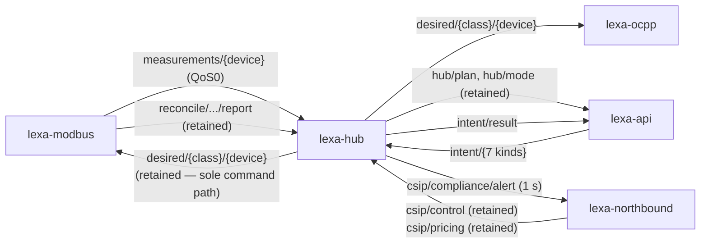

## 3.4 The control core — the single most important subsystem

This is where a new engineer must spend the most time, and where the repository is genuinely confusing without this section, because **two complete control implementations coexist**.

**Implementation A — the legacy rule cascade** (`internal/orchestrator/optimizer.go`, `DefaultOptimizer`). A fixed cascade of rules evaluated every economic tick: CSIP-disconnect → fixed-dispatch → plan-follow → import-limit → demand-response/TOU → restore. This is the **repository default** and, per the committed `configs/hub.json`, the authority a fresh factory image would run.

**Implementation B — the R4 constraint stack** (`internal/orchestrator/constraint/`, `Stack` + `Arbiter` + six constraints). A tier-arbitrated successor (decision AD-007) that ranks safety over compliance over economics and resolves conflicts through a single-author arbiter rather than an ordered cascade. It was built to shadow the legacy cascade, was validated by per-axis divergence soaks, and was flipped active one axis at a time with a full Mayhem campaign between flips.

> **Verified current state (2026-07-11, by git ancestry and a live read of the deployed config — this corrects the branch-split described in the refactor FINAL_REPORT):** the `refactor-endgame` branch that carried Implementation B **has been merged into `main`** (merge commit `f3059ce`, "refactor-endgame (R4 flips ACTIVE) × extension campaign", followed by an integration-day record and 67 further commits). The committed `configs/hub.json` still ships the conservative default (stack `off`, `mode:optimizer`) — the right choice for a factory image. But the **deployed** `/etc/lexa/hub.json` on the bench hub (modified today, matching the current binary) runs **all five constraint axes `active`** (export, gen, import, economics, battery-safety) with the legacy cascade demoted to a parallel shadow-divergence observer (`constraint_shadow:true`). So on the live hardware, Implementation B *is* the control authority; Implementation A is the fallback the repository defaults to and the shadow the deployment cross-checks against.
>
> The practical consequence for a new engineer: **read the constraint stack as the real control core, and treat the legacy cascade as the suppressed-but-present fallback.** The stack cannot be deleted yet — TASK-065 (multi-device support) and TASK-066 (delete the legacy cascade) are open — so `optimizer.go` remains in the tree as dead weight that is observably suppressed rather than removed. This is honest, documented technical debt, not an oversight.

### The three-tier protection hierarchy

The insight that fixed the "sticky failures" is the standard power-systems split: a fast, dumb, local protection layer beneath a slow, smart, central optimization layer. Mapped onto the services with no new processes:

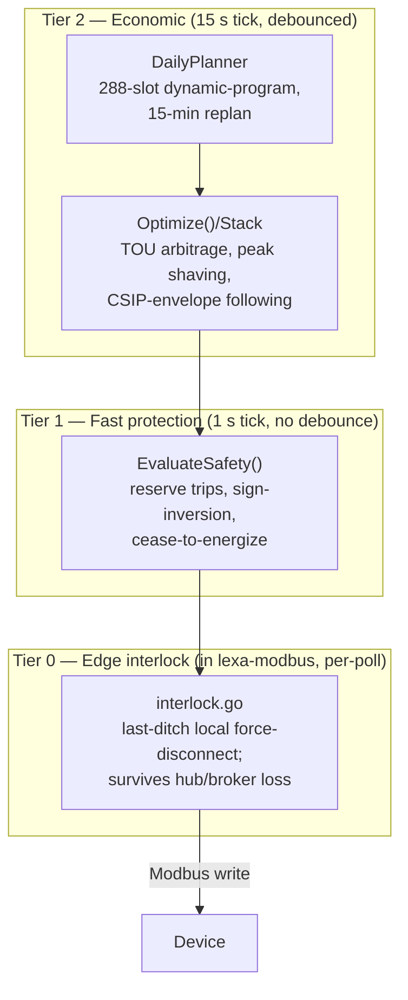

- **Tier 2** is the brain: a `DailyPlanner` dynamic-program over 288 five-minute slots with a two-dimensional state `(battery SOC, EV SOC)` and the IEC-61851 EV current ladder, replanned every 15 minutes; plus the per-tick optimizer that follows the plan while honoring the tightest active envelope. This tier is *allowed* to be slow and debounced.
- **Tier 1** is the reflex: a 1-second stateless safety evaluation that trips on reserve over-discharge, commanded-charge-but-discharging sign inversion (immediately, no debounce), and cease-to-energize. It runs on the same ticker as Tier 2 — every Nth tick is a full economic `tick()`, the intervening ticks are cheap `safetyTick()`s that read the battery and actuate only protectively.
- **Tier 0** lives in the device service (`lexa-modbus/interlock.go`), not the brain, so it keeps protecting even if the hub crashes or the broker restarts.

### The safety invariants

These have names because Mayhem grades against them (the INV-\* oracles), and they are the closest thing the product has to a specification of "correct":

| Invariant | Meaning | Where enforced |
|---|---|---|
| **INV-SOC** | Never discharge a battery below its 20% reserve; a commanded-charge pack that is actually discharging near reserve trips immediately | `optimizer.go` reserve rules + `criticalBatteryInversion` |
| **INV-EXPORT** | Never exceed the tightest of the grid limit and the CSIP `OpModExpLimW`; absorb into battery, then throttle EV, then a sticky solar ceiling | `applyExportLimitRule` + `checkExportLimitConvergence` |
| **INV-CONNECT** | On a CSIP `OpModConnect=false`, disconnect/curtail/suspend everything and wake the engine immediately | `csipDisconnectRule` + `eng.Wake()` |
| **INV-EXPIRED** | Hold a control's cap until expiry is *sustained* (debounced ~9 s), so a transient clock jump can't drop a cap early | reader + `utilitytime.DebouncedExpiry` |
| **Closed-loop convergence** | Judge success by the *measured* result, not the issued command; a meter-independent generation floor catches an inverter that echoes the cap while still generating | `checkGenLimitConvergence` |

The last one is the most important design principle in the whole product and worth stating in the abstract: **trust measurement, not command.** The hub never assumes a device did what it was told; it verifies against the meter, and the reconcile loop re-asserts on every device reconnect.

### Why the engine has no locks

The orchestrator contains **no mutex** — a deliberate and, done correctly, superior concurrency design. One goroutine (`run()`) is the sole writer of engine state and the sole caller of the optimizer; another (`plannerLoop()`) is the sole writer of the plan. Everything external mutates state by enqueueing on a bounded (16-deep) command channel drained on the control goroutine; overflow is dropped and counted. Reads are lock-free via atomic pointers. Registering an actuator after the engine starts panics, because the actuator map must be immutable for the lock-free execution path. This is what makes the brain unit-testable without timing flakiness, and it is the property ADR-0001 was protecting.

## 3.5 Northbound: the utility conversation

`lexa-northbound` is the 2030.5 client. It discovers the utility server by DNS-SD (`_ieee2030._tls._tcp`), then walks the resource tree strictly by following links from `/dcap` — never hardcoding a path — down through Time (from which it computes the clock offset), the EndDeviceList (finding itself by LFDI), DER capabilities, the function-set assignments, the DER program list, the default control and control list, pricing, and billing. The scheduler resolves the active control per §12.3 (single highest-priority program, cancelled/superseded skipped, per-MRID randomization) and **fails closed** — it holds the last-known-good control on an empty, malformed, or clock-regressed response, releasing only on a genuine server clear.

Two facts here are load-bearing and enforced in code, not convention: the clock offset is anchored to a monotonic clock, so a *local* wall-clock step cannot move utility-time evaluation (this is what makes clock-jump Mayhem scenarios survivable); and the TLS is the pinned `ECDHE-ECDSA-AES128-CCM-8` cipher, re-verified *after* the handshake completes and aborted on mismatch — belt and suspenders on the single most important protocol constraint.

## 3.6 Persistence and resilience

The hub is **crash-only** (AD-011): there is no graceful-shutdown ceremony and no blanket `recover()` (the three that exist are all the constraint-stack shadow latch). A wedged service simply dies and systemd restarts it, and it rebuilds its world from retained MQTT. On top of that base:

- **A forensic journal** (`internal/journal`): append-only NDJSON of state transitions, batched fsync (every 32 records or 5 seconds, so a power cut loses at most ~5 s), 1 MiB × 5 rotation, seq resumed from the file tail on restart with a torn final line padded.
- **A disk spool** (`internal/spool`): store-and-forward for the cloud uplink — binary-framed, three priority FIFOs, at-least-once semantics with the cursor fsync'd before commit, byte-budgeted eviction that sacrifices oldest-lowest-priority first and keeps P0 events sacrosanct.
- **The reconcile loop** (`internal/reconcile`): the single owner of "make the device match desired," verify-by-readback, and — critically — re-assert unconditionally on reconnect, so a device that drops and returns is brought back into compliance without waiting for the next control change.
- **Watchdogs that ride the real work loop**: the sd_notify kick is issued from inside the tick, so a wedged tick starves the kick and systemd restarts the service. A `DeafTracker` additionally restarts a service whose broker connection has silently gone deaf behind paho's auto-reconnect — though this is currently wired only into `lexa-api` and `lexa-ocpp` (a gap; see Part VIII).

## 3.7 Build, deploy, and OTA

The build splits cleanly: nine services are pure-Go `CGO_ENABLED=0 GOARCH=arm64`; only `northbound` and `telemetry` link wolfSSL (5.7.6, built `--enable-aesccm` against an arm64 sysroot). Deployment to the bench today is SSH+SCP (`scripts/deploy-hub-pi.sh`), which also flips the product-security defaults on (per-service MQTT credentials, ACL, `allow_anonymous false`, `tls:true`) and runs the config migrator once before restart.

The field OTA story is mid-pivot and this is important to get right: the design docs and the committed `scripts/mender/` describe **Mender**, but `docs/extension/00_PROGRESS.md` records an owner-approved pivot to **Digi-native SWUpdate A/B** because Mender's bootloader-level A/B is not viable on the AHAB-secured ConnectCore 93. Both OTA safety properties — auto-rollback on a genuinely-failing image, forward-commit on a healthy one — have been proven on hardware. The saving grace that made the pivot cheap is that `lexa-healthcheck` (the commit gate: seven checks — systemd, API, plan heartbeat, northbound, modbus, clock, cloudlink) is deliberately **bootloader-agnostic**, mapping 1:1 onto either Mender's ArtifactCommit or SWUpdate's boot-count. The docs simply haven't caught up to the decision.

# Part IV — Walkthroughs

These trace real flows through the code, top-down. They assume Part III; where a step names a service, that service is defined there.

## 4.1 What happens when the hub boots

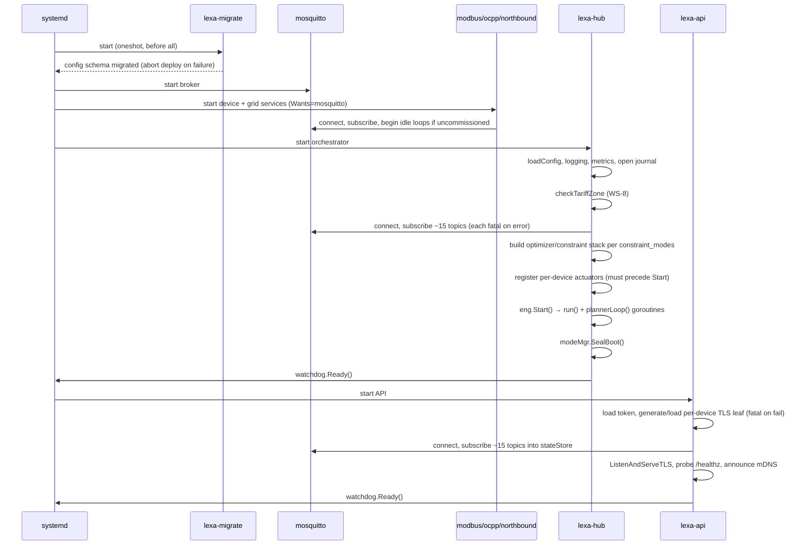

The boot order is enforced by systemd `After=` chains: migrate → broker → device/grid services → hub → api. Two robustness properties are worth noting. First, an **uncommissioned hub does not crash-loop**: each service detects "no server / no stations / empty fleet" and enters an idle loop that keeps MQTT, metrics, and the watchdog alive while skipping wolfSSL init and CSMS bind — closing a factory-fresh StartLimit hazard. Second, the watchdog is armed (`Ready()`) only after the engine's goroutines are actually running, and the per-tick kick is the *first* thing each tick does, so a wedged tick is detected rather than masked.

## 4.2 What happens when a utility communicates

```mermaid
sequenceDiagram
    participant U as Utility 2030.5 server (gridsim on the bench)
    participant NB as lexa-northbound
    participant BR as mosquitto
    participant HUB as lexa-hub (control core)
    participant MOD as lexa-modbus
    participant INV as Solar inverter

    NB->>U: mTLS handshake (ECDHE-ECDSA-AES128-CCM-8), re-verify cipher post-handshake
    NB->>U: GET /dcap → Time → EndDeviceList (self by LFDI) → DER → DERProgramList
    NB->>U: GET DefaultDERControl + DERControlList
    NB->>NB: Scheduler.Evaluate (§12.3) → active control (e.g. OpModExpLimW = 3 kW)
    NB->>BR: publish lexa/csip/control (retained)
    BR->>HUB: deliver control
    HUB->>HUB: reader applies control; INV-EXPORT recomputes tightest envelope
    HUB->>HUB: optimizer/stack: absorb into battery → throttle EV → sticky solar ceiling
    HUB->>BR: publish lexa/desired/inverter/solar-0 (retained)
    BR->>MOD: deliver desired doc
    MOD->>INV: Modbus write (scaled into SunSpec multiplier)
    MOD->>INV: read back
    MOD->>BR: publish lexa/reconcile/inverter/solar-0/report (retained)
    BR->>HUB: reconcile report
    HUB->>HUB: checkExportLimitConvergence vs measured meter — hold or escalate
```

The point to absorb: a utility control never reaches a device directly. It is resolved by the scheduler, published as a retained control, turned into a *desired document* by the control core, reconciled onto the device by the device service, and then judged against the *measured* meter reading — not the issued command. If the inverter echoes the cap but keeps generating, the meter-independent generation floor catches it and the invariant escalates.

## 4.3 What happens when an EV charger communicates

The charger is an OCPP 2.0.1 client; the hub's `lexa-ocpp` is the CSMS on :8887. On the bench it connects over `ws://`; in the product configuration it must connect over `wss://` with Basic Auth (Security Profile 2), and the CSMS **fails closed** — it refuses to start with blank SP2 credentials unless explicitly in bench mode.

```mermaid
sequenceDiagram
    participant EV as EV charger
    participant OCPP as lexa-ocpp (CSMS :8887)
    participant BR as mosquitto
    participant HUB as lexa-hub

    EV->>OCPP: WebSocket connect (wss + Basic Auth in product)
    OCPP->>OCPP: admit (Basic Auth only); unknown id auto-Accepted
    OCPP->>BR: publish lexa/ocpp/pending (retained) if unknown
    EV->>OCPP: TransactionEvent(Started)
    OCPP->>BR: publish session start
    loop charging
        EV->>OCPP: TransactionEvent(Updated) with meter values
        OCPP->>BR: publish measurements
    end
    HUB->>BR: publish desired/evse/ev-0 (e.g. limit to 16 A per plan)
    BR->>OCPP: deliver desired
    OCPP->>EV: SetChargingProfile
    EV->>OCPP: TransactionEvent(Ended) — current zeroed
```

The correctness point (audit finding OCPP-1): sessions are modeled as `TransactionEvent` Started/Updated/Ended lifecycles, and bare `MeterValues` outside a transaction are demoted to debug logging — never treated as authoritative session data. The planner treats EV charging as a first-class actor with a hard departure-time constraint and the IEC-61851 current ladder.

## 4.4 What happens when a battery communicates

The battery is a SunSpec Modbus device polled by `lexa-modbus`. Its state-of-charge and power flow feed the control core; its reserve is the most safety-critical number in the system.

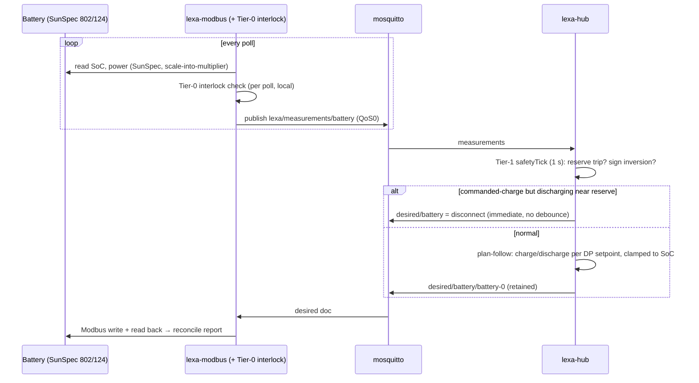

Two defenses stack here. The Tier-1 reflex in the hub trips on sign inversion immediately. The Tier-0 interlock in the device service is the last-ditch local reflex that keeps working if the hub or broker is down. **A known HIGH finding (Part VIII, H2): the Tier-0 interlock currently fails *open* when SoC reads as NaN** — precisely the metrics-read-failure case it exists to guard — which is a fix-before-field item.

## 4.5 What happens when the mobile app communicates

Two distinct conversations, at two distinct trust stages.

**Commissioning (first contact, over BLE):**

```mermaid
sequenceDiagram
    participant APP as lexa-app
    participant PROV as lexa-provision (BLE GATT)
    participant API as lexa-api

    APP->>PROV: scan for LEXA-<serial>, connect GATT
    APP->>PROV: read plaintext info (serial, capabilities)
    APP->>PROV: sec1 — X25519 ephemeral exchange
    Note over APP,PROV: K = HKDF-SHA256(shared, salt = setup code / PoP)
    APP->>PROV: encrypted confirm (proves PoP)
    PROV-->>APP: encrypted ok  (or plaintext err pop_mismatch)
    APP->>PROV: WiFi credentials (config write)
    PROV->>PROV: join network; hand back IP + cert fingerprint + bearer token
    APP->>APP: verify hub serial matches the code (hard stop on mismatch)
    APP->>API: (later) HTTPS with pinned fingerprint + bearer
```

**Steady state (over local HTTPS):** the app polls `GET /status`, `/telemetry/recent`, and `/plan` on a 5-second active / 15-second idle cadence, streams `/logs` over SSE, and issues control changes as `POST /intent` (the API publishes a whitelisted intent to the bus and blocks up to 3 seconds for the correlated hub result). Transport is HTTPS with a TOFU SHA-256 fingerprint pin learned during commissioning, plus a bearer token on write routes.

The two ends of this conversation are contract-versioned: every response carries `X-Lexa-Contract-Version: 1`, the app checks it and can surface an "update the app" banner, and a CI drift gate (`make contract`) compares live handlers against golden fixtures the app copies into its own tests. **A caveat verified during this audit** (correcting an app-side gap doc): the hub *does* now run a `lexa-provision` BLE service — it is active on the bench hub — so the commissioning path is in build-out, though a full phone-to-hardware commissioning has not yet been demonstrated end to end.

# Part V — Repository Deep Dives

The four sections below go repository by repository. The hub (V-A) leans on Part III rather than repeating it; the bench (V-B) is the fullest, because it is the least self-explanatory from its own docs; the shared library (V-C) and the app (V-D) are self-contained. Read the one you are about to work in.

# Part V-A — Repository Deep Dive: lexa-hub

The hub is covered structurally in Part III (services, control core, bus, resilience, deploy) and by the walkthroughs in Part IV. This section adds the deep-dive material those parts don't: package geography, the API surface, protocol-compliance caveats, and the technical-debt findings that anchor Part VIII.

## Purpose and shape

The product firmware: ~50k lines of non-test Go against ~51.9k lines of test (205 test files) targeting the i.MX93 on Digi Embedded Yocto 5.0. It is a defensively-engineered codebase by the numbers — one TODO in all of non-test source, three `recover()` sites (all the constraint-stack shadow latch), test LOC exceeding source LOC in the safety-critical packages.

## Package geography

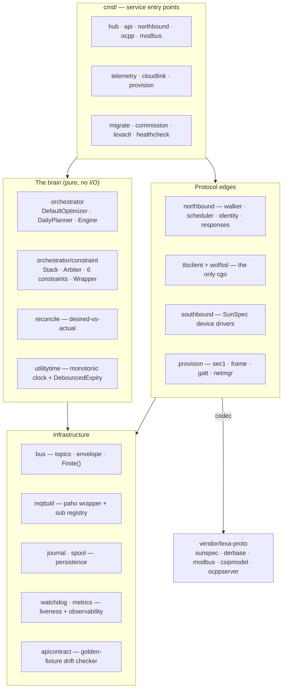

The dependency direction is clean: entry points wire together a pure brain and I/O-edge packages, both resting on infrastructure; the protocol edges pull their codecs from the vendored `lexa-proto`. Nothing in the brain imports an I/O package, which is what keeps it unit-testable.

## API surface (`lexa-api`, :9100)

Built on the standard library's `net/http.ServeMux` — no router framework, and streaming is Server-Sent Events rather than WebSockets. Every response carries `X-Lexa-Contract-Version: 1`.

| Endpoint | Method | Auth | Purpose |
|---|---|---|---|
| `/status` | GET | bearer (open if unset) | full device/plan/mode snapshot |
| `/site`, `/devices` | GET | bearer | site + device inventory |
| `/telemetry/recent` | GET | bearer | recent measurement history |
| `/plan` | GET | bearer | 24 h plan series + economics (503 until first plan) |
| `/mode` | GET | bearer | current mode (503 until first ModeStatus) |
| `/logs` | GET | bearer | SSE log stream |
| `/scan` | GET/POST | bearer | device commissioning scan |
| `/intent` | POST | **strict** | publish a whitelisted intent, await hub result ≤3 s |
| `/config/{service}` | POST | **strict** | commissioning config write (staged, fsync-rename, journaled) |
| `/healthz`, `/metrics` | GET | none (never wrapped) | liveness + Prometheus |

Authentication is a single static bearer token, constant-time compared, from a token file; write routes fail closed (`requireBearerStrict`), read routes are open when no token is set (`requireBearer`). There is no mTLS on this interface — trust is the TOFU fingerprint pin plus the bearer token. TLS is **on by default** (the code treats a nil TLS setting as enabled and a cert-generation failure as fatal — it will never silently fall back to plaintext); `tls:false` is a bench-only escape hatch.

## Protocol-compliance caveats

The protocol implementations are correct on the hard, safety-relevant parts (Part III §3.5, Part IV) but carry a set of documented rough edges that a conformance engineer should know about before an external interop test:

- **CannotComply uses a non-standard status `0xF0`** — a deliberate LEXA extension in the spec's reserved manufacturer range, but non-conformant to a strict reader.
- **The advertised `ResponseSetPath` is discovered but never used** — the client always POSTs responses to the config-default path. This works against gridsim (which matches) and would break against a real server that advertises a different path.
- **No sanity bound on the clock offset** from `/tm` — a garbage `CurrentTime` would skew every window and expiry. This is the one adopted value with no guard.
- **One malformed program aborts the entire walk** — a single program's required-control fetch failure stops discovery, rather than skipping and continuing as the DER sub-resource fetches do.
- **The battery discharge command maps to an export *ceiling*, not a setpoint** (charge maps to an exact `WSet`) — a device may undershoot a commanded discharge.
- **OCPP energy samples ignore the unit-of-measure field** — a kWh sample stored as Wh is 1000× low.

None of these are safety-invariant violations; all are interoperability or accuracy items sized in Part VIII.

## Strengths (evidence-anchored)

1. **Fault-isolated services with a measured, defensible topology decision** (ADR-0001) and per-service deny-by-default MQTT ACLs derived from actual call sites.
2. **Three-tier fail-closed safety** with closed-loop measured convergence and a meter-independent generation floor — the "trust measurement, not command" principle realized structurally.
3. **A genuinely lock-free orchestrator** (single-writer goroutines + bounded command channel + atomic snapshots) that is the reason the brain has real regression tests.
4. **Protocol correctness where it counts**: cipher pinned *and re-verified post-handshake*, namespace-safe XML, correct LFDI/SFDI, correct OCPP transaction lifecycle, int16-scale-into-multiplier on every register write.
5. **Disciplined resilience**: crash-only with retained re-seed, batched-fsync forensic journal, at-least-once disk spool, watchdogs on the real work loop, regulatory-record persistence for breach episodes and northbound responses.
6. **A security posture rare at this maturity**: TLS-on-by-default with fingerprint pinning, strict-fail write auth, OCPP SP2 fail-closed gate, correct sec1 BLE crypto with byte-for-byte cross-language test vectors, a cloudlink downlink choke point, no tracked private keys, an empty govulncheck allowlist, nightly fuzzing of every untrusted boundary.
7. **Observability**: ~90 Prometheus series, a plan heartbeat with a three-state alarm, certificate-expiry gauges, and a forensic journal correlated to journald by episode ID.

## Technical debt (the HIGH items; full register in Part VIII)

The audit surfaced seven HIGH-severity findings. Three are safety/security fix-before-field items:

- **H1** — the Tier-0 interlock and connect writes use the legacy `OpModConnect` (Modbus model 123) only, and error out at runtime on an IEEE-1547-2018-only device that exposes models 701/703/704 but no legacy 123. The correct cease path there is `OpModEnergize` (model 703). Masked on the bench because the sims implement 123.
- **H2** — the Tier-0 interlock fails *open* when battery SoC reads NaN (a metrics-read failure), the exact condition it exists to protect against.
- **H3** — the BLE commissioning default proof-of-possession (`LEXA-DEVKIT-POP`) has no production guard; the code only WARNs and proceeds, and the code comment itself notes the guard is future work (unit B4). A factory image shipped without the PoP file would let anyone in BLE range complete the handshake and receive the API fingerprint and bearer token.

The other four are reliability/CI items: the OTA commit gate can false-PASS a frozen device via hand-duplicated `/status` schema drift (**H4**); overlapping northbound schedule slots silently last-writer-win (**H5**); a hard-coded `/1000` milli-currency divisor risks 1000× mispricing against a non-gridsim server (**H6**, the one real TODO in the tree); and the mTLS handshake integration tests are dead (can't build in a fresh checkout) while the arm64 cgo artifacts are never CI-built (**H7**).

One MEDIUM finding deserves promotion in the reader's mind because it blocks a documented capability: **cert rotation cannot complete today** — `rotate.go` renames its sentinel inside `/etc/lexa/certs`, which the service's own `ReadOnlyPaths=/etc/lexa/certs` hardening makes impossible. The runbooked zero-downtime rotation is currently inoperable on a hardened unit; the fix is to move the sentinel into the writable state directory.

# Part V-B — Repository Deep Dive: csip-tls-test

## Purpose and runtime role

The bench repo has one job stated plainly in its own architecture review: be the adversary and the referee for the product. It contributes nothing that ships to a customer; everything in it exists to (a) stand in for the utility and the DER hardware with high fidelity, (b) prove protocol conformance with lab-submittable evidence, and (c) break the hub on purpose and diagnose what the failure means. Size: ~23.5k hand-written Go LOC plus ~15.4k test LOC (0.65 test:code — unusually high, and deliberate: a QA harness that is itself untested produces false verdicts).

## Component inventory

| Component | Path | Runs on | Ports | cgo? |
|---|---|---|---|---|
| gridsim mTLS server | `sim/server` (binary) over `sim/gridsim` + `sim/tlsserver` (libs) | desktop .20 | 11111 mTLS, 11112 admin | yes |
| Dashboard + Mayhem + Replay | `cmd/dashboard` | desktop .20 | 8080 | no |
| Solar inverter sim | `sim/modsim` | solar-pi .10 | 5020 Modbus / 6020 simapi | no |
| Battery sim | `sim/batsim` | battery-pi .11 | 5021 / 6021 | no |
| Meter sim | `sim/metersim` | meter-pi .12 | 5022 / 6022 | no |
| EV charger sim (OCPP) | `sim/evsim` | ev-pi .14 | 6024 simapi (dials hub :8887) | no |
| CSIP conformance runner | `sim/conformance` | Pi or desktop | dials 11111 | yes |
| Modbus conformance runner | `sim/modsim-conformance` | anywhere | dials 502x | no |
| Referee 2030.5 client | `internal/csipref` (lib) | in conformance + tests | — | no |
| wolfSSL client fetcher | `internal/tlsclient` over `internal/wolfssl` | — | — | yes |

The cgo blast radius is exactly two `internal/` packages plus three binaries; every artifact that runs on a Pi is pure Go cross-compiled with `CGO_ENABLED=0`. CI proves the boundary by building the pure-Go set with cgo disabled.

## The simulators

**gridsim** is honestly self-described as *a fixture, not a conformant server*: it serves a fixed-but-rich CSIP resource tree (three-device EndDeviceList, DER programs at primacies 1/5/10, TOU pricing, a volt-var curve, billing, a `/mup` endpoint that accepts telemetry and discards it) and implements the 2030.5 event state machine correctly for admin-injected controls. Its value is the **admin API** on :11112 — `control`, `default`, `clock`, `alerts`, `malform` (ten distinct non-conformant response variants), `outage` (down/hang with auto-clear). The clock endpoint applies an atomic offset that `/tm` tracks, which is what lets Bench Replay compress 92 simulated days into a 20-hour run while the hub's TOU windows follow along.

**The device sims** share `sim/southbound`: an in-memory SunSpec register world implementing `simonvetter/modbus` with three interception hooks used for fault injection (`faults.go` — write-path lies, delayed/ramped effects, transport faults like NaN sentinels, latency, exception codes, bad scale factors, sign inversion — each documented with the Mayhem invariant it targets). Physical coherence is a design goal: batsim integrates state-of-charge; metersim in linked mode computes grid power as `load + ev − solar − battery` by polling its siblings' simapi `/state`, so the bench's power flows balance at the PCC like a real site. evsim implements a genuine CC/CV charge model and the correct OCPP `TransactionEvent` Started/Updated/Ended lifecycle.

**simapi** is the uniform sidecar every sim exposes: `GET /state`, `POST /inject`, `POST /control`, `POST /fault`, `GET /registers`, `GET /ws`, `GET /logs` (SSE from a 400-line ring buffer). It has no authentication, which is acceptable only because the bench LAN is air-gapped — a constraint worth remembering if any sim is ever exposed more widely.

One latent defect worth flagging: solar and battery sims write their live watt registers as a raw `int16` cast (`sim/southbound/solar.go:525`, `battery.go:616`) rather than scaling into the SunSpec multiplier. Safe at the 5 kW default nameplate; wraps if a scenario raises `-wmax` past 32.7 kW. The meter and gridsim paths do this correctly (the GS-1/MTR-1 audit fixes) — these two writers were missed.

## The conformance stack

Reference: SunSpec CSIP Conformance Test Procedures v1.3. Two parallel suites share a Reporter → sectioned PASS/FAIL → lab-submittable log pattern:

- **CSIP**: 42 checks implemented twice — a cgo binary (`sim/conformance`) that runs on the Pi with the real CCM-8 fetcher, and a pure-Go mirror (`tests/csip_conformance_test.go`) that runs in hosted CI. `scripts/run-conformance.sh` orchestrates four layers: L1 logic, L2 TLS (cipher acceptance plus wrong-CA/wrong-cipher rejection), L3 full-stack mTLS walk, L4 optional packet capture grepping the wire for cipher suite `0xC0AE`.
- **Modbus**: ~28 checks per device type (`-device inverter|battery|meter`) with real write/read-back round trips and accumulator-monotonicity timing.

Two honest gaps, both acknowledged in the reports: the meter's MTR-\* checks exist only in the standalone runner, not in the hosted-CI mirror (a meter-codec regression would pass CI); and the in-repo suites test *referee vs simulator* — product-side conformance is a separate bench run whose evidence is carried manually into `CONFORMANCE_REPORT.md`.

The **referee** (`internal/csipref`) deserves emphasis because it is a structural, not procedural, defense: a second, deliberately-unsynced implementation of 2030.5 discovery (strictly link-driven — it never hardcodes a path past `/dcap`) and DER-event scheduling (cancelled → randomized-window → supersede-by-primacy → latest-creation MRID tiebreak → default fallback). If the hub and the referee ever disagree about the same server bytes, one of them misread the spec — and a fuzz corpus shared byte-identically with the hub trips if their decoders diverge.

## Mayhem, the hostile-QA engine

Mayhem is the repo's crown jewel and its largest subsystem (~7.3k LOC engine + ~8.9k test LOC in `cmd/dashboard`). Design in one paragraph: a scenario is a hypothesis about hub behavior ("if the battery reports inverted sign, the hub should disconnect it") expressed as setup / per-tick / teardown steps plus a diagnoser; the engine runs it against the *real bench*, samples ground truth from the simulators' `/state` (never from the hub's own telemetry — a hub that is confidently wrong must not grade its own homework), and a verdict ladder classifies the outcome.

The parts that make it unusual among QA harnesses:

- **The verdict taxonomy**: PASS / DEGRADED (correct but slow, or admitted via CannotComply) / FAIL / **BLIND** / INCONCLUSIVE. BLIND is the honest one: if the judging sensor answered fewer than 80% of samples, a would-be PASS is overridden to BLIND — the harness refuses to certify compliance it never measured. A cross-cutting safety auditor (`invariants.go`) can escalate any verdict when an INV-\* invariant (export, SOC, connect, expiry, EV-max, hunting) is breached, with settling grace so HIL jitter doesn't false-fail.
- **Scenarios-as-data with a hard boundary**: *oracles are code, scenarios are data*. 27 diagnoser functions live in Go; 12 are exposed by name in a registry; a JSON spec (`qa/scenarios/*.json`) selects one, parameterizes it, and supplies steps from a 14-verb, deliberately loop-free vocabulary. The spec directory is re-read fresh on every `POST /api/qa/start` — the direct fix for a 2026-07-03 incident where a stale binary silently ran old scenarios. A spec whose ID collides with a Go scenario is a load-time error, never a silent shadow. 24 of 69 scenarios have migrated; the remainder stay Go literals because they need real logic (per-tick computed values, alternating states, the matrix generator).
- **Wire-level faults**: three scenarios apply real `tc netem` loss/reorder/jitter to a bench node over SSH, with defensive engineering that shows HIL scars — it probes for passwordless sudo (INCONCLUSIVE, not false-PASS, if absent), resolves the interface by routing to the peer (not the default route), self-checks that RTT actually degraded ≥15 ms before scoring, and schedules a self-healing qdisc delete.
- **Campaign tooling**: `scripts/mayhem.py` headless runner (exit codes wired for CI); `scripts/mayhem-campaign.sh` mode-manages the hub's FAST/STOCK timing over SSH, runs N cycles with per-cycle JSON evidence and a scenario-drift table, and restores FAST unconditionally on exit via trap.

**Authoritative scenario counts (2026-07-11, from source enumeration):** 69 curated scenarios — 45 Go + 24 JSON specs — of which 3 are `Extended` (excluded from default runs), so a default full run executes 66; the matrix generator adds 12 and chaos mode 6 more. The `CLAUDE.md` figure of "59" predates the extension-campaign batch and is stale.

Known blind spots are documented rather than hidden (`docs/QA_GAPS_20260701.md`). The deepest is **self-confirmation**: the sims and the hub share codec lineage through lexa-proto, so a register-map misunderstanding present in the shared code is invisible to every scenario. The only real fix is golden fixtures captured from vendor hardware (tracked as TASK-075/RSK-16) — a hardware acquisition, not a code change.

## Bench Replay

`cmd/dashboard/replay.go` (878 LOC) is a hardware-in-the-loop *cost* simulator: it injects a synthetic 92-day summer (weather, load, EV arrivals — generated by a browser worker, then POSTed to the server so an overnight run survives the tab) into the real Pi sims at 8 s/tick, warps gridsim's clock so the hub's TOU windows track simulated time, issues real DERControls at event boundaries, and judges cost and cap compliance from the real meter (±150 W, with CannotComply-reported misses excused). A deferred restore returns the bench to a clean state (clock zero, programs cleared, sims at 1×) on finish or abort. It is a proven bug-finding tool: its first runs drove three concrete optimizer fixes (solar ceiling released to nameplate on program expiry, battery drained through reserve, cap-hunting oscillation → slew limit), lifting measured cap compliance to 87.2%.

## Build, CI, deployment

- **Makefile**: `make test-fast` (unit, <1 s), `make build`, arm64 cross-targets per sim, `make test-integration` (wolfSSL handshakes, desktop sysroot), cert generation targets.
- **CI** (5 jobs): `pure-go` (builds with CGO=0 to *prove* purity, then runs `-race` tests including the QA-harness gate `go test -race ./cmd/dashboard/...`), `cgo-fast` (cached wolfSSL 5.7.6, lint `only-new-issues`, cgo binaries), `vulncheck`, `proto-pin` (symmetric lockstep gate), nightly `fuzz` (15 min on the referee's XML decoder). Bench-touching suites are deliberately excluded from hosted CI.
- **Deployment**: sims cross-compile pure-Go and deploy to the Pis via `scripts/update-sim-pis.sh` under systemd `--user` units with linger; desktop services (gridsim, dashboard) are transient user units brought up by `scripts/bench-up.sh` — meaning **a desktop reboot silently takes down the utility and the demo UI** until someone re-runs the script.
- Docker artifacts exist but are legacy (2 of 6 sims, `golang:1.21` base) — the systemd-on-Pis path is the real one; the Docker path should be updated or deleted.

## Strengths

1. Transport/crypto correctness proven on the wire, not asserted.
2. Mayhem: a genuinely rare asset — most teams' fault-injection stories are aspirational; this one has 69 scenarios, five campaign generations of evidence, and a verdict for "we weren't watching."
3. The independent referee with active anti-self-confirmation tripwires.
4. Physically coherent simulator fleet with first-class fault injection.
5. Documentation and traceability that are best-in-class: every audit finding has a tag, every tag is cited at the fixing line, and every claimed weakness in this handbook's assessment traces to a file.

## Weaknesses and technical debt

| Item | Severity | Detail | Fix / effort |
|---|---|---|---|
| Self-confirmation ceiling | High | Shared codec lineage; closable only with vendor-hardware golden fixtures (TASK-075) | Weeks + hardware |
| Meter conformance not in CI | Medium | MTR-\* checks live only in the standalone runner | Add meter env to `tests/` mirror; 2–3 days |
| Dashboard package monolith | Medium | ~14.7k LOC of engine in one `package main`; can't be imported or tested apart from the web server | Extract `mayhem`/`replay` packages; 1–2 weeks |
| Engine file size + stringly verdicts | Medium | `mayhem.go` 3,091 lines; verdict strings (144 literals, no type) | Continue spec migration; introduce a verdict type; ongoing |
| Duplicated bench-I/O | Low–Med | `replay.go` and `mayhem.go` carry near-identical sim/hub I/O layers; TOU price basis triplicated (hub, SPA, replay) | Shared helper package; 3–5 days |
| Latent int16 wrap in solar/battery sims | Low (latent) | Raw cast of live W | Scale into SF; 1 day |
| Deploy config reset | Medium (ops) | `deploy-hub-pi.sh` overwrites `/etc/lexa/*.json`, silently resetting bench enables | Idempotent config drop-ins (a lexa-hub change); 2–3 days |
| Repo clutter | Low | Stale `.claude/worktrees/` (inflate naive LOC counts 25×), 15 committed `qa-mayhem-*.md` run logs at repo root and in `cmd/dashboard/` | Prune; hours |

# Part V-C — Repository Deep Dive: lexa-proto

## Purpose

The shared protocol module: ~8.3k lines across five packages, consumed by hub and bench at a CI-pinned commit. Rationale, history, and the pin/vendor mechanics are covered in Part II (§2.3–2.4); this section is the package tour and quality read.

## Package tour

**`sunspec`** (~3.9k lines) — the strongest package in the module and arguably in the system. A declarative register-layout engine (`Field`/`Layout`/`View` with sentinel-aware typed accessors) transcribes SunSpec model tables 701–714 point-for-point, eliminating the hand-computed-offset bug class entirely. `scale.go` is the codec at the center of the system's most safety-relevant numeric invariant (GS-1/MTR-1): SunSpec watt fields are int16 and wrap at ±32,767, so all conversions must scale into the multiplier register, never raw-cast. That invariant is defended by an exported generative sweep (`sweep.go` — deliberately *not* a `_test.go` file, so both consumers can run the identical property contract against their own vendored copy in their own CI; the bench does exactly this via `internal/southbound/sunspecsweep`). The commit that landed it reports 65M fuzz executions, zero crashers, and one pinned fix ("FIX-B": a raw `0x8000` at a normal scale factor is an ordinary −32,768, *not* a not-implemented sentinel — documented in three places against the plausible-looking "fix" that would reintroduce the bug). Newest additions serve the hub's commissioning wizard: a Model-1 identity reader and a bus sweep that is **read-only by construction** — there is no write call in the file to misuse, a better guarantee than a runtime guard when probing unknown energized hardware.

**`csipmodel`** (~2.2k lines) — pure IEEE 2030.5 XML structs, zero logic. Encodes the system's XML invariant: every 2030.5 root element carries an explicit namespaced `XMLName`, because `encoding/xml` silently yields zero-value structs otherwise; 18 round-trip tests pin it. Includes one documented LEXA extension (`ResponseCannotComply = 0xF0`, placed in the spec's reserved manufacturer range). Design wart: `DERControlBase` (scalar-only) and `ExtendedDERControlBase` (scalar + curves + droop) overlap with only a doc comment steering callers to the right one.

**`derbase`** (~1k lines) — the CSIP-to-SunSpec bridge: fans a `DERControlBase` out to Model 704 (or legacy 123) register writes, and implements the SunSpec curve-adopt handshake correctly (write staging curve → request adoption by 1-based index → poll `AdptCrvRslt` → enable). Also owns the `Measurements` type both consumers re-export via a Go type alias — the "option-a alias" extraction pattern from TASK-023 that moved a shared type with zero call-site churn, and which the bench replicated independently from the docs alone (good evidence the docs are usable).

**`ocppserver`** (~180 lines) — a deliberately minimal OCPP 2.0.1 CSMS **test double**: accept-and-log handlers, no transaction state. Supports Security Profile 2 (TLS + Basic Auth, with a constant-time credential comparison). Its two tests are real in-process WebSocket integration tests, one a named regression for the OCPP-1 audit finding.

**`modbus`** (~100 lines) — the `Transport` interface over `simonvetter/modbus`, plus a serial constructor that exists specifically because the underlying library doesn't parse baud rate from the URL. **Zero tests** — including for that exact gotcha.

## Quality read

| Package | Coverage | Verdict |
|---|---|---|
| sunspec | 78.8%, 78 tests + 2 fuzz targets | Excellent — spec-pinned, property-swept |
| csipmodel | n/a (no branches) | Good — the real risk (XML tags) is what's tested |
| derbase | 26.9% | Correct core logic; large untested accessor surface |
| ocppserver | 66.7% | Appropriate for a test double |
| modbus | 0% | The one real test gap |

Process-level findings: no tags, no changelog (SHA-pin prose is the only versioning — internally consistent but opaque as traffic grows); 10 of ~28 files fail `gofmt` (the gate was explicitly deferred "until hosted" — which, per the finding below, is now); no LICENSE (private repo, low priority).

**The headline finding** (detailed in §2.3): the module *is now hosted* — private GitHub repo created 2026-07-10, CI green, history pushed — while every consuming document still says it isn't. The AD-003(f) hosted-flip checklist (module-path rename, drop vendor/replace, pseudo-version pins, branch protection) is unblocked and should be scheduled; until executed, the docs should at least stop claiming the opposite of reality.

**The boundary finding**: the byte-identical `identity`/`dnssd` forks in both consumers (Part II §2.4) are the next extraction candidates — they are exactly the kind of zero-business-logic protocol code this module exists to hold.

# Part V-D — Repository Deep Dive: lexa-app

*Maturity framing: the app is intentionally earlier-stage than the hub — an Android-first companion distributed as a debug APK to teammates, not a store product. It is judged here against that purpose. What follows is notable precisely because the engineering rigor substantially exceeds what its stage requires.*

## Purpose and architecture

Two jobs: **commission** a factory-fresh hub over BLE (authenticate with a setup code, hand over WiFi credentials, receive back IP + certificate fingerprint + bearer token) and **monitor/control** it over local HTTPS. The repo is a three-way split chosen for testability (ADR-0001, Flutter over Capacitor):

- `packages/lexa_core` — pure Dart, zero Flutter dependency (~3.9k lines): domain models, the typed API client, the pinned HTTP transport, the polling repository, and the entire BLE provisioning protocol. Everything here runs under headless `dart test` — no emulator.
- `app/` — the Flutter UI (~10k lines): 13 feature screens, Riverpod state graph (`app/lib/src/providers.dart`), go_router navigation (five-tab `StatefulShellRoute`: Now / Solar / Battery / EV / More), the `flutter_blue_plus` platform glue, secure profile storage.
- `tools/mockhub` — a Go fake of the hub's API (2.4k lines) with real TLS + fingerprint semantics and scenario flags (`-scenario nominal|stale|breach|flap`), used both as the dev-loop server and as a spawned real-TLS integration-test target.

## Communication model

**Transport security is enforced structurally, not by policy**: `PinnedHttpClient` refuses non-HTTPS outright and trusts exactly one certificate — SHA-256 of the leaf DER compared against the pinned fingerprint. When the hub flipped :9100 from HTTP to HTTPS (2026-07-11), the app needed zero changes because it had never supported plaintext. Retry policy distinguishes transient failures (jittered exponential backoff) from terminal ones — pin mismatches and 401s are never retried; a pin mismatch hard-stops polling.

**Discovery is two mechanisms with distinct trust roles**: BLE for first contact (the hub advertises `LEXA-<serial suffix>`), and mDNS (`_lexa-hub._tcp`, matched on the TXT `serial=` record) only to *heal a commissioned hub's changed IP*. The healing path can rewrite host and port but structurally cannot rewrite the fingerprint or token — `HubProfile.copyWith` simply has no fingerprint parameter. An attacker on the LAN who spoofs mDNS can therefore redirect the app only to an endpoint that must still present the pinned certificate.

**The commissioning protocol** ("LEXA Provision v1", ADR-0002) is a proper AKE: X25519 ephemeral exchange, key = HKDF-SHA256(shared secret, salt = proof-of-possession code), AES-128-GCM with a strictly-increasing per-direction nonce counter; any replay, reorder, or tamper permanently aborts the session. This is verified by seeded property tests (~350 messages across 35 sessions per run) rather than example tests. The handoff hard-stops if the hub's reported serial doesn't match the code the user entered — nothing is persisted on mismatch.

**Steady-state**: 5 s active / 15 s idle polling with last-good-snapshot caching and rising staleness metadata (the UI shows stale data as stale rather than blank), SSE log streaming, and 503s modeled as "feature unavailable" (`null`) rather than as errors — a convention the hub's contract documents.

## Cross-repo contract discipline

The app tracks `lexa-hub/docs/API_CONTRACT.md` as authoritative, version-checks the wire contract at runtime (`supportedContractVersion = 1`, with an "update the app" banner path), and copies golden fixture values from `lexa-hub/internal/apicontract/http_v1/*.json` into its wire-contract tests. `docs/LEXA_HUB_GAPS.md` is a working artifact of real cross-repo collaboration: specific gaps with acceptance criteria, three of which (firmware stamping, `/plan` forecasts, tariff/reserve read-back) were closed hub-side and wired app-side within a day. The open items that matter: **GAP-1/2/3 — hub-side BLE commissioning** (see status note below) and GAP-6 (cloud transport, undecided by design).

*Status note (live probe, 2026-07-11): the gap doc's claim that "lexa-hub has zero BLE code" is already stale — a `lexa-provision` BLE GATT service is present and active on the bench hub, and `cmd/provision` exists in lexa-hub. End-to-end phone-to-hub commissioning has not yet been demonstrated, but the hub-side blocker is now in build-out, not absent.*

## Testing

Measured fresh during this audit: **app 96.2%, lexa_core 96.0%, mockhub 90.2%** line coverage, against enforced CI gates of 90/90/85. ~84 Dart test files across seven layers: unit, wire-contract (hub fixtures), widget/behavior, golden visual (Ahem-font-deterministic, theme-paired), real-TLS integration against a spawned mockhub, property/fuzz on the BLE codecs, and security-property tests (a dedicated sweep asserts tokens never appear in any `toString()`). Injected clock/timers/randomness throughout makes the concurrency-heavy polling and rediscovery code deterministic under test. The riskiest hardware-dependent units (real BLE, real mDNS) were deliberately sequenced last in the roadmap, after everything mockable was solid.

## Strengths

- Security model implemented and *tested*, not aspirational: structural HTTPS-only, terminal pin-mismatch handling, tamper-aborting AKE, secrets swept from string output, serial-verified handoff.
- Sealed error taxonomies let the UI exhaustively switch on failure modes; graceful degradation (stale-not-blank) is a first-class design goal grounded in documented bench observations.
- Test depth far beyond companion-app norms, with the coverage gates to keep it there.
- A working cross-repo feedback loop with the hub team, with same-day gap closure on record.

## Weaknesses

*Appropriate to stage (not findings):* no camera QR scan (deferred; manual code entry works), no iOS runner (Info.plist keys pre-documented for the port), minimal accessibility and no i18n, no cloud/background sync (blocked on undecided hub-side design), offline cache is one JSON document rather than a database.

*Real, even at this stage:*
- `docs/ROADMAP.md`'s Phase-3 table is stale — units 3.1 (offline cache) and 3.4 (SSE poll relaxation) are implemented and tested but unmarked, in a repo otherwise disciplined about doc/code sync.
- The offline-cache storage deviated from the roadmap's stated plan (sqflite/drift → secure-storage JSON) with no ADR or commit note recording the change as deliberate. The choice looks right; the silence is the defect.
- No crash-reporting or diagnostics-upload path — acceptable now, but Phase 3's background work will create failure modes nobody is foregrounded to observe; design this before, not after.
- One hardcoded app-version constant (`settings_screen.dart:19`) in an otherwise consistency-enforced codebase.

# Part VI — Deployment, Testing, and QA

## 6.1 The physical bench

The system is developed against a flat, air-gapped `69.0.0.x/24` LAN. The desktop workstation holds a static `.20` on its wired interface (never the default route — internet is on a separate WiFi link, so the bench stays isolated).

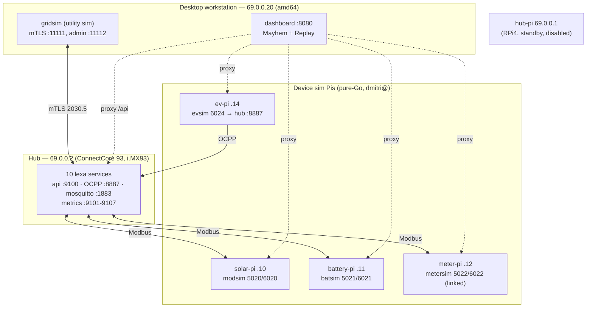

The hub migrated from a Raspberry Pi 4 (`.1`, now a disabled warm standby) to a Digi ConnectCore 93 dev kit (`.2`, root SSH) on 2026-07-07. **Verified live during this audit (2026-07-11):** the dev kit runs the custom `dey-image-lexa` Yocto image (flashed 2026-07-08), not the interim factory image the older bench docs describe — it has a real `sudo`, the `sch_netem` kernel module and `tc` (so wire-level fault injection works on the hub), an active Bluetooth stack, and the `lexa-provision` BLE service running. The `BENCH.md`/`DEVKIT.md` "interim caveats" sections are stale and should be revised.

A deployment footgun worth calling out: the desktop services (gridsim, dashboard) run as *transient* systemd user units brought up by `scripts/bench-up.sh`, not boot-persistent units — so a desktop reboot silently takes down the simulated utility and the demo UI until someone re-runs the script.

## 6.2 The testing pyramid

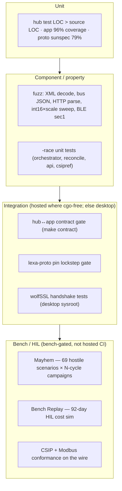

The distribution is unusual and deliberate: the safety-critical decision core (orchestrator, reconcile, API contract) is the most densely tested code, test LOC exceeds source LOC in the hub, and every *untrusted decode boundary* (2030.5 XML, bus JSON, HTTP header parsing, the SunSpec int16×scale codec, the BLE sec1 handshake) has a fuzz target — several seeded from captured real responses and, for the 2030.5 corpus, kept byte-identical between the hub and the bench so the two independent decoders can't silently diverge.

The **real behavioral oracle lives in the bench repo, not in hosted CI**. This is the single most important thing to understand about how this product is validated: correctness is proven not primarily by unit tests but by driving the *real* hub on the *real* bench through 69 adversarial scenarios and judging the outcome from the simulators' ground truth. That is why the Mayhem engine (Part V-B §Mayhem) is described as the most valuable asset in the codebase, and why its BLIND verdict — refusing to certify compliance it never measured — matters: it is the mechanism that keeps the oracle honest.

## 6.3 CI/CD across the repositories

| Repo | Jobs | What gates a merge | Bench-gated (excluded) |
|---|---|---|---|
| `lexa-hub` | vet-build-test, cgo, cross, vulncheck, proto-pin, nightly fuzz | gofmt, vet, `-race`, **contract drift gate**, arm64 pure-Go build, reachable-only govulncheck (empty allowlist), pin lockstep | Mayhem, conformance, arm64 **cgo** build |
| `csip-tls-test` | pure-go, cgo-fast, vulncheck, proto-pin, nightly fuzz | build-purity proof, `-race` incl. QA-harness unit gate, lint (new-issues), pin lockstep, `--verify-vendor` | Mayhem campaigns, HIL replay, on-wire conformance |
| `lexa-proto` | build-test (now hosted, green) | cgo-free build + `go test ./...` incl. the int16×scale sweep | — |
| `lexa-app` | lexa-core, app, mockhub, integration | analyze + format + **≥90% coverage** + goldens + APK; mockhub ≥85%; real-TLS integration vs spawned mockhub | on-device BLE/mDNS |

Two structural CI gaps carry forward into the roadmap. First, **the arm64 cgo binaries (`northbound`, `telemetry`) are never built in CI** — only the pure-Go cross-build is — so a wolfSSL sysroot or toolchain drift surfaces at deploy time, not in a pull request. Second, **the `--verify-vendor` step of the proto-pin gate is a no-op in hosted CI** (there is no lexa-proto checkout for it to regenerate against), so a stale or hand-edited `vendor/lexa-proto/` tree passes the gate; only a desktop run catches it. The pin-*string* comparison does run and does gate, so outright pin skew is caught — but the vendor *contents* are trusted.

## 6.4 The certificate and identity fabric

There is one bench certificate authority (`csip-tls-test/certs/vault/ca-key.pem`, gitignored; the public `ca-cert.pem` is tracked). Four distinct trust domains hang off it:

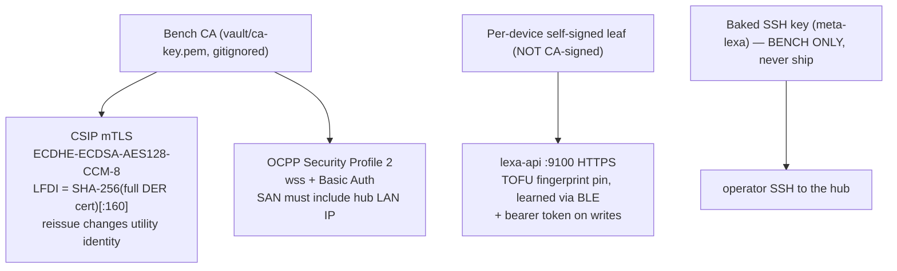

The subtle one is domain D3: the app-facing API cert is a per-device self-signed ECDSA leaf, *not* signed by the bench CA. Trust is established by trust-on-first-use fingerprint pinning during BLE commissioning, and — verified in the app — the mDNS IP-healing path structurally cannot rewrite that fingerprint. This is a coherent design for a device with no PKI at the edge, and it is why the certificate-rotation runbook is a probe-then-swap dance with an LFDI pre-check rather than a simple file replace.

## 6.5 Configuration ownership

| Configuration | Owned by | Source of truth |
|---|---|---|
| Hub runtime config (`hub.json`, `northbound.json`, `modbus.json`, …) | `lexa-hub/configs/` (bench) and `configs/factory/` (uncommissioned) | committed defaults are conservative; the **deployed** `/etc/lexa/*.json` is what actually runs |
| Hub config *schema* (validation allowlists) | `lexa-hub/configs/schema/` (go:embed'd) | enforces commissioning-time config writes |
| Bench QA scenarios | `csip-tls-test/qa/scenarios/*.json` | re-read fresh on every `POST /api/qa/start` |
| Ports / IPs / bench topology | `csip-tls-test/docs/BENCH.md` + `CLAUDE.md` | durable reference |
| hub↔app wire contract | `lexa-hub/internal/apicontract/http_v1/*.json` + `apicontract.Version` | golden fixtures; app mirrors them |
| FAST/STOCK hub timing | `csip-tls-test/scripts/hub-replay-tune.sh` (reaches into the hub over SSH) | rewrites deployed `/etc/lexa` and restarts services |

Two ownership hazards recur in the docs and are worth flagging for anyone doing bench work. `scripts/deploy-hub-pi.sh` overwrites `/etc/lexa/*.json` wholesale, silently resetting bench-specific enables on every deploy. And `hub-replay-tune.sh` still defaults its target IP to the disabled `.1` Pi — safe only because callers pass `.2` explicitly.

# Part VII — Quality Assessment

An honest engineering assessment against the expectations for a **commercial energy product**. Grades are on a 1–10 scale where 7 = "solid, shippable with known gaps," 8 = "strong," 9 = "exemplary," and anything below 6 = "a real liability for a commercial product." The subject of this assessment is primarily `lexa-hub`, because that is the thing that must be field-ready; the bench and library are assessed in their deep dives and folded into the ecosystem view. The app is assessed separately in §7.3 and must not be graded on the same scale — it is at a different, intended, maturity.

## 7.1 Graded categories (the hub and its ecosystem)

| Category | Grade | One-line justification |
|---|---:|---|
| Architecture | **9** | Fault-isolated services, a *measured* topology decision (ADR-0001), a lock-free single-writer brain, three-tier fail-closed safety. The only drag is the two-implementation control core mid-migration. |
| Maintainability | **7** | Excellent boundaries and near-zero TODO debt, but pervasive comment/line-number drift, a 105 KB single-file `optimizer.go`, and stale docs (the "six services" header, the Mender/SWUpdate contradiction). |
| Readability | **8** | Task-tagged rationale in nearly every function; the code explains *why*, not just *what*. Docked for a few god-files and the cognitive load of the legacy/stack duality. |
| Code organization | **8** | Clean cmd/internal split, ruthless cgo containment (two packages), a pure I/O-free brain. The bench's dashboard monolith is the weaker sibling. |
| Testing | **7** | Test LOC > source in core packages, fuzz on every untrusted boundary, a CI contract gate. Real holes: southbound device models and `cmd/telemetry` are thinly tested, the mTLS handshake tests are dead, and the behavioral oracle is bench-gated out of CI. |
| Protocol implementation | **8** | Correct on the safety-critical parts and proven on the wire; a handful of interop caveats (0xF0 status, unused ResponseSetPath, unit-of-measure) keep it from a 9. |
| Security | **7** | Rare-for-stage posture (TLS-on-by-default, pinning, SP2 gate, sec1 crypto, empty vuln allowlist) undercut by the default-PoP takeover (H3), a single shared bearer token, and plaintext escape hatches. |
| Reliability | **7** | Crash-only + retained re-seed + spool + journal + hardware-proven OTA rollback, held back by the interlock fail-open (H2), inoperable cert rotation (M2), and watchdog blind spots. |
| Scalability | **6** | Sized for one site with one device of each class; the DP is fixed-dimension, multi-device is explicitly not started (TASK-065). Correct for the product's scope today, but a real ceiling. |
| Performance | **8** | The box is ~idle by design (ADR-0001's own measurement); ample headroom, no hot paths under stress. Ungraded upward only because it's never been load-tested at fleet scale. |
| Deployment | **6** | SSH+SCP to the bench works and the OTA safety properties are hardware-proven, but there is no signed-OTA fleet pipeline yet and the Mender→SWUpdate pivot isn't reflected in the docs/scripts. |
| Documentation | **9** | Best-in-class *engineering* docs — ADRs, an 82-task refactor playbook, runbooks, forensics guides, audit-tag traceability. Docked only for the doc/reality drift this handbook keeps flagging. |
| Observability | **8** | ~90 metric series, plan heartbeat, cert-expiry gauges, forensic journal. Some failure modes (dead-device telemetry, actuator fan-out misses) are log-only. |
| Error handling | **9** | Uniform "never crash on I/O, count + edge-log + return"; fail-closed control plane; total optimizer functions; NaN/Inf rejected at decode. |
| Configuration management | **7** | schema_version + factory/bench profiles + embedded schema that can't drift from the binary. Docked for minimal write-validation and an unbuilt factory-secret provisioning step. |
| CI/CD | **7** | Split cgo/pure/cross jobs, `-race`, reachable-only govulncheck, contract + pin gates, nightly fuzz. Docked because the arm64 cgo binaries aren't CI-built and the vendor-verify step is a hosted no-op. |
| Developer experience | **8** | `go.work` local dev, a mockhub, FAST/STOCK timing modes, scenarios-as-data. The friction is the multi-repo lockstep ceremony. |
| Operational readiness | **6** | Watchdogs, a flash budget, runbooks, a healthcheck gate — but the dev kit runs everything as root with an anonymous broker, and cert rotation is currently inoperable. |
| Field readiness | **5** | The firmware is ahead of the productization around it: no product cloud in the compliance path, no manufacturing PKI/claim flow, OTA pipeline unfinished, and three fix-before-field safety/security items open (H1/H2/H3). |
| Supportability | **7** | The forensic journal + journald correlation + diag bundle give real remote-triage capability; docked for the diag-bundle redaction gaps and coarse write attribution. |
| Extensibility | **8** | The constraint stack, the desired-doc command path, and the `lexa-proto` boundary are all built for extension; a second device class is the near-term test of it (not yet done). |

**Composite (hub as a pre-commercial product): ~7.** A genuinely strong engineering core — architecture, error handling, safety design, and documentation are at or near commercial-grade — sitting inside a productization envelope that is still being built, with a short list of concrete fix-before-field items. This is a product that is *engineered* like a shipping device well before it is *packaged* like one.

## 7.2 Hub report card — production readiness

Judged against "could this be deployed to paying customers' homes on a utility program."

| Dimension | Grade | Assessment |
|---|---:|---|
| Production readiness | **5** | Blocked on H1/H2/H3 (safety/security), an unfinished OTA pipeline, and no manufacturing/PKI flow. Not a code-quality problem — a productization-completeness one. |
| Architecture | **9** | The strongest dimension; a topology that was challenged and survived on measurement. |
| Reliability | **7** | Strong resilience primitives with a few sharp edges (interlock fail-open, cert rotation, watchdog gaps). |
| Testing | **7** | Deep where it matters, thin in a few places, oracle bench-gated. |
| Documentation | **9** | Exceptional, modulo drift. |
| Security | **7** | Strong posture, one serious default-credential gap. |
| Deployment | **6** | Bench-proven, fleet-unproven. |
| Maintainability | **7** | Clean boundaries, some god-files and doc drift. |
| Operational maturity | **6** | Runbooks and watchdogs exist; the field-ops story (fleet OTA, remote fleet observability, cert lifecycle at scale) is roadmap. |

**Bottom line for the hub:** the control core, the protocol handling, and the safety engineering are *ready enough to trust on a bench and to build on*; the gap to a fielded product is a bounded, enumerable list — close H1/H2/H3, finish the SWUpdate pipeline, build the manufacturing/PKI flow, and stand up the cloud backend — not a rewrite.

## 7.3 App report card — judged at its intended maturity

The app is an Android-first companion distributed as a debug APK, deliberately earlier-stage than the hub. It is **not** compared to the hub; it is judged against "a well-built companion app for monitoring, control, and provisioning."

| Dimension | Grade | Assessment |
|---|---:|---|
| Architecture | **8** | Principled three-way split (pure-Dart core / Flutter UI / Go mockhub) with an ADR; interface-first API client; a Riverpod graph that handles real hub-switch races. |
| Maintainability | **8** | Extensive "why" comments, sealed error taxonomies, injectable time/randomness, near-zero real TODO debt. |
| User experience (from code + goldens) | **6** | Strong *failure-mode* UX (stale-not-blank, confirm-before-apply, distinct error messages); held back by minimal accessibility, no i18n, manual-only code entry, and a narrow golden set. Real device feel is unassessable from a static read. |
| API design | **8** | Textbook interface/implementation split, 503-as-null convention, sealed outcome enums, a runtime contract-version guard. |
| Communication robustness | **9** | The standout: full error taxonomy with no raw-exception leakage, bounded jittered backoff, identity-safe mDNS healing, property-proven BLE crypto framing. |
| Future readiness | **6** | Well-positioned structurally (core/UI split, `LexaApi` interface, contract versioning) but three of five Phase-3 units unstarted, no field-diagnostics pipeline, and the whole provisioning track gated on hub-side BLE that is only now coming online. |

**Bottom line for the app:** it substantially over-delivers on engineering rigor for its stage — 96% tested, property-verified crypto, structural security — and its honest gaps are almost all *product surface* (iOS, cloud, QR scan, a11y) rather than engineering debt. The two things that matter even now: keep the roadmap doc in sync with the shipped code (two Phase-3 units are done but unmarked), and record the offline-cache storage deviation as a deliberate decision.

# Part VIII — Path Forward

The refactor program closed the *architecture* work; what remains is productization and a short list of correctness fixes. The phases below are ordered by "what blocks a field deployment" first.

## Phase 1 — Critical, before any field deployment

These are the fix-before-field items. None is a rewrite; all are bounded.

| Item | Why it blocks field | Effort | Risk to do |
|---|---|---|---|
| **H2 — interlock fail-open on NaN SoC** | The last-ditch battery protection stops protecting exactly when a sensor read fails | S (days) | Low — flip the gate to fail-closed |
| **H1 — cease-to-energize on 1547-2018-only devices** | Tier-0 disconnect silently errors on a real inverter with no legacy model 123 | M (1–2 wk) | Medium — needs `OpModEnergize` path + a capability check; test against real firmware |
| **H3 — default-PoP commissioning takeover** | A factory image without the PoP file is remotely claimable over BLE | S | Low — build-tag/config gate making a missing PoP fatal on product |
| **Finish the SWUpdate A/B OTA pipeline + `/etc/lexa` data-partition migration** | No safe field-update mechanism without it; the p7 migration must precede the first slot switch | M–L | High — bootloader/AHAB territory; the safety props are proven, the pipeline isn't finished |
| **Manufacturing PKI + claim flow** | No way to provision per-device identity/secrets at the factory; H9/factory-secret gap | L | Medium — greenfield but well-scoped |
| **H6 — CSIP milli-currency divisor** | 1000× mispricing risk against a non-gridsim server | S + bench | Low once verified against a conformant server |
| **M2 — restore cert rotation** | The documented zero-downtime rotation can't complete on a hardened unit | S | Low — move the sentinel to the state directory |

**Quick wins in this phase:** H2, H3, M2, and H6 are all small, low-risk, and independently shippable — a sensible first sprint that closes two of the three safety/security blockers and restores cert rotation.

## Phase 2 — Reliability hardening

| Item | Value | Effort |
|---|---|---|
| **H4 — bind healthcheck decode to the API golden fixtures** | Removes the OTA-false-PASS-via-schema-drift risk | S |
| **H7 — restore mTLS handshake tests + CI-build the arm64 cgo binaries** | Closes the coverage hole on the crypto client and catches sysroot drift in PRs | M |
| **Thread DeafTracker into the idle modbus/northbound/telemetry loops (M13)** | A wedged-deaf idle service currently isn't restarted | S |
| **Broker-liveness detection (M14)** | A wedged-but-running mosquitto is undetectable today | S–M |
| **Telemetry robustness (M10)** | Clamp the negative-rate ticker crash, reset fail counters, alarm on all-NaN, make the CSIP subscribe fatal | S |
| **Coalesce the cmdCh drop (M1)** | Don't silently lose a compliance-relevant mutation under intent-flood | S |
| **Complete the proto-pin vendor-verify in CI (cross-repo)** | Today `--verify-vendor` is a hosted no-op; a stale vendor tree passes | S |

## Phase 3 — Architecture completion

| Item | Value | Effort |
|---|---|---|
| **TASK-065 — multi-device support** | Removes the single-device-per-class scalability ceiling; unblocks TASK-066 | L |
| **TASK-066 — delete the legacy optimizer cascade** | Removes the two-implementation cognitive load and the suppressed `optimizer.go` dead weight | M (blocked on 065) |
| **Extract `identity`/`dnssd` into lexa-proto (cross-repo)** | Closes the 476-line byte-identical unmonitored fork — the exact MTR-4 pattern lexa-proto exists to prevent | M |
| **Execute the lexa-proto hosted-flip checklist** | The repo is already hosted with green CI; finish the module-path rename, drop vendor/replace, switch to pseudo-version pins, add branch protection | M |
| **Stand up the product cloud backend** | The on-box cloudlink agent is complete but has nothing to talk to | L |

## Phase 4 — Developer & operational experience

| Item | Value | Effort |
|---|---|---|
| Extract the bench dashboard's Mayhem/Replay engines into importable packages | Lets the ~14.7k-LOC QA engine be tested apart from the web server | M |
| Reconcile the Mender/SWUpdate documentation with the decided pivot | Removes a live doc/reality contradiction that will mislead the next engineer | S |
| Refactor `mayhem.go` (3,091 lines) + introduce a verdict *type* | Reduces the biggest maintainability hotspot in the bench | Ongoing |
| Sync the app roadmap doc + record the offline-cache storage decision | Small doc-hygiene items in an otherwise disciplined app | S |
| Idempotent hub config drop-ins so deploy stops resetting bench enables | Removes a recurring bench footgun | S |

## Phase 5 — Product expansion

Fleet management, a signed-OTA release pipeline at scale, iOS app parity, cloud/remote access (app Phase 3.2/3.3/3.5), volt-var/volt-watt curve functions (de-scoped for V1.0 as AD-010; the `csipmodel` types already exist), and additional DER classes. All are greenfield and gated on Phases 1–3.

---

# Technical Debt Register (prioritized)

Severity is impact-if-shipped × likelihood. Effort: S ≤ 1 wk, M 1–4 wk, L > 1 mo.

| ID | Severity | Item | Impact if ignored | Fix | Effort | Repo |
|---|---|---|---|---|---|---|
| H3 | **Critical** | Default BLE PoP has no production guard | Remote hub takeover over BLE from a mis-built factory image | Config/build gate: missing PoP fatal on product | S | hub |
| H2 | **Critical** | Tier-0 interlock fails open on NaN SoC | Battery over-discharge goes unprotected during a sensor fault | Fail closed on unknown-SoC-while-charging-and-discharging | S | hub |
| H1 | **High** | Cease-to-energize uses legacy model 123 only | Safety disconnect silently errors on a 1547-2018-only inverter | Add `OpModEnergize` path + startup capability check | M | hub |
| OTA | **High** | SWUpdate pipeline unfinished; docs still say Mender | No safe field update; the p7 data migration is a one-way hazard | Finish pipeline; migrate `/etc/lexa`+`/var/lib/lexa` to p7; update docs | M–L | hub + meta-lexa |
| H6 | **High** | Hard-coded `/1000` milli-currency divisor | 1000× mispriced dispatch against a non-gridsim server | Derive scale from the price multiplier; verify on a conformant server | S | hub |
| H7 | **High** | Dead mTLS handshake tests; arm64 cgo never CI-built | Cipher-invariant regressions and sysroot drift ship undetected | Restore the in-process-server helpers; cache an arm64 wolfSSL sysroot in CI | M | hub |
| H4 | **High** | Healthcheck can false-PASS a frozen device (schema drift) | A bad OTA slot gets committed | Contract-test the healthcheck decode against API fixtures | S | hub |
| M2 | **High** | Cert rotation can't complete on a hardened unit | The documented zero-downtime rotation is inoperable | Move the sentinel to the writable state directory | S | hub |
| SELF | **High** | Bench self-confirmation ceiling | A register-map misunderstanding in shared code is invisible to every scenario | Golden fixtures captured from vendor hardware (TASK-075) | L + HW | bench |
| IDDUP | **Medium** | 476-line byte-identical `identity`/`dnssd` fork, unmonitored | Silent divergence — the exact failure lexa-proto exists to prevent | Extract into lexa-proto, or add a scoped diff gate | M / S | proto + both |
| H5 | **Medium** | Overlapping NB schedule slots silently last-writer-win | DP mis-constrained on a malformed schedule with no signal | Detect + reject/alarm | S | hub |
| VENDOR | **Medium** | `--verify-vendor` is a no-op in hosted CI | A stale/hand-edited vendor tree passes the pin gate | Give the CI job a lexa-proto checkout (now that it's hosted) | S | both consumers |
| DEAF | **Medium** | DeafTracker wired only in api/ocpp | A wedged-deaf idle service isn't restarted | Thread it into the three idle loops | S | hub |
| METERCONF | **Medium** | Meter conformance not in hosted CI | A meter-codec regression passes CI | Add a meter env to the in-process mirror | S | bench |
| DASHPKG | **Medium** | Bench dashboard is one `package main` | The QA engine can't be imported or unit-tested apart from the server | Extract mayhem/replay packages | M | bench |
| DOCS | **Medium** | Recurring doc/reality drift (six services, Mender, BENCH caveats, app roadmap) | Misleads the next engineer; erodes trust in otherwise excellent docs | A doc-sync pass in each repo | S each | all |
| CONFIG | **Low** | `deploy-hub-pi.sh` resets bench enables; `hub-replay-tune.sh` defaults to the disabled Pi | Recurring bench friction / footgun | Idempotent drop-ins; fix the default IP | S | bench |
| SCALE | **Low (latent)** | solar/battery sims raw-int16 watt cast | Register wrap if a scenario raises nameplate past 32.7 kW | Scale into the multiplier | S | bench |
| GITIGN | **Low** | `lexa-hub/.gitignore:18` is a fused line — `go.work.sum` and `.claude/worktrees/` are not actually ignored | Accidental commit of dev artifacts | Split into two lines | trivial | hub |
| LINT | **Low** | golangci-lint runs `only-new-issues` over a frozen ~60-issue backlog | Backlog never burns down | A cleanup PR | S | hub |

# Part IX — Code-Level Reference

*Parts I–VIII explain the system as an architecture: what exists, why, and how it fits. This part is the companion for the engineer who has the code open in front of them and needs to know the actual types, goroutines, channels, and function signatures — and, above all, how the pieces call each other. It is written to be read with a checkout beside it: every code block quotes real source (function bodies trimmed with `// …` where length would obscure the point), and every claim is anchored to a `file:line` you can jump to.*

*A note on how to use it. Sections IX-A through IX-F go subsystem by subsystem, each self-contained; IX-G is the capstone that traces concrete values across repository boundaries and is the fastest way to build a whole-system mental model. If you are about to modify a subsystem, read its section's closing "gotchas" list first — those are the invariants the code depends on but does not enforce at compile time.*

| Section | Subsystem | Repo | Read this before you… |
|---|---|---|---|
| IX-A | The orchestrator engine (goroutines, channels, lock-free core) | lexa-hub | touch anything in `internal/orchestrator` |
| IX-B | Northbound & the wolfSSL cgo boundary | lexa-hub | change TLS, discovery, or the scheduler |
| IX-C | The bus, reconcile, and persistence internals | lexa-hub | add a message type or a persisted record |
| IX-D | lexa-proto: the SunSpec codec, DER mapping, XML model | lexa-proto | touch a register layout or a wire type |
| IX-E | The Mayhem QA engine: scenarios, oracles, verdicts | csip-tls-test | add or debug a QA scenario |
| IX-F | The mobile app: Dart architecture internals | lexa-app | add a screen, endpoint, or provisioning step |
| IX-G | Cross-repository data & type flow (capstone) | all four | you need to follow one value through the whole system |

---

## IX-A — The Orchestrator Engine: goroutines, channels, and the lock-free core

This is the control brain of the LEXA hub: a continuous loop that reads system
state, asks an `Optimizer` for a `Plan`, and fans that plan out to device
actuators. Its defining property is that **it contains no `sync.Mutex`**. All
shared state is either (a) owned by exactly one goroutine, (b) published through
an `atomic.Pointer`/`atomic.Value` snapshot, or (c) mutated only by draining a
bounded channel on the one goroutine allowed to touch it. Understanding *why*
that works — and what invariant you must not break — is the whole job of this
section.

### Why no mutex?

A mutex protects a critical section, but it says nothing about *ordering* or
*who* may write. The old Engine had five mutexes (`actuMu`, `planInMu`,
`dailyPlanMu`, `planMu`, `csipMu`) and still had a latent wedge: an MQTT
callback could block on a lock the tick held (`engine_state.go:110`, "the C08
wedge shape this task exists to close off"). The redesign (TASK-067) replaces
locks with two cheaper primitives:

1. **Single-writer discipline** — every mutable field names *one* goroutine as
   its sole writer in its doc comment. A single writer never races itself, so
   its own read-modify-write needs no lock.
2. **Lock-free snapshot reads** — writers publish immutable snapshots via
   `atomic.Pointer.Store`; any number of readers `Load` them without blocking
   the writer or each other.

Cross-goroutine *mutations* (from arbitrary MQTT callbacks) don't lock either —
they enqueue a closure onto a bounded channel that the writer goroutine drains.

### Goroutine / channel topology

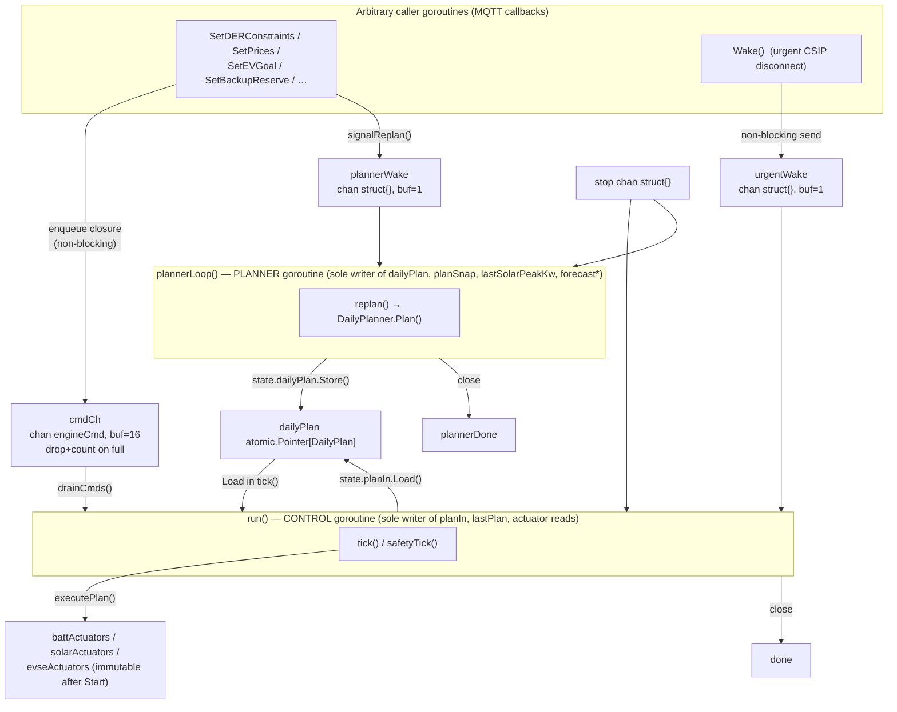

Two long-lived goroutines are launched by `Start` and nothing else:

```go
// engine.go:463
func (e *Engine) Start() {
	e.started.Store(true)
	// Apply any commands enqueued before Start … here, on the calling goroutine,
	// while nothing else can be draining cmdCh …
	e.drainCmds()
	go e.run()
	go e.plannerLoop()
}
```

### The core structs

`Engine` (`engine.go:95`) holds the wiring and the atomic publish slots; all
*mutable* control-path state lives in `engineState` (`engine_state.go:23`). The
load-bearing fields:

```go
// engine.go:95
type Engine struct {
	reader    SystemReader
	optimizer Optimizer
	interval  time.Duration

	safety         SafetyEvaluator   // non-nil only if optimizer implements it
	safetyReader   SafetyReader
	safetyInterval time.Duration

	state *engineState

	started atomic.Bool           // guards actuator registries; panic after Start

	cmdCh      chan engineCmd      // buffered(16) mutation queue
	cmdDropped atomic.Uint64       // count of dropped-on-full commands

	planner     *DailyPlanner
	plannerWake chan struct{}      // buffered(1): poke the planner

	planObserver func(Plan)

	stop        chan struct{}
	stopOnce    sync.Once          // the ONE sync primitive — makes Stop idempotent
	done        chan struct{}
	plannerDone chan struct{}
	urgentWake  chan struct{}      // buffered(1): poked by Wake()

	forecastSource      atomic.Value  // string, written by planner goroutine
	forecastAgeSecs     atomic.Int64
	effectiveReservePct atomic.Uint64 // float64 bits (math.Float64bits)
}
```

Note `stopOnce sync.Once` is the *only* `sync` type in the Engine — and it
guards shutdown, not shared control state.

```go
// engine_state.go:23
type engineState struct {
	// Immutable after Start (Register*Actuator writes, executePlan reads).
	battActuators  map[string]BatteryActuator
	solarActuators map[string]SolarActuator
	evseActuators  map[string]EVSEActuator

	planIn    atomic.Pointer[plannerInput]  // writer: run(); reader: replan()
	dailyPlan atomic.Pointer[DailyPlan]      // writer: replan(); reader: tick()
	planSnap  atomic.Pointer[PlanSnapshot]   // writer: replan(); reader: any
	lastPlan  atomic.Pointer[Plan]           // writer: tick(); reader: any

	lastSolarPeakKw float64  // writer AND sole reader: replan() — no atomic needed
}
```

`engineCmd` is just a closure applied on the writer goroutine:

```go
// engine_state.go:13
type engineCmd func(*engineState)
```

#### Who writes what state, and from which goroutine

| State | Type | Sole writer | Read by | Mechanism |
|---|---|---|---|---|
| `battActuators`/`solarActuators`/`evseActuators` | `map` | `Register*Actuator` (init, before `Start`) | `executePlan` (control) | Immutable-after-`Start`; direct read, no lock |
| `planIn` | `atomic.Pointer` | control goroutine `run()`→`drainCmds`→`setPlanIn` | planner `replan()` | RMW on writer only, atomic publish |
| `dailyPlan` | `atomic.Pointer` | planner `replan()` | control `tick()` | atomic publish/consume |
| `planSnap` | `atomic.Pointer` | planner `replan()` | any caller (`DailyPlanSnapshot`) | atomic publish |
| `lastPlan` | `atomic.Pointer` | control `tick()` | any caller (`LastPlan`) | atomic publish |
| `lastSolarPeakKw` | plain `float64` | planner `buildPlannerParams` | planner only | single goroutine ⇒ no sync |
| `forecastSource`/`forecastAgeSecs`/`effectiveReservePct` | `atomic.Value`/`Int64`/`Uint64` | planner `buildPlannerParams` | any caller | atomic publish |
| `cmdDropped` | `atomic.Uint64` | `enqueue` (any goroutine) | any caller (`CmdDropped`) | atomic add |
| `started` | `atomic.Bool` | `Start` (once) | `mustNotBeStarted` | atomic |
| `expGuard`/`impGuard`/`lastBattCmd`/`battDrainTicks` | plain fields on `DefaultOptimizer` | control goroutine (`Optimize`/`EvaluateSafety`) | same | single goroutine ⇒ no sync |
| `costModelOverride` | `atomic.Pointer` | `SwapCostModel` (any goroutine) | control (`costModel()`) | atomic |

The critical row is `lastSolarPeakKw`: it is a **bare `float64`, not an atomic**,
and that is *correct* because `buildPlannerParams` (its only reader and writer)
runs solely on the planner goroutine (`engine_state.go:61`). This is the payoff
of single-writer discipline — state touched by one goroutine needs no
synchronization at all.

### The channels

Five channels, each with a deliberate buffer size and single semantics:

```go
// engine.go:254 (in New)
cmdCh:       make(chan engineCmd, 16),
plannerWake: make(chan struct{}, 1),
// engine.go:260
stop:        make(chan struct{}),
done:        make(chan struct{}),
plannerDone: make(chan struct{}),
urgentWake:  make(chan struct{}, 1),
```

**`cmdCh` (buffered 16) is lossy by design.** Any caller may mutate planner
inputs; they never block and they never lock. The whole mutator surface is one
idiom — enqueue a closure, poke the planner:

```go
// engine.go:295
func (e *Engine) SetPrices(importPrices, exportPrices []float64) {
	e.enqueue(func(s *engineState) {
		s.setPlanIn(func(in *plannerInput) {
			in.importPrices = importPrices
			in.exportPrices = exportPrices
		})
	})
	e.signalReplan()
}
```

The overflow path — **drop and count, never block** — is verbatim:

```go
// engine_state.go:112
func (e *Engine) enqueue(cmd engineCmd) {
	select {
	case e.cmdCh <- cmd:
	default:
		n := e.cmdDropped.Add(1)
		log.Printf("[orchestrator] command channel full; dropping mutation (dropped=%d total)", n)
	}
}
```

A full `cmdCh` means the control goroutine is not keeping up, which "shouldn't
happen at any real tick cadence — the channel is drained immediately before every
tick." Blocking instead would let a stuck MQTT callback wedge the control loop
(the exact anti-pattern this design forbids). The drop count is mirrored to a
Prometheus counter by `cmd/hub` (`main.go:771`).

The single consumer drains without blocking, applying each closure in order:

```go
// engine_state.go:126
func (e *Engine) drainCmds() {
	for {
		select {
		case cmd := <-e.cmdCh:
			cmd(e.state)
		default:
			return
		}
	}
}
```

`drainCmds` runs *only* on the control goroutine — from `Start` (before the
goroutines launch) and from `run()` immediately before every tick — which is what
makes `setPlanIn`'s read-modify-write race-free even though `SetPrices` is called
concurrently:

```go
// engine_state.go:95
func (s *engineState) setPlanIn(fn func(*plannerInput)) {
	next := s.planInSnapshot() // Load current
	fn(&next)                  // mutate the COPY
	s.planIn.Store(&next)      // publish new immutable snapshot
}
```

**`plannerWake` and `urgentWake` (both buffered 1)** are coalescing signals. A
`select`/`default` send means "at most one pending wake" — a burst of ten price
updates collapses to one replan:

```go
// engine.go:454
func (e *Engine) Wake() {
	select {
	case e.urgentWake <- struct{}{}:
	default: // wake already pending; don't block
	}
}
```

**`stop`/`done`/`plannerDone`** are the lifecycle handshake. `Stop` closes `stop`
once (via `stopOnce`) and waits for both goroutines to close their done channels:

```go
// engine.go:476
func (e *Engine) Stop() {
	e.stopOnce.Do(func() { close(e.stop) })
	<-e.done
	<-e.plannerDone
}
```

### The two goroutines and their for-select loops

**`run()` — the control goroutine.** It owns the single ticker and is the sole
writer of `planIn` and `lastPlan`:

```go
// engine.go:494
func (e *Engine) run() {
	defer close(e.done)

	base := e.interval
	econEvery := 1
	fastLoop := e.safety != nil && e.safetyReader != nil &&
		e.safetyInterval > 0 && e.safetyInterval < e.interval
	if fastLoop {
		base = e.safetyInterval
		econEvery = int(math.Round(float64(e.interval) / float64(e.safetyInterval)))
		if econEvery < 1 {
			econEvery = 1
		}
	}

	ticker := time.NewTicker(base)
	defer ticker.Stop()

	e.drainCmds()
	e.tick() // evaluate immediately so devices get a first control

	n := 0
	for {
		select {
		case <-e.stop:
			return
		case <-e.urgentWake:
			e.drainCmds()
			e.tick()
			ticker.Reset(base) // skip the tick that would fire after the forced one
			n = 0
		case <-ticker.C:
			e.drainCmds()
			n++
			if !fastLoop || n >= econEvery {
				n = 0
				e.tick()
			} else {
				e.safetyTick()
			}
		}
	}
}
```

**`plannerLoop()` — the planner goroutine.** Sole writer of `dailyPlan`,
`planSnap`, and the forecast atomics; sole reader of `planIn`. It runs
independently so the ~350 ms DP never stalls the control tick:

```go
// engine.go:573
func (e *Engine) plannerLoop() {
	defer close(e.plannerDone)
	interval := time.Duration(e.plannerCfg.ReplanIntervalS) * time.Second
	if interval <= 0 {
		interval = 15 * time.Minute
	}
	ticker := time.NewTicker(interval)
	defer ticker.Stop()

	e.replan() // plan immediately on startup

	for {
		select {
		case <-e.stop:
			return
		case <-e.plannerWake:
			e.replan()
			ticker.Reset(interval)
		case <-ticker.C:
			e.replan()
		}
	}
}
```

The two goroutines communicate *only* through atomics: `run()` publishes `planIn`
that `plannerLoop()` reads (`e.state.planInSnapshot()`), and `plannerLoop()`
publishes `dailyPlan` that `run()` reads (`e.state.dailyPlan.Load()`). No lock is
shared because neither ever writes what the other writes.

### The two-loop tick model (ADR-0001, Tier-0/Tier-1)

There is exactly **one ticker**, running at the *fast* cadence `base =
safetyInterval` when a fast loop is wired. Every Nth tick
(`econEvery = round(interval/safetyInterval)`) is a full economic `tick()`; the
rest are cheap `safetyTick()`s. The safety pass reads a cheap snapshot, evaluates
immediate reflexes, and touches nothing economic:

```go
// engine.go:545
func (e *Engine) safetyTick() {
	state, err := e.safetyReader.ReadSafetyState()
	if err != nil {
		log.Printf("[orchestrator] safety: read state error: %v", err)
		return
	}
	plan := e.safety.EvaluateSafety(state)
	if len(plan.BatteryCommands) == 0 && len(plan.SolarCommands) == 0 && len(plan.EVSECommands) == 0 {
		return // nothing to protect against this tick
	}
	if e.planObserver != nil {
		e.planObserver(plan)
	}
	e.executePlan(plan)
	if len(plan.Decisions) > 0 {
		e.logPlan(state, plan)
	}
}
```

Because both `tick()` and `safetyTick()` run on the same goroutine, the optimizer
carries **unsynchronized per-tick state** — hysteresis guards, debounce counters,
`lastBattCmd` — with no lock (`interfaces.go:5`, `optimizer.go:180`).

**Wall-clock scaling.** The optimizer's breach/debounce thresholds are expressed
in ticks but must mean a *constant wall-clock duration* whether the bench runs
FAST (3 s) or STOCK (15 s). `SetTickInterval` records the cadence and `scaleTicks`
rescales any tuned-tick constant:

```go
// optimizer.go:234
func (o *DefaultOptimizer) scaleTicks(ticks int) int {
	if o.tickInterval <= 0 || o.tickInterval == tunedTickInterval {
		return ticks // tests / fast mode: bit-identical to the raw constant
	}
	hold := time.Duration(ticks) * tunedTickInterval
	n := int(math.Round(hold.Seconds() / o.tickInterval.Seconds()))
	if n < 2 {
		n = 2 // preserve single-glitch tolerance
	}
	return n
}
```

The constraint package mirrors this exactly in `Session.ScaleTicks`
(`session.go:57`) — the comment warns "do not 'improve' the rounding," because
FAST/STOCK equivalence of every migrated threshold depends on the two staying
byte-identical.

### The lock-free read path

Two things make reads lock-free. First, **atomic snapshot publish/consume**:
`tick()` stores an immutable `*Plan`; `LastPlan()` loads it:

```go
// engine.go:933  (inside tick)
e.state.lastPlan.Store(&plan)

// engine.go:943
func (e *Engine) LastPlan() Plan {
	if p := e.state.lastPlan.Load(); p != nil {
		return *p
	}
	return Plan{}
}
```

Second, **the actuator maps are immutable after `Start`**, so `executePlan` reads
them directly with no lock and no snapshot copy:

```go
// engine.go:968
func (e *Engine) executePlan(plan Plan) {
	for _, cmd := range plan.BatteryCommands {
		a, ok := e.state.battActuators[cmd.Name]  // direct map read, no lock
		if !ok { /* … */ continue }
		if err := a.ApplyBatteryCommand(cmd); err != nil { /* … */ }
	}
	// … solar, evse …
}
```

Immutability is *enforced*: registration after `Start` panics.

```go
// engine_state.go:166
func (e *Engine) mustNotBeStarted(who string) {
	if e.started.Load() {
		panic(fmt.Sprintf("orchestrator: %s called after Start; actuators must be registered before Start", who))
	}
}
```

The panic is deliberate. A previous version allowed hot-plug registration under
`actuMu`; no caller used it, and it "was the one thing standing in the way of
dropping `actuMu` entirely" (`engine_state.go:158`). Trading a never-used feature
for a lock-free execute path is the core bargain of this file.

### The key interfaces

The Engine is generic over four small interfaces (`interfaces.go`):

```go
// interfaces.go:9
type Optimizer interface {
	Optimize(state SystemState) Plan
}
// interfaces.go:15
type SystemReader interface {
	ReadSystemState() (SystemState, error)
}
// interfaces.go:25 — OPTIONAL extension; type-asserted in New()
type SafetyEvaluator interface {
	EvaluateSafety(state SystemState) Plan
}
// interfaces.go:33 — OPTIONAL cheap snapshot for the fast loop
type SafetyReader interface {
	ReadSafetyState() (SystemState, error)
}
```

Actuators are registered by name and looked up per command:

```go
// interfaces.go:38
type BatteryActuator interface{ ApplyBatteryCommand(cmd BatteryCommand) error }
type SolarActuator   interface{ ApplySolarCommand(cmd SolarCommand) error }
type EVSEActuator    interface{ ApplyEVSECommand(cmd EVSECommand) error }
```

`PlanObserver` is a `func(Plan)` on `Config` (`engine.go:239`), called before
actuation and "must not block" — `cmd/hub` uses it to forward compliance breaches
northbound.

The constraint subpackage defines the second-generation controller as a ladder
of `Constraint`s arbitrated by `Resolve`:

```go
// constraint/constraint.go:171
type Constraint interface {
	Name() string
	Tier() Tier
	Evaluate(in Input, s *Session) ([]Demand, *orchestrator.ComplianceBreach)
}
```

with two optional capability interfaces the `Stack` type-asserts:

```go
// constraint/stack.go:55
type postArbiter interface {
	Constraint
	PostArbitrate(in Input, s *Session, plan *orchestrator.Plan)
}
// constraint/stack.go:64
type fastSafetyEvaluator interface {
	EvaluateFast(state orchestrator.SystemState) []Demand
}
```

### The optimizer cascade (DefaultOptimizer.Optimize)

The authoritative optimizer is a strictly ordered rule cascade. Each rule threads
a mutable copy of `batteries` so later rules see earlier setpoints. The ordering
and early-return structure, condensed:

```go
// optimizer.go:325
func (o *DefaultOptimizer) Optimize(state SystemState) Plan {
	// … now := …; plan := Plan{Timestamp: now}

	// Rule 1: CSIP disconnect — highest priority, ALWAYS early-return.
	if csipDisconnectRule(state.CSIPControl, state, &plan) {
		return plan
	}

	limits := deriveGridConstraints(state.Grid, state.CSIPControl)
	solarW, batteryW, evseW, surplusW := computePowerBalance(state)
	// … copy batteries so rules see prior setpoints …

	// Rule 2: CSIP fixed dispatch (OpModFixedW).
	batteries = applyFixedDispatchRule(state.CSIPControl, batteries, solarW, homeLoadW, o.SOCReserve, &plan)

	// Rule 2.5: follow the 24-hour DP plan (unless CSIP mandated fixed dispatch).
	planFollowed := false
	if state.CSIPControl == nil || state.CSIPControl.Base.OpModFixedW == nil {
		batteries, surplusW, planFollowed = applyPlanRule(state.DailyPlanTarget, batteries, state.EVSEs, o.SOCReserve, o.SOCFullThreshold, surplusW, &plan)
	}

	// Rule 3: export limit (battery → EV → curtail). ALWAYS runs.
	batteries, surplusW = o.applyExportLimitRule(state.Solar, state.EVSEs, evseW, limits, state.Grid.NetW, o.SOCFullThreshold, surplusW, batteries, &plan)
	o.checkExportLimitConvergence(limits.exportLimitW, state.Grid.NetW, &plan)

	// Rule 3.1: generation limit (curtail inverters ≤ MaxLimW).
	applyGenLimitRule(state.Solar, limits.maxLimitW, &plan)
	o.checkGenLimitConvergence(state.Solar, state.Batteries, state.Grid.NetW, limits.maxLimitW, &plan)

	// Rule 3.5: import limit (discharge battery).
	batteries = o.applyImportLimitRule(batteries, limits, state.Grid.NetW, o.SOCReserve, &plan)
	o.checkImportConvergence(limits.importLimitW, state.Grid.NetW, &plan)

	if !planFollowed {
		// Rule 4: self-consumption; Rule 5: TOU peak discharge; Rule 6: EV allocation.
		batteries, surplusW = applySelfConsumptionRule(...)
		// … isPeak := cm.IsPeakHour(serverNow) …
		batteries, surplusW = applyDemandResponseRule(...)
		applyEVChargingRule(...)
	}

	// Final: restore uncommanded devices; battery-safety backstop.
	applyRestoreRule(state.Solar, batteries, o.SOCReserve, solarCapActive, &plan)
	o.checkBatterySafety(state.Batteries, &plan)  // force-disconnect a mis-behaving pack

	// … stamp Breach.MRID + blanket-stamp every command's MRID from state.CSIPControl …
	// … record commanded setpoints into o.lastBattCmd for EvaluateSafety …
	return plan
}
```

The safety backstop and the fast-loop share one predicate. `criticalBatteryInversion`
is the act-now case (charge commanded but discharging near reserve), used both by
the debounced economic `checkBatterySafety` (`optimizer.go:1618`) and the
stateless fast-loop `EvaluateSafety`:

```go
// optimizer.go:1567
func criticalBatteryInversion(powerW, soc, socReserve float64, chargeCommanded bool) bool {
	return chargeCommanded && powerW > complianceBreachW &&
		!math.IsNaN(soc) && soc <= socReserve+5
}

// optimizer.go:1595
func (o *DefaultOptimizer) EvaluateSafety(state SystemState) Plan {
	plan := Plan{Timestamp: state.Timestamp, Safety: true}
	empty := &Plan{} // no fresh economic plan on the fast tick
	for _, b := range state.Batteries {
		if !b.Connected { continue }
		chargeCommanded := o.chargeCommandedFor(b.Name, empty) // falls back to o.lastBattCmd
		if !criticalBatteryInversion(b.PowerW, b.SOC, o.SOCReserve, chargeCommanded) {
			continue
		}
		f := false
		plan.BatteryCommands = append(plan.BatteryCommands, BatteryCommand{Name: b.Name, SetpointW: 0, Connect: &f})
		// … AddDecision("safety/battery-direction-fast", …) …
	}
	return plan
}
```

`EvaluateSafety` is stateless (no debounce) and reads `o.lastBattCmd` — written by
`Optimize` on the same goroutine — so a fast tick between two economic ticks can
tell a measured discharge contradicts the last commanded charge without any lock.

### The constraint stack: demands → arbiter → commands

The candidate `Stack` (currently shadow/gateway-wired, `stack.go:23`) composes
constraints instead of cascading rules. Each constraint emits `Demand`s — *bounds,
not commands* — on `(Device, Axis)`; the arbiter intersects them with strict tier
priority. `Stack.Optimize` is evaluate → arbitrate → emit → post-arbitrate:

```go
// stack.go:133
func (s *Stack) Optimize(state orchestrator.SystemState) orchestrator.Plan {
	// … plan := Plan{Timestamp: now} …
	in := Input{State: state, Plant: s.plant, TickSeconds: s.tickSeconds()}

	var demands []Demand
	var post []postArbiter
	for _, c := range s.constraints {
		if pa, ok := c.(postArbiter); ok {  // battery safety authors AFTER the arbiter
			post = append(post, pa)
			continue
		}
		ds, breach := c.Evaluate(in, s.session(c))
		demands = append(demands, ds...)
		if breach != nil { recordBreach(&plan, breach) }
	}

	desired := Resolve(demands)   // the arbiter
	emitCommands(&plan, desired)

	// FIX-F: snapshot per-axis authorship BEFORE the post pass …
	authors := make(map[string]string, len(desired))
	for dev, d := range desired {
		for axis, src := range d.Authors {
			if src != "" { authors[axisKey(dev, axis)] = src }
		}
	}
	for _, pa := range post {
		before := snapshotBatteryCommands(plan.BatteryCommands)
		pa.PostArbitrate(in, s.session(pa), &plan)
		attributePostArbiterAuthorship(before, plan.BatteryCommands, pa.Name(), authors)
	}
	s.lastAuthors = authors
	// … blanket-stamp MRID …
	return plan
}
```

The arbiter (`Resolve`, `arbiter.go:77`) buckets demands per `(Device, Axis)`,
sorts SAFETY→COMPLIANCE→ECONOMICS, and folds. The **narrowing-only** invariant is
structural: each demand *intersects* the running interval, so a lower tier can
only shrink what a higher tier set — economics can never relax a compliance cap.
The cross-tier fold in `resolveInterval` (`arbiter.go:160`) also credits, tier by
tier, whichever tier last *tightened* the surviving `Max` bound — that is the
**per-axis single-author** result surfaced as `Desired.Authors`:

```go
// arbiter.go:180
newLo := math.Max(accLo, tierLo)
newHi := math.Min(accHi, tierHi)
if newLo <= newHi {
	if newHi < accHi || (newHi == accHi && newLo > accLo) {
		author = tierAuthor  // this tier actually narrowed the axis → it authors it
	}
	accLo, accHi = newLo, newHi
	continue
}
// lower tier infeasible inside the higher-tier interval → higher tier wins, record a Conflict
```

`Connect` resolves separately — `false` (disconnect) always wins (`arbiter.go:299`).
`emitCommands` (`stack.go:275`) walks devices in sorted order (byte-reproducible
for shadow diffing) and fans each resolved axis onto the correct command class.

### The shadow Wrapper: run both, diff, latch, compose

`Wrapper` (`shadow.go:231`) runs the legacy optimizer *and* the candidate `Stack`
on the same `SystemState` every tick, diffs their outputs under tolerance bands,
and — in the default (shadow) mode — returns the **legacy plan unmodified**:

```go
// shadow.go:396
func (w *Wrapper) Optimize(state orchestrator.SystemState) orchestrator.Plan {
	legacy := w.legacy.Optimize(state)

	if len(w.active) == 0 {              // pure shadow: observe & discard candidate
		if atomic.LoadUint32(&w.latched) == 0 {
			w.observeCandidate(state, legacy)
		}
		return legacy
	}
	if atomic.LoadUint32(&w.latched) == 1 {   // candidate previously panicked
		atomic.AddUint64(&w.activeFallback, 1)
		return legacy
	}
	candidate, ok := w.runCandidate(state)    // under a recover() latch
	if !ok {
		atomic.AddUint64(&w.activeFallback, 1)
		return legacy
	}
	authors := candidateAuthors(w.candidate)
	composed := w.compose(legacy, candidate, authors)
	w.compare(state, legacy, candidate, "", authors)
	return composed
}
```

Three concurrency-relevant properties:

1. **Panic latch (WS-5.1).** The candidate runs under `recover()`
   (`runCandidate`, `shadow.go:439`); the first panic sets `latched` atomically
   and permanently disables candidate observation — "a panic anywhere in the
   candidate stack must never kill the process controlling hardware"
   (`tripLatch`, `shadow.go:507`).
2. **Atomic counters only.** All wrapper diff/debounce/rate-limit state is
   single-goroutine (control loop) and unsynchronized; *only* the divergence
   counters (`count`, `safetyCount`, `panics`, `axisCounts sync.Map`) are atomic,
   because a metrics scrape reads them from another goroutine (`shadow.go:47`).
3. **Per-axis divergence + active composition.** `compare` (`shadow.go:526`) runs
   per-axis diffs (`diffSolar`/`diffBattery`/`diffEVSE`/`diffBreach`) and, in
   active mode, `compose` (`shadow.go:650`) overwrites only the axes an *active*
   constraint authored this tick (via `Stack.AxisAuthors`), dropping legacy's
   write and counting it in `legacyDropped`. Battery setpoint and connect compose
   **independently** (`composeBatteryAxes`, `shadow.go:705`) — one active
   constraint can own a pack's setpoint while another owns its connect.

### The DailyPlanner DP

`DailyPlanner` holds **no mutable state** (`planner.go:205`) — `Plan` is a pure
function, safe for concurrent use, which is why the planner goroutine can call it
freely. It solves a 288-slot (24 h / 5 min) dynamic program over discretized
battery-SOC × EV-SOC state, minimizing total electricity cost subject to SOC
bounds, EV departure target, and DER constraints. The state at each slot is
`(battLevelIdx, evLevelIdx)`; the DP table is `dp[nBatt][nEV]` of cost-to-here,
double-buffered with `dpNext`:

```go
// planner.go:262
dp := makeDP2D(nBatt, nEV, inf)
dpNext := makeDP2D(nBatt, nEV, inf)
// … seed dp[iBatt0][iEV0] = 0 …
```

Transition tables (`battDest`/`battEffKw`/`evDest`) are **precomputed once** before
the time loop — destination SOC indices depend only on `(level, action)`, not on
`t` — turning the innermost transition into O(1) (`planner.go:317`). The forward
pass costs each `(battKw, evKw)` action against the all-in import or export price,
enforcing export/import/generation caps by *skipping* infeasible transitions:

```go
// planner.go:445
gridKw := loadKw + evKw - solarKw - battKwEff   // + import, − export
if !math.IsNaN(c.ExpLimW) && -gridKw > c.ExpLimW/1000+1e-6 { continue }
if !math.IsNaN(c.ImpLimW) && gridKw > c.ImpLimW/1000+1e-6 { continue }
// … MaxLimW generation cap …
var stepCost float64
if gridKw > 0 {
	stepCost = gridKw * planStepHours * impPrice
} else {
	stepCost = gridKw * planStepHours * expPrice
}
if nc := cost0 + stepCost; nc < dpNext[ni][nj] {
	dpNext[ni][nj] = nc
	back[t][ni][nj] = backNode{src: [2]int16{int16(i), int16(j)}, cmd: [2]int16{int16(bi), int16(ci)}}
}
```

A soft terminal penalty (`100 $/kWh` per kWh below `TerminalSocKwh`,
`planner.go:509`) keeps the battery from ending below reserve while always leaving
a feasible answer. Backtracking (`planner.go:536`) walks `back[t]` to fill the 288
`PlanInterval`s, using the **snapped effective power** (`battEffKw`) not the raw
command so the plan books only the energy the SOC state actually moved.

The published result flows back to the control loop through `replan()`
(`engine.go:599`): it reads state, snapshots `planIn`, builds params, runs the DP,
and `Store`s both `dailyPlan` and the richer `planSnap` — all on the planner
goroutine, so storing freshly-built slices is race-free:

```go
// engine.go:634
e.state.dailyPlan.Store(plan)
e.state.planSnap.Store(&PlanSnapshot{ Plan: plan, ForecastKw: params.SolarForecastKw, /* … */ })
```

### One full tick, end-to-end

A single economic tick (`tick()`, `engine.go:895`), with the actual call chain:

1. `run()` receives `<-ticker.C` (`engine.go:526`) → `drainCmds()`
   (`engine_state.go:126`) applies any queued `engineCmd`s, so a `SetPrices` from
   an MQTT callback lands *now*, before optimization. `n >= econEvery` selects the
   full `tick()`.
2. `tick()` → `e.reader.ReadSystemState()` (`engine.go:897`) — the sole read of
   live device state this tick (cmd/hub's `MQTTSystemReader`, which also resolves
   `CSIPControl` and `ClockOffset`).
3. **Inject the plan target at server time** (`engine.go:918`):
   `dp := e.state.dailyPlan.Load()`; `serverTime := state.Timestamp + ClockOffset`;
   `state.DailyPlanTarget = dp.CurrentTarget(serverTime)` — an *atomic Load* of the
   plan the planner goroutine published, no lock.
4. `plan := e.optimizer.Optimize(state)` (`engine.go:923`). In production the
   `optimizer` is actually the mode manager wrapping either `DefaultOptimizer` or
   the shadow `Wrapper` (`main.go:733`), but the interface is `Optimize`. The
   cascade / stack runs entirely on this goroutine.
5. `if e.planObserver != nil { e.planObserver(plan) }` (`engine.go:927`) — forwards
   breaches northbound *before* actuation.
6. `e.executePlan(plan)` (`engine.go:930` → `:968`) — direct map lookups into the
   immutable actuator registries, calling `ApplyBatteryCommand` / `ApplySolarCommand`
   / `ApplyEVSECommand`.
7. `e.state.lastPlan.Store(&plan)` (`engine.go:933`) — atomic publish for
   `/status` readers.
8. `logPlan` if there are decisions (`engine.go:936`).

Meanwhile `plannerLoop()` is on its own cadence; when a `SetPrices` also poked
`plannerWake`, `replan()` recomputes the DP and `Store`s a new `dailyPlan` that the
*next* `tick()` will `Load`. The two never block each other.

### Gotchas for anyone editing this

- **Do not register actuators after `Start`.** `RegisterBatteryActuator` (and its
  siblings) panic via `mustNotBeStarted` (`engine_state.go:166`). The panic is the
  contract that keeps the actuator maps immutable and the execute path lock-free —
  do not "helpfully" make it tolerate late registration.
- **Do not add a mutex.** If two goroutines seem to need one, you have violated
  single-writer discipline. Find the field, confirm its one writer
  (`engine_state.go` doc comments), and route cross-goroutine mutations through
  `cmdCh`/`enqueue` instead. The only legitimate `sync` type here is `stopOnce`.
- **`cmdCh` is lossy by design.** A full channel drops the command and increments
  `cmdDropped` (`engine_state.go:112`). Never change `enqueue` to block — that
  re-opens the MQTT-callback wedge the whole design exists to prevent. If drops
  appear in prod, the control goroutine is starving, not the channel being too
  small.
- **`setPlanIn` must run only on the control goroutine.** Its read-modify-write
  (`engine_state.go:95`) is race-free *only* because it is applied inside an
  `engineCmd` by `drainCmds`. Never call it from a mutator directly.
- **Keep the clock consistent.** The DP window, `Optimize`'s TOU evaluation, and
  `CurrentTarget` all use `state.Timestamp + ClockOffset`. If you add a
  time-dependent decision, use server time (`engine.go:919`, `buildPlannerParams`
  `engine.go:671`), never `time.Now()` — a replay warps the utility clock.
- **`lastSolarPeakKw` is intentionally a bare `float64`.** It is touched only by
  the planner goroutine (`engine_state.go:61`). Do not read it from another
  goroutine; if you must, promote it to an atomic and update the writer/reader
  table.
- **The optimizer's guard state is single-goroutine, not thread-safe.** `expGuard`,
  `impGuard`, `lastBattCmd`, `battDrainTicks` (`optimizer.go`) are shared between
  `Optimize` and `EvaluateSafety` *only because both run on the control goroutine*.
  Do not call either from elsewhere (`interfaces.go:5`).
- **Preserve FAST/STOCK tick scaling.** Any new tick-count threshold must go
  through `scaleTicks` (`optimizer.go:234`) / `Session.ScaleTicks`
  (`session.go:57`), and the two implementations must stay byte-identical
  (`TestScaleTicks_ParityWithOptimizer`).
- **The shadow `Wrapper` must fail toward legacy.** Any new candidate code path
  must stay inside the `recover()` latch (`shadow.go:439`) and must never actuate
  in shadow mode — `Optimize` returns the legacy plan unmodified unless an axis is
  explicitly `active`. A tripped `Latched()` or nonzero `ActiveFallbacks()` fails
  the soak gate; treat them as blockers, not warnings.

---

## IX-B — Northbound & the wolfSSL cgo Boundary

This section traces one CSIP discovery walk from the top of the hub's northbound stack down through the single cgo binding and back, and documents the seams a junior engineer must respect when touching any of it. Everything below is read from `/home/dmitri/projects/lexa-hub` at commit `d6ac263`. The through-line to hold onto: **cgo is quarantined behind one interface and one package**, and two protocol invariants (the cipher pin and the XML namespace) are enforced *in code*, not by convention.

### 1. The seam: `discovery.Fetcher`

The walker never imports `wolfssl`, never sees an `unsafe.Pointer`, and never links the wolfSSL sysroot. It depends on exactly one method:

```go
// internal/northbound/discovery/walker.go:44
type Fetcher interface {
	// Get performs an HTTPS GET on the given path and returns the raw XML body.
	// The path is always relative (e.g., "/edev/0/fsa"), not an absolute URL.
	Get(ctx context.Context, path string) ([]byte, error)
}
```

That one-method interface is the whole abstraction. The walker is constructed with *some* `Fetcher` and stores it as a field (`walker.go:119-133`):

```go
// internal/northbound/discovery/walker.go:119
type Walker struct {
	fetcher Fetcher
	lfdi    string // our LFDI, used to find our EndDevice in the list
}

func NewWalker(f Fetcher, lfdi string) *Walker {
	return &Walker{fetcher: f, lfdi: strings.ToUpper(lfdi)}
}
```

Because the dependency is an interface, there are two implementations that satisfy it, and the walker cannot tell them apart:

**(a) The production cgo implementation — `tlsclient.WolfSSLFetcher`** (`internal/tlsclient/fetcher.go:18`). Its `Get` (`fetcher.go:232`) drives a real wolfSSL mTLS session.

**(b) The cgo-free test implementation — `mockFetcher`** (`internal/northbound/discovery/walker_test.go:18`). This is the "plain" fetcher: no TLS, no cgo, no sysroot. It serves pre-marshalled XML from a map:

```go
// internal/northbound/discovery/walker_test.go:35
func (m *mockFetcher) Get(ctx context.Context, path string) ([]byte, error) {
	m.getCalls = append(m.getCalls, path)
	r, ok := m.responses[path]
	if !ok {
		return nil, fmt.Errorf("404: no resource at %s", path)
	}
	return xml.Marshal(r)
}
```

There is a third (`blockingFetcher`, `walker_test.go:59`) whose `Get` hangs on `<-ctx.Done()` to prove cancellation unwinds a wedged walk. The payoff of the seam: the *entire* discovery/scheduler traversal is unit-testable with `go test` and `CGO_ENABLED=0`, on any machine, because the wolfSSL half is swapped out for a map lookup. cgo is a *deployment* concern of one leaf package, not a *testing* concern of the whole northbound.

### 2. The sole cgo binding — `internal/wolfssl`

Every line of C in this repo lives behind `internal/wolfssl/wolfssl.go`. The package doc states the contract (`wolfssl.go:1-13`): "This is the only package in the project that touches cgo directly." The preamble is deliberately tiny:

```go
// internal/wolfssl/wolfssl.go:15
/*
#cgo LDFLAGS: -lwolfssl
#include <wolfssl/options.h>
#include <wolfssl/ssl.h>
#include <stdlib.h>
*/
import "C"
```

**`Init` is process-global.** wolfSSL keeps library-global C state, so `wolfSSL_Init()` must run **exactly once per process, before any other call**. The binding makes a failure loud rather than silent:

```go
// internal/wolfssl/wolfssl.go:37
func Init() {
	if int(C.wolfSSL_Init()) != Success {
		panic("wolfSSL_Init failed")
	}
}
```

It panics because a failed crypto-library init is unrecoverable — there is no degraded mode. Production binaries call `Init` from `main()`; test binaries call it once in `TestMain`. Calling it per-connection, or from an `init()` inside a library package, is the bug this design guards against.

**The handle lifecycle** is a two-level hierarchy: one `CTX` (context: certs + cipher config, expensive, long-lived) parents many `SSL` sessions (per-connection, cheap). The binding exposes each C function as a typed Go wrapper that takes/returns an opaque `unsafe.Pointer`:

| Level | Create | Destroy | Notes |
|---|---|---|---|
| CTX | `NewClientCtx()` `:65` | `FreeCtx()` `:79` | nil-safe free |
| SSL | `NewSSL(ctx)` `:154` | `FreeSSL()` `:163` | nil-safe free |
| session | `Connect(ssl)` `:219` | `Shutdown(ssl)` `:262` | close-notify |

Two accessors read negotiated parameters back out of the handshake — these are the enforcement primitives for the cipher pin:

```go
// internal/wolfssl/wolfssl.go:270
func CipherName(ssl unsafe.Pointer) string { ... }  // wolfSSL_get_cipher_name
// :279
func Version(ssl unsafe.Pointer) string    { ... }  // wolfSSL_get_version
```

**`RequireClientCert` is the reason this binding exists at all.** wolfSSL's default is to accept an *unauthenticated* peer even with CAs loaded — mTLS is opt-in, and the upstream go-wolfssl wrapper doesn't expose the opt-in. This is a server-side call, but it belongs in the same binding:

```go
// internal/wolfssl/wolfssl.go:143
func RequireClientCert(ctx unsafe.Pointer) {
	C.wolfSSL_CTX_set_verify(
		(*C.WOLFSSL_CTX)(ctx),
		C.WOLFSSL_VERIFY_PEER|C.WOLFSSL_VERIFY_FAIL_IF_NO_PEER_CERT,
		nil,
	)
}
```

**`PeerCertificateDER`** (`:181`) is the cgo→Go memory hand-off you must get right. It borrows a C `X509*`, copies the DER out with `C.GoBytes` (which allocates a *Go* slice), and frees the C object — so no C memory escapes into Go's GC domain:

```go
// internal/wolfssl/wolfssl.go:181
func PeerCertificateDER(ssl unsafe.Pointer) []byte {
	x509 := C.wolfSSL_get_peer_certificate((*C.WOLFSSL)(ssl))
	if x509 == nil {
		return nil
	}
	defer C.wolfSSL_X509_free(x509)          // free the C object …
	var sz C.int
	der := C.wolfSSL_X509_get_der(x509, &sz)
	if der == nil || sz <= 0 {
		return nil
	}
	return C.GoBytes(unsafe.Pointer(der), sz) // … after copying into Go memory
}
```

That returned `[]byte` is exactly what `identity.FromCertificateDER` consumes (§6). The **cgo memory rule** to internalize: strings you pass *in* (`C.CString`) you must `C.free` (see `SetCipherList`, `wolfssl.go:91-98`, which `defer C.free`s every time); C objects you get *out* you must free with their matching C destructor; bytes you want to *keep* you copy into Go memory with `C.GoBytes`/`C.GoString` before freeing the C source.

### 3. The mTLS client and the cipher-pin invariant

`tlsclient.Client` (`client.go:40`) owns one `ctx` and, after `Dial`, one `ssl`:

```go
// internal/tlsclient/client.go:40
type Client struct {
	cfg  Config
	ctx  unsafe.Pointer      // wolfSSL CTX, built in New, freed in Free
	ssl  unsafe.Pointer      // per-connection, populated by Dial, cleared by Close
	conn net.Conn
	file *os.File
}
```

`New` (`client.go:53`) builds the CTX once — cipher list, CA, client cert, client key — using an `ok`-guarded `defer` so a half-built CTX is freed on any error (`client.go:63-68`). `Dial` (`client.go:93`) opens TCP, dups the fd, attaches wolfSSL to it, sets socket read/write timeouts (because Go's netpoller deadlines can't reach wolfSSL's blocking `read(2)` on the dup'd fd — `client.go:142-161`), and performs the handshake.

**The load-bearing block is the post-handshake re-verification** (`client.go:171-178`). wolfSSL's cipher *list* restricts what we *offer*; it does not guarantee what got *negotiated*. CSIP §5.2.1.1 mandates exactly one suite, so the client reads the negotiated values back and tears the session down if they don't match — verbatim:

```go
// internal/tlsclient/client.go:171
	if err := wolfssl.Connect(ssl); err != nil {
		return fmt.Errorf("TLS handshake: %w", err)
	}
	if wolfssl.CipherName(ssl) != DefaultCipherList || wolfssl.Version(ssl) != "TLSv1.2" {
		wolfssl.Shutdown(ssl)
		return fmt.Errorf("CSIP §5.2.1.1: negotiated %s/%s, want %s/TLSv1.2",
			wolfssl.Version(ssl), wolfssl.CipherName(ssl), DefaultCipherList)
	}
```

`DefaultCipherList` is a single constant, the one place the cipher is named (`config.go:7`):

```go
// internal/tlsclient/config.go:7
const DefaultCipherList = "ECDHE-ECDSA-AES128-CCM-8"
```

**Invariant #1 (cipher pin):** this string is compared, at runtime, against the negotiated cipher on every dial. Never change it, and never route around this check — it is the difference between "we asked for CCM-8" and "we are provably speaking CCM-8/TLS 1.2."

`Close` (`client.go:190`) does `Shutdown → FreeSSL`, clears `ssl`, and closes the fd/conn — leaving the CTX intact so the client can `Dial` again. `Free` (`client.go:209`) calls `Close` then `FreeCtx`. This split is the entire basis for keep-alive, next.

The response reader is cgo-adjacent but cgo-*free* in its core: `readResponse` (`client.go:279`) hands wolfSSL's `Read` to `httpwire.ReadHTTPResponse`, a leaf parser that imports nothing but the stdlib:

```go
// internal/tlsclient/httpwire/httpwire.go
func ReadHTTPResponse(read func([]byte) (int, error), maxHeader, maxBody int) ([]byte, error)
```

Keeping the header-loop / chunked-decoder / size-cap logic in a cgo-free package (`httpwire.go:1-4`) means the HTTP parser can be fuzzed on any machine without a wolfSSL sysroot — the same "quarantine cgo to a leaf" move as the `Fetcher` seam, applied one layer down.

### 4. `WolfSSLFetcher` keep-alive — one session across a whole walk

A discovery walk fetches ~15 resources. Opening a fresh TLS session per resource would be wasteful and would defeat CSIP's persistent-connection model, so `WolfSSLFetcher` holds **one** `*Client` for its lifetime and serializes access:

```go
// internal/tlsclient/fetcher.go:18
type WolfSSLFetcher struct {
	client *Client
	mu     sync.Mutex
}
```

`doGet` (`fetcher.go:159`) is the keep-alive core. It dials only if not already connected (`ensureDialed`, `:151`, which checks `f.client.ssl != nil`), reuses the live session, and on any I/O error **`Close`s and redials once** — note `Close`, not `Free`:

```go
// internal/tlsclient/fetcher.go:159
func (f *WolfSSLFetcher) doGet(path string) (*HTTPResponse, error) {
	if err := f.ensureDialed(); err != nil { ... }
	raw, err := f.client.Get(path)
	if err != nil {
		f.client.Close()               // drop the dead SESSION, keep the CTX
		if err2 := f.client.Dial(); err2 != nil { ... }
		raw, err = f.client.Get(path)
		...
	}
	...
	if resp.ConnClose {                // server sent Connection: close
		f.client.Close()              // pre-close so next call redials clean
	}
	return resp, nil
}
```

**"Never `Free()` mid-walk"** falls straight out of the `Close`/`Free` split in §3. `Close` destroys the per-connection `ssl` and lets `Dial` rebuild it against the *same CTX*. `Free` destroys the CTX itself — after which `New` would have to re-run (re-load certs, re-set the cipher list) to fetch anything. Calling `Free` between two resource fetches of one walk would throw away the loaded cert/cipher configuration and force a full CTX rebuild; the redial path deliberately uses `Close` so the expensive CTX survives every reconnect. `Free` is called in exactly two places: `WolfSSLFetcher.Free` (`fetcher.go:35`, end of life) and inside `Reload` on the *old* client after a swap.

**Cert rotation — probe-then-commit `Reload`** (`fetcher.go:124`). When a device cert is rotated, the fetcher must switch to a new session without ever exposing an unverified cert on the live path and without freeing the old session while a request could be in flight. The ordering is the whole point (`planReload`, `fetcher.go:78`): build the new client, `Dial` it, and *probe* it with a real GET to `/dcap` — a 200 proves the new cert is accepted at **both** the TLS layer (wrong-CA fails at `Dial`) and the CSIP application layer (a right-CA-but-unregistered device 200-handshakes then 403s). Only after the probe succeeds does `Reload` take the mutex, swap the pointer, and free the *old* client:

```go
// internal/tlsclient/fetcher.go:124
func (f *WolfSSLFetcher) Reload(newCfg Config, probePath string) error {
	newClient, err := New(newCfg)
	if err != nil { ... }
	if err := planReload(newClient, probePath); err != nil {  // dial+probe BEFORE lock
		return err                                            // failure: f untouched
	}
	f.mu.Lock()
	old := f.client
	f.client = newClient                                      // ownership transfer
	f.mu.Unlock()
	old.Free()                                                // Close→FreeSSL→FreeCtx
	return nil
}
```

On probe failure the new client is fully torn down and the error returned; `f` keeps running on its previous cert — "a failed rotation attempt costs nothing" (`fetcher.go:70`). Because every request path holds `f.mu` for its full duration, `old` is unreachable by any in-flight call by the time `old.Free()` runs.

One more contract worth internalizing: `Get` checks `ctx` **once**, after taking `f.mu` and before writing bytes (`fetcher.go:232-238`). It cannot interrupt an in-flight blocking `read(2)` — that's `SO_RCVTIMEO` territory, not `ctx` territory (`fetcher.go:215-231`). Cancellation granularity is therefore honestly "between fetches," which is exactly what the walker's doc promises.

### 5. `Walker.Discover` — link-driven traversal

The walk is **link-driven, not path-hardcoded**: the only literal URL is the `/dcap` entry point; every other path comes from a `*Link.Href` in a parsed resource (`walker.go:6-9`). `Discover` (`walker.go:157`) threads `ctx` and walks the tree in the CSIP-mandated order. The call skeleton, trimmed to the load-bearing sequence:

```go
// internal/northbound/discovery/walker.go:157
func (w *Walker) Discover(ctx context.Context, dcapPath string) (*ResourceTree, error) {
	tree := &ResourceTree{}

	dcap, err := w.fetchDeviceCapability(ctx, dcapPath)          // 1. GET /dcap
	tree.DeviceCapability = dcap

	if dcap.TimeLink != nil {
		tm, err := w.fetchTime(ctx, dcap.TimeLink.Href)         // 2. follow TimeLink
		tree.Time = tm
		tree.ClockOffset = tm.CurrentTime - time.Now().Unix()   // ← clock offset
	}

	edl, err := w.fetchEndDeviceList(ctx, dcap.EndDeviceListLink.Href) // 3. EndDeviceList
	self := w.findSelfDevice(edl)                               // match OUR LFDI
	if self == nil { return nil, fmt.Errorf("step 3: LFDI %s not found ...") }

	if self.DERListLink != nil {                                // 3b. DERList + per-DER
		derList, _ := w.fetchDERList(ctx, self.DERListLink.Href)
		for _, der := range derList.DER { /* cap/settings/status/avail — non-fatal */ }
	}

	fsaList, err := w.fetchFSAList(ctx, self.FunctionSetAssignmentsListLink.Href) // 4. FSA
	for i, fsa := range fsaList.FunctionSetAssignments {        // 5. per FSA → programs
		progList, _ := w.fetchDERProgramList(ctx, fsa.DERProgramListLink.Href)
		for _, prog := range progList.DERProgram {              // 6. per program
			// DefaultDERControl, DERControlList, ActiveDERControlList, DERCurveList
		}
	}
	// 7 pricing · 8 billing · 9 flow-reservation · MUP list
	return tree, nil
}
```

Two design points a junior engineer should note. First, the split between **fatal** and **non-fatal** links is deliberate: a missing `EndDeviceListLink` or an LFDI not found in the list aborts the walk (`walker.go:191-203`), but a per-DER `DERStatus` fetch that fails is logged and skipped (`walker.go:233-238`) — monitoring sub-resources must never block control. Second, `ClockOffset = tm.CurrentTime - time.Now().Unix()` (`walker.go:187`) is computed here and *only* here; the scheduler consumes it, never recomputes it.

**Invariant #2 (namespace `XMLName`).** Every fetch funnels through one function where HTTP meets XML:

```go
// internal/northbound/discovery/walker.go:546
func (w *Walker) fetchAndParse(ctx context.Context, path string, dest interface{}) error {
	if err := ctx.Err(); err != nil {                       // pre-check: don't start
		return fmt.Errorf("walk canceled at %s: %w", path, err)
	}
	body, err := w.fetcher.Get(ctx, path)                   // ← the Fetcher seam
	if err != nil {
		if ctxErr := ctx.Err(); ctxErr != nil {             // re-check: classify cancel
			return fmt.Errorf("walk canceled at %s: %w", path, ctxErr)
		}
		return fmt.Errorf("GET %s: %w", path, err)
	}
	if err := xml.Unmarshal(body, dest); err != nil {
		return fmt.Errorf("parse XML from %s: %w", path, err)
	}
	return nil
}
```

The safety here lives in the model types (`lexa-proto/csipmodel`), not this function: every 2030.5 root element carries `XMLName xml.Name` bound to `xmlns="urn:ieee:std:2030.5:ns"`. If a struct's `XMLName` namespace is wrong or missing, `xml.Unmarshal` **silently yields a zero-value struct** — no error, just empty fields — and the walk proceeds on garbage. This is why the CLAUDE.md invariants list flags it: a namespace typo doesn't crash, it quietly discovers nothing. The `fetchXxx` helpers (`walker.go:377-450`) are all two-liners over `fetchAndParse`, so this is the single choke point for both cancellation classification and namespace-safe unmarshal.

### 6. `identity.FromCertificateDER` — LFDI and SFDI

Device identity is a pure function of the certificate DER (`identity.go:55`). The LFDI is the leftmost 160 bits (20 bytes) of `SHA-256(DER)`; the SFDI is derived from the LFDI:

```go
// internal/northbound/identity/identity.go:55
func FromCertificateDER(der []byte) (LFDI, SFDI) {
	sum := sha256.Sum256(der)
	var lfdi LFDI
	copy(lfdi[:], sum[:20])              // leftmost 160 bits
	return lfdi, sfdiFromLFDI(lfdi)
}
```

The SFDI takes the leftmost **36 bits** of the LFDI (the first 5 bytes hold 40 bits, so the bottom 4 bits of byte 4 are dropped), treats them as a decimal integer, and appends a sum-of-digits checksum so the whole thing is divisible by 10:

```go
// internal/northbound/identity/identity.go:67
func sfdiFromLFDI(lfdi LFDI) SFDI {
	top := uint64(lfdi[0])<<28 | uint64(lfdi[1])<<20 |
		uint64(lfdi[2])<<12 | uint64(lfdi[3])<<4 | uint64(lfdi[4])>>4
	check := checksum(top)
	return SFDI(top*10 + uint64(check))
}
// :80
func checksum(n uint64) int {
	sum := 0
	for x := n; x > 0; x /= 10 { sum += int(x % 10) }
	return (10 - sum%10) % 10
}
```

The **known-answer test** pins this to the SunSpec worked example (`identity_test.go:26`): LFDI `3E4F45AB31…`, first 36 bits `0x3E4F45AB3` = 16726121139, digit sum 39, check digit 1, `wantSFDI = 167261211391`. `TestLFDIFromKnownDER` (`identity_test.go:46`) independently confirms LFDI = `upper(hex(sha256(der)[:20]))`. Note the input to this whole pipeline is the DER returned by `wolfssl.PeerCertificateDER` (§2) — the identity math is cgo-free, but its data originates at the cgo boundary.

### 7. `scheduler.Evaluate` — §12.3 resolution and fail-closed

The scheduler answers one question: *given the discovered programs and the current server time, what `DERControlBase` do I apply right now?* Signature and top-level flow (`scheduler.go:160`):

```go
// internal/northbound/scheduler/scheduler.go:160
func (s *Scheduler) Evaluate(programs []discovery.ProgramState, serverNow int64) *ActiveControl {
	resolved, programFound := s.resolve(programs, serverNow)
	return s.failClosed(resolved, programFound, discovery.HighestPriorityProgram(programs), serverNow)
}
```

`resolve` (`scheduler.go:170`) is the pure §12.3 precedence: pick the single **highest-priority program** (lowest primacy, mRID tiebreak — `helpers.go:30`); within it find an active event; else fall back to that program's `DefaultDERControl`. It does **not** merge across programs — absolute primacy (`scheduler.go:18-25`). `activeEvent` (`scheduler.go:346`) skips **cancelled** events (`CurrentStatus == 6`), applies **per-MRID randomization** (cached once so timing is stable across polls — `randomizedStart`/`randomizedDuration`, `:400`/`:427`), skips **superseded** events, and breaks ties by latest `CreationTime` then mRID:

```go
// internal/northbound/scheduler/scheduler.go:349
	for i := range ps.Controls.DERControl {
		ctrl := &ps.Controls.DERControl[i]
		if ctrl.EventStatus != nil && ctrl.EventStatus.CurrentStatus == 6 { continue } // cancelled
		start := s.randomizedStart(ctrl)
		end := start + s.randomizedDuration(ctrl)
		if !utilitytime.InWindow(start, end, serverNow) { continue }
		if ctrl.EventStatus != nil && ctrl.EventStatus.PotentiallySuperseded {
			if s.isSuperseded(ctrl, ps.Controls.DERControl, serverNow) { continue }
		}
		if best == nil || ctrl.CreationTime > best.CreationTime ||
			(ctrl.CreationTime == best.CreationTime && ctrl.MRID > best.MRID) {
			best = ctrl
		}
	}
```

**`failClosed`** (`scheduler.go:209`) is the safety heart. A transient/hostile discovery cycle must never *drop* a live safety cap. The rules, all verbatim in the function:

- **Valid resolved control** → adopt and store as `lastGood` — *except* the clock-regression guard (`:228`): if we resolved down to the *default* but `lastGood` is an unexpired, still-served *event*, the server clock merely stepped back before the event's start; hold the event rather than flap to default.
- **Malformed control** (implausible `OpModXxxLimW`, `plausibleControl`/`plausibleLimit` `:327`/`:337`, ceiling `maxPlausibleLimitW = 1e9`) → never adopt, hold `lastGood` marked `Held` + `ImplausibleReject` (`:243-249`).
- **`resolved == nil` with `programFound == true`** → explicit server clear, release (`:264-282`), unless the clock-regression guard says hold.
- **`resolved == nil` with `programFound == false`** (no programs at all — outage/empty) → hold `lastGood` fail-closed until its own `ValidUntil` (`:284-288`).

```go
// internal/northbound/scheduler/scheduler.go:284
	if s.lastGood != nil && !controlExpired(s.lastGood, serverNow) {
		held := *s.lastGood
		held.Held = true
		return &held
	}
	s.lastGood = nil     // nothing safe to hold — release
	return nil
```

The `Held` flag (not `Source`) carries the fail-closed signal upward so Response/MRID addressing is unaffected (`scheduler.go:66-72`). `run.RunOnce` reads it to emit the WARN and the implausible-reject metric (`run.go:299-311`).

### 8. `run.go` — monotonic-clock anchoring

The exposure `run.go` closes: fail-closed *holds* a control indefinitely across a WAN outage, and during that hold a **local wall-clock step** must not shift utility-time evaluation (GAP-04). The fix is to anchor a monotonic `utilitytime.Clock` at each successful walk, so between walks `ServerNow()` derives from *monotonic elapsed time*, not the wall clock:

```go
// internal/northbound/run/run.go:270
	if class := d.clk.SetOffset(tree.ClockOffset); class == utilitytime.Step {
		slog.Info("lexa-northbound: utility clock stepped", "offset_s", tree.ClockOffset)
	}
	// Re-anchor the monotonic reference at this successful walk:
	d.clk.Anchor(utilitytime.ServerNowAt(time.Now(), tree.ClockOffset))   // :288
	serverNow := d.clk.ServerNow()                                        // :296
	active := d.sched.Evaluate(tree.Programs, serverNow)                  // :297
```

`ServerNowAt(now, offset)` is the raw `local + offset` formula, computed once and *locked in* as the anchor. Under a stable local clock this is bit-identical to the old `scheduler.ServerNow(offset)`; it only diverges when the local clock steps during a discovery gap — precisely the case it exists to neutralize (`run.go:275-288`). `serverNow` is computed **once per walk** and shared across `Evaluate`, `schedule.Build`, `tracker.Update`, and `SupersededMRIDs` — never recomputed per consumer.

Note also the cancellation classification (`run.go:220-255`): a `context.Canceled` walk is a *clean shutdown*, logged at Info and **not** counted as a fail-closed failure; a genuine walk error increments `d.failures`, WARNs "holding last-published control (fail-closed)", and publishes nothing — because "server unreachable" is not "server says no controls."

### `responses.Tracker` — the Response state machine (AD-016)

`Tracker` (`tracker.go:35`) drives the GEN.044/CORE-022 Response lifecycle and depends only on a narrow `Poster` interface (`tracker.go:30`), the same cgo-quarantine trick as the walker:

```go
// internal/northbound/responses/tracker.go:30
type Poster interface {
	Post(path string, body []byte, contentType string) ([]byte, string, error)
}
```

`Update` (`tracker.go:221`) runs each poll: Pass 1 emits **Received(1)** on first sighting, **Cancelled(6)** for server-cancelled events, **Superseded(7)** for losers; Pass 2 emits **Started(2)/Completed(3)** as the active event begins/ends. `posted map[string]uint8` records the last status per mRID so a transition is never re-posted; `terminalResponse` (`:206`) gates further posts once an event is Completed/Cancelled/Superseded.

Persistence (AD-016 / WS-4.2, `persist.go`) is a self-compacting **NDJSON append-log**. Each transition is one line (`stateEntry`, `persist.go:67`) with op `posted`/`alerted`/`clear`/`compact`; `LoadState` (`:105`) replays the file to a `State{Posted, Alerted}` on restart; `Store.Compact` (`:325`) periodically rewrites to just the live state via atomic tmp+rename+fsync. The subtlety worth knowing: a CannotComply is marked in-memory `alerted` *immediately* but written durably to `confirmedAlerted`/`store` **only after the POST succeeds** (`tracker.go:142-158`) — so a crash mid-POST retries rather than swallowing a Response the utility never received.

### One walk, by layer

```mermaid
sequenceDiagram
    participant R as run.Discovery<br/>(RunOnce)
    participant W as discovery.Walker
    participant F as Fetcher<br/>(interface)
    participant WF as tlsclient.<br/>WolfSSLFetcher
    participant C as tlsclient.Client
    participant CG as internal/wolfssl<br/>(cgo)
    participant S as gridsim :11111

    R->>W: Discover(ctx, "/dcap")
    W->>F: Get(ctx, "/dcap")
    Note over F,WF: interface dispatch —<br/>walker never sees cgo
    WF->>WF: f.mu.Lock(); ctx.Err()?
    WF->>C: ensureDialed() → Dial()
    C->>CG: NewSSL / SetFD / Connect
    CG->>S: TLS 1.2 mTLS handshake
    C->>C: CipherName==CCM-8 && Version==TLSv1.2?<br/>(invariant #1, client.go:174)
    WF->>C: Get("/dcap")
    C->>CG: wolfSSL_write / wolfSSL_read
    CG->>S: HTTP GET /dcap
    S-->>CG: 200 application/sep+xml
    CG-->>W: raw XML body
    W->>W: xml.Unmarshal → XMLName ns check<br/>(invariant #2, fetchAndParse)
    W->>F: Get(ctx, dcap.TimeLink.Href)
    Note over W,S: …repeat for Time, EndDeviceList, FSA,<br/>DERProgram, controls (~15 GETs,<br/>ONE kept-alive session)…
    W-->>R: *ResourceTree (incl. ClockOffset)
    R->>R: clk.Anchor(...); sched.Evaluate(...)
```

### cgo gotchas (read before you touch any of this)

1. **`wolfssl.Init` exactly once per process.** Global C state. `main()` or `TestMain` only — never an `init()`, never per-connection. A double-init or a use-before-init is undefined behavior; the binding `panic`s on init *failure* precisely because there is no safe degraded path (`wolfssl.go:37`).

2. **Never `Free()` mid-walk — `Close()` and redial instead.** `Close` drops the per-connection `ssl` and lets `Dial` rebuild against the same CTX; `Free` destroys the CTX (certs + cipher config) and forces a full `New`. The keep-alive redial path (`fetcher.go:166-172`) uses `Close` for exactly this reason. `Free` is end-of-life only, or the *old* client in `Reload` after ownership has transferred.

3. **cgo memory ownership.** Strings passed *in* via `C.CString` must be `C.free`d (always `defer`d — `wolfssl.go:92-93`). C objects gotten *out* must be freed with their C destructor (`C.wolfSSL_X509_free`, `:186`). Bytes you keep must be copied into Go memory (`C.GoBytes`/`C.GoString`) *before* freeing the C source, so nothing C-owned escapes into Go's GC domain.

4. **Sysroot / cross-compile split.** The `internal/wolfssl`, `tlsclient`, and the cgo binaries need a wolfSSL sysroot to build (`#cgo LDFLAGS: -lwolfssl`, `wolfssl.go:16`) and can only be tested where that sysroot lives — desktop amd64, or `-tags=integration`. Everything *above* the `Fetcher`/`Poster` seams (walker, scheduler, identity, responses, httpwire) is cgo-free and runs under `CGO_ENABLED=0` on any machine. That is not an accident — it is the reason both seams exist. When you add a resource type or a scheduler rule, you should be able to test it with `go test ./internal/northbound/...` and never touch wolfSSL.

5. **The two protocol invariants are code, not comments.** The cipher pin is a runtime string compare on every dial (`client.go:174`) — enforced, and a mismatch tears the session down. The namespace is enforced by `XMLName` on the `csipmodel` root types; a wrong/missing namespace makes `xml.Unmarshal` return a *silent zero-value struct*, not an error (`walker.go:557`). Break either and the failure mode is quiet, not loud — which is exactly why both are on the "read before touching" list.

---

## IX-C — The Bus, Reconcile, and Persistence Internals

### C.1 The versioned envelope: `internal/bus/envelope.go`

Every message family on the bus embeds `Envelope` by value, adding an `omitempty` "v" field so a legacy publisher that never set a version stays wire-indistinguishable from an explicit `"v":0`:

```go
// internal/bus/envelope.go:25-27
type Envelope struct {
	V int `json:"v,omitempty"`
}
```

Per-schema constants — one per message family, deliberately not a single global version so unrelated schemas don't force lockstep bumps — all start at 1:

```go
// internal/bus/envelope.go:36-74 (excerpt)
const (
	MeasurementV     = 1 // lexa/measurements/{device}       (Measurement)
	ActiveControlV   = 1 // lexa/csip/control                (ActiveControl)
	DesiredStateV    = 1 // lexa/desired/{class}/{device}     (DesiredState, AD-013)
	ReconcileReportV = 1 // lexa/reconcile/{class}/{device}/report (ReconcileReport, TASK-031)
	...
)
```

The decode pipeline is a strict three-stage gate — **CheckVersion → Unmarshal → Finite** — run by `mqttutil.SubscribeDecodeErr` before a handler ever sees a message (full pipeline in §C.2). `CheckVersion` only peeks at `{"v": int}`; it never flags malformed JSON, deliberately leaving that to the real `json.Unmarshal` a few lines later in the caller:

```go
// internal/bus/envelope.go:130-149
func CheckVersion(topic string, payload []byte, supported int) error {
	var peek struct {
		V int `json:"v"`
	}
	if err := json.Unmarshal(payload, &peek); err != nil {
		return nil // malformed JSON — not our job to flag
	}
	if peek.V == 0 {
		if LegacyV0Accepted {
			return nil
		}
		return &VersionError{Topic: topic, Got: 0, Supported: supported}
	}
	if peek.V < 0 || peek.V > supported {
		return &VersionError{Topic: topic, Got: peek.V, Supported: supported}
	}
	return nil
}
```

`LegacyV0Accepted` (envelope.go:86) is a package-level `var`, true today — the transition switch that will one day reject any publisher that never adopted versioning. Rejections and decode failures are tracked in two separate rate-limited `sync.Map` counters (`rejectCounters`, `decodeFailCounters`, envelope.go:156/207) so a publisher stuck on the wrong schema doesn't spam journald — only the first rejection per topic and every 100th (`logEveryN`) after are logged (envelope.go:164-184).

Three concrete message structs embedding `Envelope`, spanning the three families the task calls out:

```go
// internal/bus/messages.go:21-28 — a measurement
type Measurement struct {
	Envelope
	Device   string   `json:"device"`
	W        *float64 `json:"w,omitempty"`         // net power (W)
	VoltageV *float64 `json:"voltage_v,omitempty"`
	Hz       *float64 `json:"hz,omitempty"`
	Ts       int64    `json:"ts"`
}

// internal/bus/desired.go:27-65 — the AD-013 desired-state document
type DesiredState struct {
	Envelope
	DeviceClass string   `json:"device_class"` // "battery" | "solar" | "evse"
	DeviceID    string   `json:"device_id"`
	CeilingW    *float64 `json:"ceiling_w,omitempty"`  // nil = no opinion, NOT restore
	SetpointW   *float64 `json:"setpoint_w,omitempty"` // explicit 0 idles the pack
	Connect     *bool    `json:"connect,omitempty"`
	MaxCurrentA *float64 `json:"max_current_a,omitempty"`
	ConnectorID int      `json:"connector_id,omitempty"`
	Source      string   `json:"source"` // "csip-event" | "csip-default" | "economic" | "safety"
	MRID        string   `json:"mrid,omitempty"`
	IssuedAt    int64    `json:"issued_at"`
	Seq         uint64   `json:"seq"`
}

// internal/bus/intent.go:42-50 — an intent (cloud/app/cli goal)
type EVGoalIntent struct {
	Envelope
	IntentMeta
	StationID     string   `json:"station_id,omitempty"`
	TargetSocKwh  *float64 `json:"target_soc_kwh"`
	DepartureUnix int64    `json:"departure_unix"`
	InitialSocKwh *float64 `json:"initial_soc_kwh,omitempty"`
	CapacityKwh   *float64 `json:"capacity_kwh,omitempty"`
}
```

Note `Measurement.VoltageV` (not `V`): if it were named `V` it would collide with `Envelope.V` at the same JSON key `"v"`, and Go's encoder resolves that collision by field depth — the shallower own-field wins and the embedded `Envelope.V` silently never serializes (documented at messages.go:9-20, verified by `envelope_test.go`'s collision case). This is the concrete landmine every new message type must dodge.

### C.2 `finite.go` — NaN/Inf rejection is defense in depth, not the primary gate

Go's stdlib `json.Unmarshal` already rejects bare/quoted `NaN`/`Infinity` tokens into a typed `float64`/`*float64` field. `finite.go` exists for the *residual* risk: a lax future decoder (`UseNumber`, `map[string]any`, a third-party lib) that lets a non-finite value slip through as something a later `ParseFloat` turns into a live NaN:

```go
// internal/bus/finite.go:21-37
func finite(name string, p *float64) error {
	if p == nil {
		return nil // absent value — always safe
	}
	return finiteVal(name, *p)
}

func finiteVal(name string, v float64) error {
	if math.IsNaN(v) || math.IsInf(v, 0) {
		return fmt.Errorf("bus: field %q is non-finite (%v)", name, v)
	}
	return nil
}
```

Every message type carrying a `*float64`/`float64` implements `Finite() error`. The safety-critical instance is `ActiveControl`, whose limits are what the optimizer treats as authoritative export/import caps — a NaN here must never be adopted, only ever cause the whole message to be dropped so last-known-good control holds (finite.go:79-99):

```go
// internal/bus/finite.go:85-98
func (a ActiveControl) Finite() error {
	if err := finite("exp_lim_w", a.ExpLimW); err != nil {
		return err
	}
	if err := finite("imp_lim_w", a.ImpLimW); err != nil {
		return err
	}
	if err := finite("max_lim_w", a.MaxLimW); err != nil {
		return err
	}
	return finite("fixed_w", a.FixedW)
}
```

`mqttutil.SubscribeDecodeErr` (§C.3) calls `Finite()` via a type assertion (`interface{ Finite() error }`) immediately after a successful `Unmarshal`, so the full decode pipeline is exactly: **CheckVersion (schema gate) → json.Unmarshal (shape gate) → Finite() (numeric-safety gate) → handler**.

### C.3 Topics and the `PubQoS` policy — `internal/bus/topics.go`

Topic constants and their builders live in one file; QoS is a *function of the topic string*, never a caller-chosen literal:

```go
// internal/bus/topics.go:56-83
const (
	QoS0 byte = 0
	QoS1 byte = 1
)

func PubQoS(topic string) byte {
	switch {
	case strings.HasPrefix(topic, "lexa/measurements/"):
		return QoS0
	case strings.HasPrefix(topic, "lexa/battery/") && strings.HasSuffix(topic, "/metrics"):
		return QoS0
	case strings.HasPrefix(topic, "lexa/evse/") && strings.HasSuffix(topic, "/state"):
		return QoS0
	default:
		return QoS1
	}
}
```

The rule: the **measurement plane** (raw device polls, battery metrics, EVSE state) is QoS 0 — high-frequency, freshness-gated by subscribers, a dropped sample is documented design, not a bug. **Everything else** — commands, CSIP control/pricing/billing, compliance alerts, the desired-state doc, reconcile reports — is QoS 1 (bounded PUBACK wait via `mqttutil.publishTimeout`). Subscribe always requests QoS 1 regardless (topics.go:68-71); effective delivery QoS is `min(publish, subscribe)`, so a QoS-0 publish stays best-effort no matter what a subscriber asks for.

`SupportedV(topic)` (topics.go:97-184) is the sibling function mapping a topic prefix/exact-match to its schema-version constant, feeding `CheckVersion`'s `supported` argument — again, one place owns the topic→policy mapping rather than scattering it across callers.

Builder functions keep topic strings out of call sites:

```go
// internal/bus/topics.go:355-368
func DesiredTopic(class, device string) string {
	return fmt.Sprintf("lexa/desired/%s/%s", class, device)
}

func ReconcileReportTopic(class, device string) string {
	return fmt.Sprintf("lexa/reconcile/%s/%s/report", class, device)
}
```

Wildcard subscriptions used by consumers:

```go
// internal/bus/topics.go:381-388
SubDesired         = "lexa/desired/+/+"
SubReconcileReport = "lexa/reconcile/+/+/report"
```

### C.4 `internal/mqttutil` — the paho wrapper and reconnect-safe subscribe

#### `ConnectAuthInstrumented` and the subscription registry

`buildClientOptions` (mqttutil.go:187-243) constructs every client this package creates with `SetAutoReconnect(true)`, an `OrderedMemoryStore` (fixing paho's default map-iteration-order resend bug — WS-9.2), and `SetWriteTimeout(publishTimeout)`. The load-bearing piece for reconnect safety is `subRegistry`:

```go
// internal/mqttutil/mqttutil.go:20-64
type subscription struct {
	topic   string
	handler mqtt.MessageHandler
}

// subRegistry records the subscriptions made on one client so they can be
// re-established after an automatic reconnect. With CleanSession=true the
// broker holds no session for the client and paho does not re-send SUBSCRIBE
// packets on reconnect — without this replay, a broker restart leaves the
// client connected but permanently deaf.
type subRegistry struct {
	mu   sync.Mutex
	subs []subscription
}

func (r *subRegistry) add(topic string, h mqtt.MessageHandler) {
	r.mu.Lock()
	r.subs = append(r.subs, subscription{topic: topic, handler: h})
	r.mu.Unlock()
}

func (r *subRegistry) replay(c mqtt.Client) {
	r.mu.Lock()
	subs := make([]subscription, len(r.subs))
	copy(subs, r.subs)
	r.mu.Unlock()

	for _, s := range subs {
		tok := c.Subscribe(s.topic, 1, s.handler)
		if !tok.WaitTimeout(10 * time.Second) {
			log.Printf("[mqtt] resubscribe %s: timeout", s.topic)
			continue
		}
		if err := tok.Error(); err != nil {
			log.Printf("[mqtt] resubscribe %s: %v", s.topic, err)
		}
	}
	if len(subs) > 0 {
		log.Printf("[mqtt] re-established %d subscriptions", len(subs))
	}
}
```

`replay` is wired into `SetOnConnectHandler` (mqttutil.go:213-234), which paho fires both on the *initial* connect (registry empty — no-op, nothing has subscribed yet) and on *every* reconnect. `instState.noteConnected()` (mqttutil.go:104-110) is what tells the two apart, so `Instrumentation.OnReconnect` fires only on a genuine reconnect. Because retained topics redeliver their retained message on every re-SUBSCRIBE, every handler wrapped this way **must be idempotent** — this is stated directly in the doc comment (mqttutil.go:44) and is the load-bearing assumption behind `reconcile.Reconciler.SetDesired`'s replay-tolerant seq/issuedAt gate (§C.5).

#### The generic `Subscribe[T]` / `SubscribeDecodeErr`

```go
// internal/mqttutil/mqttutil.go:485-487
func Subscribe[T any](client mqtt.Client, topic string, handler func(topic string, msg T)) error {
	return SubscribeDecodeErr(client, topic, handler, nil)
}
```

```go
// internal/mqttutil/mqttutil.go:545-584
func SubscribeDecodeErr[T any](client mqtt.Client, topic string, handler func(topic string, msg T), onErr func(topic string, payload []byte, err error)) error {
	h := func(_ mqtt.Client, m mqtt.Message) {
		if verr := bus.CheckVersion(m.Topic(), m.Payload(), bus.SupportedV(m.Topic())); verr != nil {
			if ve, ok := verr.(*bus.VersionError); ok {
				bus.RejectAndAlarm(ve)
			}
			return
		}
		var v T
		if err := json.Unmarshal(m.Payload(), &v); err != nil {
			log.Printf("[mqtt] unmarshal on %s: %v", m.Topic(), err)
			bus.RecordDecodeFailure(m.Topic(), err)
			if onErr != nil {
				onErr(m.Topic(), m.Payload(), err)
			}
			return
		}
		if fv, ok := any(v).(interface{ Finite() error }); ok {
			if err := fv.Finite(); err != nil {
				log.Printf("[mqtt] non-finite value on %s: %v", m.Topic(), err)
				bus.RecordDecodeFailure(m.Topic(), err)
				if onErr != nil {
					onErr(m.Topic(), m.Payload(), err)
				}
				return
			}
		}
		handler(m.Topic(), v)
	}
	// Record before subscribing so a reconnect racing this call still replays
	// the subscription (a duplicate SUBSCRIBE for the same topic is idempotent).
	if reg, ok := registries.Load(client); ok {
		reg.(*subRegistry).add(topic, h)
	}
	tok := client.Subscribe(topic, 1, h)
	if !tok.WaitTimeout(10 * time.Second) {
		return fmt.Errorf("mqttutil: subscribe %s: no ack after 10s", topic)
	}
	return tok.Error()
}
```

Generics do the real work here: `T any` lets one function body serve every message struct in `internal/bus` — `Measurement`, `DesiredState`, `ReconcileReport`, `EVGoalIntent`, all ~20 types — with full compile-time type safety at the call site (`func(topic string, msg bus.DesiredState)`) and zero reflection-based dispatch tables. The closure `h` captures `T`, `handler`, and `onErr`; because it's registered in `subRegistry` *before* `client.Subscribe` is even called (comment at line 574-575: "a duplicate SUBSCRIBE for the same topic is idempotent"), a reconnect racing the initial `Subscribe` call can never lose the registration. This is the mechanism that makes the whole bus reconnect-safe: every subscriber in the codebase calls `mqttutil.Subscribe[T]`, never raw `client.Subscribe`, so the registry always has a complete, replayable picture.

Real call sites, showing the generic instantiated at three different `T`s:

```go
// cmd/modbus/main.go:265 — SubDesired feeds every device shell
mqttutil.Subscribe(mc, bus.SubDesired, func(topic string, doc bus.DesiredState) {
	dev := bus.DeviceFromDesiredTopic(topic)
	switch bus.ClassFromDesiredTopic(topic) {
	case bus.DesiredClassBattery:
		if s, ok := battShells[dev]; ok {
			s.setDesired(doc, time.Now())
		}
	...
	}
})

// cmd/hub/main.go:896 — SubReconcileReport feeds the breach-episode component
mqttutil.Subscribe(mc, bus.SubReconcileReport, func(_ string, rep bus.ReconcileReport) {
	emitAlerts(episodes.OnReport(rep, time.Now()))
})
```

#### `PublishJSON` / `PublishJSONRetained` / Async

```go
// internal/mqttutil/mqttutil.go:300-309
func PublishJSON(client mqtt.Client, topic string, v any) error {
	return publishJSON(client, topic, 1, false, publishTimeout, v)
}

func PublishJSONRetained(client mqtt.Client, topic string, v any) error {
	return publishJSON(client, topic, 1, true, publishTimeout, v)
}
```

`publishTimeout = 5 * time.Second` (mqttutil.go:127) bounds a synchronous QoS-1 wait for a PUBACK. `PublishJSONAsync`/`PublishJSONRetainedAsync` (mqttutil.go:398-416) exist for tick-path callers (the hub's per-device actuators) that must not stall on a sick-but-alive broker — they hand the message to paho and return a `*PendingPub`, harvested later via `Harvest(timeout)` (mqttutil.go:457-472), which uses a non-blocking `select { case <-p.tok.Done(): ...; default: ... }` rather than `WaitTimeout(0)` — the doc comment (mqttutil.go:422-432) explains that `WaitTimeout(0)` races an already-complete token against a zero timer and can lose the select at random in paho v1.4.3.

#### `OrderedMemoryStore` + `WriteTimeout`

```go
// internal/mqttutil/mqttutil.go:195-212
SetStore(mqtt.NewOrderedMemoryStore()).
// bounds how long a single underlying net.Conn write may block (default 0 =
// unbounded). A wedged TCP write would otherwise stall paho's internal write
// goroutine indefinitely.
SetWriteTimeout(publishTimeout).
```

Paho's default `MemoryStore` iterates its internal Go map in undefined order, so a resend after reconnect (in-flight QoS>0 messages, `ResumeSubs`) can replay messages out of publish order. `OrderedMemoryStore` (vendored) records each message's insertion time and sorts by it in `All()` — still purely in-memory, no on-disk persistence added.

### C.5 `internal/reconcile` — the pure desired-vs-actual state machine

This package is explicitly **I/O-free**: "no time.Now / time.Sleep / time.After anywhere in this package" (reconcile.go:14-16). Every input is an event plus an injected `time.Time`; every output is a value (`Action`, `[]Report`) the caller (the shell) interprets. This is what makes the whole state machine table-driven-testable with a fake clock.

#### Core types

```go
// internal/reconcile/report.go:14-27 — the actuatable surface
type Field int

const (
	SetpointW Field = iota // battery real-power (W): +discharge, -charge
	CeilingW                // solar generation ceiling (W)
	Connect                 // battery cease/energize, carried as 1/0
	MaxCurrentA             // EVSE charging-current ceiling (A)
)

// internal/reconcile/report.go:77-83 — the only output that touches the world
type Action struct {
	Kind   ActionKind
	Fields map[Field]float64
	Reason string // "write-on-diff" | "retry" | "reconnect-reassert" | "reassert" | "new-desired"
}

// internal/reconcile/reconcile.go:139-144 — a normalized readback sample
type Observed struct {
	Read      map[Field]float64
	Connected bool
	At        time.Time
	Plausible bool // the shell's nameplate/plausibility verdict (ledger L9)
}
```

`Reconciler` (reconcile.go:148-183) is single-writer (no locks, one goroutine per device) and holds the standing desired doc, the AD-013 seq/issuedAt baseline, the last readback, convergence state, a divergence-episode timer, and a retry-backoff cursor.

#### `SetDesired` — the AD-013 seq/issuedAt/staleness/NaN gate

```go
// internal/reconcile/reconcile.go:196-256
func (r *Reconciler) SetDesired(doc bus.DesiredState, now time.Time) (Action, []Report) {
	if docHasNaN(doc) {
		return none(), []Report{r.rejectReport(doc, RejectNaN, now)}
	}
	if now.Unix()-doc.IssuedAt > int64(r.cfg.StaleAfter/time.Second) {
		return none(), []Report{r.rejectReport(doc, RejectStale, now)}
	}
	seqReset := false
	if r.haveApplied {
		newerIssued := doc.IssuedAt > r.lastAppliedIssuedAt
		higherSeq := doc.Seq > r.lastAppliedSeq
		switch {
		case higherSeq:
			// Normal forward progress.
		case newerIssued:
			seqReset = true // publisher restarted; accept, but flag it
		default:
			// seq <= last AND issuedAt <= last: retained redelivery. Reject.
			return none(), []Report{r.rejectReport(doc, RejectSeqRegression, now)}
		}
	}
	// Accept, adopt as standing intent...
	if fieldsEqual(prevFields, r.desiredFields) {
		return none(), reports // heartbeat refresh — no re-write
	}
	// New target: reset convergence window, write unconditionally.
	...
	return r.writeAction("new-desired", now), reports
}
```

This is exactly why `mqttutil`'s replay-on-reconnect (§C.4) is safe: a re-SUBSCRIBE redelivers the retained `DesiredState`, but `SetDesired`'s seq/issuedAt comparison sees `seq <= lastAppliedSeq && issuedAt <= lastAppliedIssuedAt` and rejects it as a replay (`RejectSeqRegression`) — state is left completely unchanged. The reconcile handler is **idempotent by construction**, not by convention.

#### `Observe` — verify-by-readback

```go
// internal/reconcile/reconcile.go:262-307
func (r *Reconciler) Observe(o Observed, now time.Time) (Action, []Report) {
	for _, v := range o.Read {
		if math.IsNaN(v) || math.IsInf(v, 0) {
			return none(), []Report{...RejectNaN}
		}
	}
	r.lastRead = o
	if r.desired == nil {
		return none(), nil
	}
	if !o.Connected || !o.Plausible {
		return none(), nil // hold previous assessment — plausibleW discipline
	}
	ok, complete := r.matches(o.Read)
	if !complete {
		return none(), nil // missing a commanded field: cannot assess, hold
	}
	if ok {
		// close any open episode, mark converged
	}
	// diverged: start/continue the divergence timer, emit episode-begin if due
	if r.backoffReady(now) {
		return r.writeAction("write-on-diff", now), reports
	}
	return none(), reports
}
```

Convergence is judged **only from a plausible, connected readback** — never from a write's own success ("trust measurement, not the command", reconcile.go:31-32). An implausible/disconnected/field-incomplete sample holds the previous verdict rather than provoking a write storm.

#### `Reconnected` — reassert-on-reconnect (ledger L4)

```go
// internal/reconcile/reconcile.go:313-325
func (r *Reconciler) Reconnected(now time.Time) (Action, []Report) {
	if r.desired == nil {
		return none(), nil
	}
	r.converged = false
	if r.divergentSince.IsZero() {
		r.writeAttempts = 0
	}
	return r.writeAction("reconnect-reassert", now), nil
}
```

An unconditional write, always — a reconnected device may have rebooted to hardware defaults, so the pre-drop readback is no longer trustworthy evidence of anything.

#### Why this is AD-013's single command path

`CLAUDE.md`/lexa-hub records the collapse directly: the legacy `lexa/control/battery/{device}`, `lexa/control/solar/{device}`, and `lexa/evse/{station}/command` topics were deleted in TASK-032 — "the retained `lexa/desired/{class}/{device}` document (AD-013) is now the sole command path, executed by the device reconcilers." Before this, four independent mechanisms (tracked as ledger rows L1–L4 in `docs/refactor/PRESERVATION_LEDGER.md`) each re-implemented some subset of standing-intent-plus-watchdog, revert-detection, and reconnect-reassert. `internal/reconcile` subsumes all four into one exhaustively table-tested core (reconcile.go:1-59), consumed identically by every device class's shell — `cmd/modbus/reconcile_shell.go` (battery, shadow/active dual-mode), `cmd/modbus/reconcile_solar.go`, and `cmd/ocpp`'s EVSE shell.

### C.6 `internal/journal` — the append-only NDJSON forensic journal

#### The `Writer` struct and batched fsync

```go
// internal/journal/journal.go:171-185
type Writer struct {
	cfg Config
	mu   sync.Mutex
	f    *os.File
	w    *bufio.Writer
	size int64
	seq  uint64
	unflushed      int
	firstUnflushed time.Time
	failing bool // edge-triggered error state
	dropped uint64
}
```

`Append` never fsyncs unconditionally — it checks a lazy boundary:

```go
// internal/journal/journal.go:310-362 (trimmed)
func (w *Writer) Append(e Event) error {
	w.mu.Lock()
	defer w.mu.Unlock()

	if e.V == 0 { e.V = SchemaV }
	if e.Ts == 0 { e.Ts = w.cfg.Now().Unix() }
	nextSeq := w.seq + 1
	e.Seq = nextSeq

	b, err := json.Marshal(e)
	if err != nil { return w.fail(...) }
	b = append(b, '\n')

	if err := w.ensureOpen(); err != nil { return w.fail(...) }
	if err := w.rotateIfNeeded(int64(len(b))); err != nil { return w.fail(...) }

	n, werr := w.w.Write(b)
	w.size += int64(n)
	if werr != nil { return w.fail(...) }
	w.seq = nextSeq // only commit the seq advance once the write didn't error

	if w.unflushed == 0 {
		w.firstUnflushed = w.cfg.Now()
	}
	w.unflushed++

	due := w.unflushed >= w.cfg.FlushEvery || w.cfg.Now().Sub(w.firstUnflushed) >= w.cfg.FlushInterval
	if due {
		if err := w.flushLocked(); err != nil { return w.fail(...) }
	}
	w.recovered()
	if w.cfg.Metrics != nil { w.cfg.Metrics.Writes.Inc() }
	return nil
}
```

`DefaultFlushEvery = 32`, `DefaultFlushInterval = 5 * time.Second` (journal.go:99-100). **Why batch instead of `Sync()` per Append?** The package doc quantifies it directly (journal.go:66-77): at the pathological worst-case rate (~2.33 events/sec), 32 events take ~13.7s to accumulate — slower than the 5s boundary — so the time boundary governs, capping fsyncs at ~17,280/day. `os.File.Sync()` per Append would defeat this entirely and is called out by name as "exactly what the batching exists to avoid — never simplify to it." This is the durability-vs-throughput tradeoff every junior engineer should internalize: a crash between two flush boundaries loses at most `FlushInterval` (5s) worth of *already-written-but-unfsynced* events — acceptable because MQTT retained state (§C.5) is the actual recovery mechanism; the journal is the *forensic record*, not the source of truth (journal.go:5-7).

#### Rotation

```go
// internal/journal/journal.go:382-405 (trimmed) — trigger
func (w *Writer) rotateIfNeeded(nextLen int64) error {
	if w.size+nextLen <= w.cfg.MaxBytes {
		return nil
	}
	if err := w.flushLocked(); err != nil { return err }
	if err := w.f.Close(); err != nil { ... }
	if err := rotateFiles(w.cfg.Dir, w.cfg.Name, w.cfg.MaxFiles); err != nil { return err }
	return w.openActive()
}

// internal/journal/journal.go:411-435 — rename-shift chain, never copy
func rotateFiles(dir, name string, maxFiles int) error {
	base := filepath.Join(dir, name)
	oldest := fmt.Sprintf("%s.%d", base, maxFiles)
	os.Remove(oldest) // ignore ErrNotExist
	for i := maxFiles - 1; i >= 1; i-- {
		src, dst := fmt.Sprintf("%s.%d", base, i), fmt.Sprintf("%s.%d", base, i+1)
		os.Rename(src, dst) // skip if src doesn't exist
	}
	return os.Rename(base, base+".1")
}
```

`DefaultMaxBytes = 1 << 20` (1 MiB), `DefaultMaxFiles = 4` → total resident cap = `1 MiB × 5 = 5 MiB`, regardless of input volume — a heavier storm just rotates the fixed 5 MiB window faster (journal.go:56-64).

#### `resumeSeq` on restart + torn-final-line padding

```go
// internal/journal/journal.go:263-296
func resumeSeq(path string) (uint64, error) {
	f, err := os.Open(path)
	if errors.Is(err, os.ErrNotExist) { return 0, nil }
	...
	var last uint64
	sc := bufio.NewScanner(f)
	sc.Buffer(make([]byte, 0, 64*1024), 8<<20)
	for sc.Scan() {
		var e Event
		if err := json.Unmarshal(sc.Bytes(), &e); err != nil {
			continue // tolerate a torn tail line; resume from the last good one
		}
		last = e.Seq
	}
	return last, sc.Err()
}
```

And the torn-line pad, applied on `openActive` (called at `Open` and after every rotation):

```go
// internal/journal/journal.go:248-259
if w.size > 0 {
	var last [1]byte
	if _, err := f.ReadAt(last[:], w.size-1); err == nil && last[0] != '\n' {
		if n, werr := f.Write([]byte{'\n'}); werr == nil {
			w.size += int64(n)
		}
	}
}
```

If a prior crash left the file's tail without a trailing newline (a torn write), the next `Append`'s bytes would otherwise land directly after the garbage with no separator, silently concatenating a well-formed *new* event onto the torn one — making `Scan` skip and lose the new event too. Padding a newline first isolates the tear to exactly the one truncated line. The file is opened `O_RDWR` (not `O_WRONLY`) specifically so `ReadAt` can service this check (comment at journal.go:231-234) — `O_WRONLY` would return `EBADF` and silently skip the pad.

### C.7 `internal/spool` — disk store-and-forward

#### Frame format

```go
// internal/spool/segment.go:16-33
// On-disk record framing:
//   [u32 len][u8 prio][u64 ts][u16 streamlen][stream][payload]
// len is big-endian and covers EVERYTHING after itself.
const (
	lenPrefix      = 4
	recHeaderBytes = 1 + 8 + 2 // prio + ts + streamlen
	maxStreamLen   = 1<<16 - 1
	maxRecordBytes = 16 << 20 // decode sanity ceiling — treat as torn beyond this
	maxSegBytes    = 256 << 10 // 256 KiB per segment file
)
```

```go
// internal/spool/segment.go:87-113
func decodeRecord(br *bufio.Reader) (Record, int64, error) {
	var lb [lenPrefix]byte
	n, err := io.ReadFull(br, lb[:])
	if err != nil {
		if n == 0 && errors.Is(err, io.EOF) { return Record{}, 0, io.EOF }
		return Record{}, 0, errTorn // partial length prefix
	}
	l := binary.BigEndian.Uint32(lb[:])
	if l < recHeaderBytes || int64(l) > maxRecordBytes {
		return Record{}, 0, errTorn // garbage length prefix — treat as a tear
	}
	body := make([]byte, l)
	if _, err := io.ReadFull(br, body); err != nil {
		return Record{}, 0, errTorn // body shorter than len promised
	}
	...
	return Record{...}, lenPrefix + int64(l), nil
}
```

#### Three priority FIFOs

```go
// internal/spool/spool.go:108-110, 140-146
const NumPriorities = 3 // p0/ p1/ p2/ subdirectories

type class struct {
	dir     string
	segs    []*segment // oldest -> newest
	cursor  cursor     // first uncommitted record
	nextSeq uint64
}
```

`Peek` always drains the highest-priority non-empty class first (`topClass`, internal.go:18-25) — P0 (events) fully drains before P1 before P2 (telemetry). Eviction under byte pressure is the mirror image: `victimClass` (internal.go:48-55) picks "the lowest-priority non-empty class that is NOT higher priority than the appending class" — appending a P0 event can evict P2 then P1 but never itself trigger a P0 eviction unless P0 alone exceeds the whole budget.

#### Peek/Commit — at-least-once, cursor fsync-before-commit

```go
// internal/spool/spool.go:15-26 (package doc)
//	recs, _ := sp.Peek(max, maxBytes) // DOES NOT consume
//	if publishToCloud(recs) == ack {
//	    sp.Commit(len(recs))          // NOW consume, durably
//	}
// Peek never advances the read cursor; Commit does, and fsyncs the advance
// before returning. A crash between Peek and Commit REDELIVERS those records
// on the next Open: at-least-once, never exactly-once.
```

```go
// internal/spool/spool.go:406-459 (trimmed)
func (s *Spool) Commit(n int) error {
	s.mu.Lock()
	defer s.mu.Unlock()
	...
	// walk n records forward from the cursor to find the new boundary
	newSeq, newOff := cl.segs[endIdx].seq, endOff
	if newOff >= cl.segs[endIdx].bytes && endIdx+1 < len(cl.segs) {
		newSeq, newOff = cl.segs[endIdx+1].seq, 0
	}
	// Make the class's data durable up to the new cursor, THEN persist the cursor
	if err := s.syncClassActive(c); err != nil { return s.fail(...) }
	cl.cursor = cursor{seq: newSeq, off: newOff}
	if err := writeCursor(cl.dir, cl.cursor, s.syncFn); err != nil { return s.fail(...) }
	s.gcConsumed(c)
	s.m.Commits.Add(uint64(walked))
	return nil
}
```

The ordering — **fsync the segment data, then fsync-and-rename the cursor file** — is what guarantees a committed offset can never point past durable bytes: if the process dies between the two fsyncs, the cursor on disk still says "not yet committed," so those records replay on the next `Open`. `writeCursor` itself uses the same tmp+rename atomicity pattern as journal rotation (segment.go:250-277): a kill mid-write leaves the *previous* cursor file intact because `os.Rename` is atomic.

#### Byte-budget eviction

```go
// internal/spool/spool.go:318-334
for s.totalBytes+recBytes > s.maxBytes {
	v := s.victimClass(c)
	if v < 0 || !s.evictOldest(v) {
		break
	}
}
if s.totalBytes+recBytes > s.maxBytes {
	// Cannot make room without evicting a higher-priority class — the
	// incoming record is the least important thing in the spool: drop it.
	s.m.Drops.Inc()
	s.m.DropBytes.Add(uint64(recBytes))
	return nil
}
```

Eviction unit is a whole *segment*, never a single record — "cheap, fsync-free, and it bounds churn" (spool.go:49-50). This is the at-least-once guarantee's complete story: appends are batched to a 5s fsync interval (`flushInterval`, spool.go:113-114) exactly like the journal, so a power cut can lose at most the last <5s of *never-peeked* appends — invisible end-to-end, because nothing not yet peeked was ever handed to the uplink.

### C.8 `internal/watchdog` — sd_notify kicks and the "deaf" MQTT client

`Kick()` (watchdog.go:71-73) writes the systemd `WATCHDOG=1` datagram; it is called from the engine's own tick loop, never from an independent goroutine timer — the doc comment is explicit that this placement is what makes the watchdog detect a "live but wedged" process (a deadlocked read, a stuck optimizer pass) rather than just process liveness.

`DeafTracker` solves a narrower, MQTT-specific problem: `mqtt.Client.IsConnected()` stays `true` throughout paho's entire `AutoReconnect` retry loop, not just while actually connected — so a sustained broker outage never trips `IsConnected()` false, and a kick gated on it alone keeps the watchdog satisfied through the whole outage:

```go
// internal/watchdog/deaf.go:24-72
type DeafTracker struct {
	mu             sync.Mutex
	disconnectedAt time.Time // zero = currently connected
}

func (t *DeafTracker) OnConnectionLost() {
	t.mu.Lock()
	defer t.mu.Unlock()
	if t.disconnectedAt.IsZero() {
		t.disconnectedAt = time.Now() // idempotent — a second drop mid-outage doesn't reset the clock
	}
}

func (t *DeafTracker) OnReconnect() {
	t.mu.Lock()
	defer t.mu.Unlock()
	t.disconnectedAt = time.Time{}
}

func (t *DeafTracker) DeafFor(now time.Time) time.Duration {
	t.mu.Lock()
	defer t.mu.Unlock()
	if t.disconnectedAt.IsZero() {
		return 0
	}
	d := now.Sub(t.disconnectedAt)
	if d < 0 { return 0 }
	return d
}
```

Wired via `mqttutil.Instrumentation.OnConnectionLost`/`OnReconnect` (§C.4), giving a caller (typically the engine's plan observer) a `DeafFor(now)` duration to gate `Kick()` on — the caller decides how long "deaf" is tolerable before it stops kicking and lets systemd restart the process.

### C.9 `internal/utilitytime` — the monotonic-anchored `Clock` and `DebouncedExpiry`

#### The `Clock` struct

```go
// internal/utilitytime/utilitytime.go:158-176
type Clock struct {
	mu  sync.Mutex
	cfg Config

	offset     int64
	haveOffset bool
	lastUpdate time.Time

	anchored     bool
	anchorServer int64     // server (utility) time at the anchor instant
	anchorMono   time.Time // cfg.Now() value at the anchor instant (monotonic reading intact)
	anchorWall   int64     // anchorMono.Unix() — wall seconds at the anchor
}
```

`ServerNow()` has two modes. Before any `Anchor` call it reproduces the exact CLAUDE.md formula `serverNow = time.Now().Unix() + tree.ClockOffset` bit-for-bit. Once anchored, it derives purely from *monotonic* elapsed time, immune to a local wall-clock step:

```go
// internal/utilitytime/utilitytime.go:253-266
func (c *Clock) ServerNow() int64 {
	c.mu.Lock()
	defer c.mu.Unlock()
	now := c.cfg.Now()
	if c.anchored {
		elapsed := int64(now.Sub(c.anchorMono).Seconds())
		return c.anchorServer + elapsed
	}
	return ServerNowAt(now, c.offset)
}

func (c *Clock) Anchor(serverUnix int64) {
	c.mu.Lock()
	defer c.mu.Unlock()
	c.anchorMono = c.cfg.Now()
	c.anchorServer = serverUnix
	c.anchorWall = c.anchorMono.Unix()
	c.anchored = true
}

// utilitytime.go:340-342 — the stateless form other packages use directly
func ServerNowAt(now time.Time, offset int64) int64 {
	return now.Unix() + offset
}
```

The doc comment stresses that Go's `time.Time.Sub` prefers the monotonic reading when both operands carry one — so `now.Sub(c.anchorMono)` is immune to an NTP correction or RTC fix-up happening *after* the anchor, as long as `cfg.Now()` values are produced from a single base via `.Add()` in tests (never reconstructed via `time.Date`, which strips the monotonic reading).

`SetOffset` classifies every new offset relative to the previous one but **never gates** on the classification — it's advisory output for logging/policy only, never a filter on what `ServerNow` returns:

```go
// internal/utilitytime/utilitytime.go:204-228
func (c *Clock) SetOffset(offset int64) StepClass {
	...
	delta := offset - c.offset
	if delta < 0 { delta = -delta }
	if delta > c.cfg.WobbleMaxS { class = Step } else { class = Wobble }
	c.offset = offset
	c.haveOffset = true
	c.lastUpdate = c.cfg.Now()
	return class
}
```

#### `DebouncedExpiry` — debounced ~9s

```go
// internal/utilitytime/expiry.go:23-50
type DebouncedExpiry struct {
	Confirm int // consecutive Observe(true) calls required before firing
	count   int
}

func (d *DebouncedExpiry) Observe(expired bool) bool {
	if !expired {
		d.count = 0 // any false rides out the whole excursion
		return false
	}
	d.count++
	confirm := d.Confirm
	if confirm <= 0 { confirm = 1 }
	return d.count >= confirm
}
```

`Confirm` is not a fixed tick count — it's derived from a fixed **wall-clock window**, `expiryConfirmWindowS = 9.0` seconds (`cmd/hub/state.go:63`), scaled to whatever the engine's tick cadence happens to be:

```go
// cmd/hub/state.go:75-84
func confirmTicksFor(engineInterval time.Duration) int {
	if engineInterval <= 0 {
		engineInterval = 15 * time.Second
	}
	n := int(math.Ceil(expiryConfirmWindowS / engineInterval.Seconds()))
	if n < 2 {
		n = 2 // floor: a single-tick clock excursion can never drop a still-valid control
	}
	return n
}
```

At the FAST 3s engine interval this is `ceil(9/3) = 3` ticks — bit-for-bit the legacy `expiryConfirmTicks=3` constant it replaced. At STOCK's 15s interval it floors to `ceil(9/15) = 1 → 2` ticks = 30s (not the naively-scaled 45s a tick-counted constant would have given at 3×15s), a deliberate wall-clock-denomination fix documented as part of AD-004. The whole point: a control reading past `ValidUntil` must persist for ~9 real seconds — not "N ticks," which meant different real time at different cadences — before it's actually released, riding out a transient forward clock jump while still clearing a genuinely dead publisher quickly.

### C.10 The full round trip: desired-doc → reconcile → readback → report

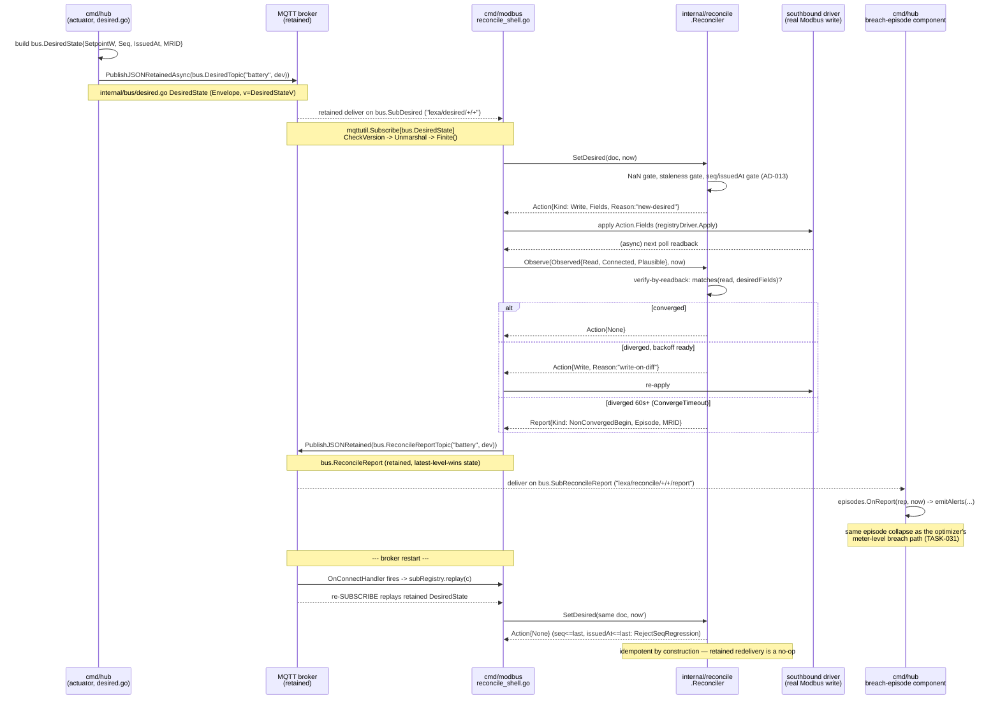

### Editing gotchas

- **Adding a new bus message type**: embed `Envelope` by value (not a named field), give it a wire field name that cannot collide with `"v"` (never name a field `V`), add a `FooV = 1` constant in `internal/bus/envelope.go`, wire the topic into `SupportedV` in `internal/bus/topics.go`, and — if it carries any `float64`/`*float64` — implement `Finite() error` in `internal/bus/finite.go`. If the topic is retained, decide whether it's STATE (latest-wins, like `DesiredState`/`ReconcileReport`) or an EDGE (never retained, like `ComplianceAlert`/`TopicIntentChargeNow`) — retaining an edge topic replays a false edge on every reconnect.
- **Registering a new subscriber**: always call `mqttutil.Subscribe[T]`/`SubscribeDecodeErr`, never a raw `client.Subscribe` — only the wrapped path registers into `subRegistry` and gets replayed on reconnect. A raw `mc.Subscribe` call (there is exactly one legacy exception, `cmd/northbound`'s FR-request path, called out in topics.go's package doc) is permanently deaf after any broker restart.
- **A new reconciler-consumed field**: add it to `reconcile.Field`'s enum (report.go), thread it through `fieldsOf`/`docHasNaN` in reconcile.go, and give it a sensible default tolerance in `tolerance()` — a boolean-like field (à la `Connect`) needs a sub-1.0 tolerance so it never aliases.
- **The reconcile handler must be idempotent**: every retained topic redelivers on reconnect (subRegistry.replay) and mosquitto can also resurrect a stale retained message independently. `SetDesired`'s seq/issuedAt gate is what makes replay a safe no-op — do not "simplify" that gate to a plain equality check; the `SeqReset` branch (lower/reset seq but strictly newer `issuedAt`) is what makes a *publisher restart* observable instead of silently rejected.
- **Journal**: never add a per-tick/steady-state event type — the vocabulary in `schema.go` is deliberately transition-only (control adopted/released, dispatch-on-change, breach begin/end). Adding a steady-state event blows the flash-wear budget the package doc computes explicitly. Never call `f.Sync()` per `Append`; that defeats the batched-flush design entirely.
- **Spool**: never bypass `Peek`/`Commit` — anything that reads records without calling `Commit` will see them redelivered on the next `Open` (by design, at-least-once), but code that reads *and silently discards* without committing will leak disk budget until eviction catches up. A new stream must pick a `Priority` (0 = highest) matching its criticality — telemetry belongs at P2 (lowest), safety/compliance events at P0.
- **Clock/expiry**: any new staleness/grace/debounce constant belongs in `internal/utilitytime`, not as a fresh local constant in a service — AD-004 makes this package the single owner after the 2026-07 clock-jitter incident required four separate fixes across three services. Denominate new thresholds in wall-clock seconds (`ExpiryConfirmWindowS`-style), never raw tick counts, so FAST and STOCK cadences mean the same real-world duration.

---

**Key files referenced**: `/home/dmitri/projects/lexa-hub/internal/bus/{envelope,finite,topics,messages,desired,intent,scan}.go`, `/home/dmitri/projects/lexa-hub/internal/mqttutil/mqttutil.go`, `/home/dmitri/projects/lexa-hub/internal/reconcile/{reconcile,report}.go`, `/home/dmitri/projects/lexa-hub/internal/journal/{journal,schema}.go`, `/home/dmitri/projects/lexa-hub/internal/spool/{spool,segment,internal}.go`, `/home/dmitri/projects/lexa-hub/internal/watchdog/{watchdog,deaf}.go`, `/home/dmitri/projects/lexa-hub/internal/utilitytime/{utilitytime,expiry}.go`, `/home/dmitri/projects/lexa-hub/cmd/hub/{desired,state,main}.go`, `/home/dmitri/projects/lexa-hub/cmd/modbus/{main,reconcile_shell}.go`.

---

## IX-D — lexa-proto: the SunSpec Codec, DER Mapping, and XML Model

`lexa-proto` (`/home/dmitri/projects/lexa-proto`) is the shared module both `csip-tls-test` and `lexa-hub` vendor at a pinned commit (`proto.pin`, CI-gated by `scripts/check-proto-pin.sh`). It has no product logic of its own — it is pure protocol plumbing: a declarative SunSpec/Modbus register-layout engine, the CSIP→SunSpec DER control mapping, the IEEE 2030.5 XML struct model, and a minimal OCPP 2.0.1 CSMS test double. Four packages, ~30 files. This section is a from-source reference for a junior engineer who has to read or extend any of them.

### The end-to-end write path

```mermaid
flowchart LR
    subgraph XML["csipmodel (wire format)"]
        A["DERControl.DERControlBase<br/>csipmodel/resources.go:269<br/>e.g. OpModFixedW *ActivePower{Value,Multiplier}"]
    end
    subgraph MAP["derbase (CSIP → SunSpec mapping)"]
        B["Base.ApplyControl(ctrl, tag)<br/>derbase/derbase.go:207<br/>opMode → register-write fan-out"]
        B2["write704 / adoptCurve<br/>read-modify-write, curve handshake"]
    end
    subgraph LAYOUT["sunspec (declarative layout engine)"]
        C["L704.View(regs)<br/>sunspec/layout.go:117<br/>named-field offsets — no hand-computed math"]
    end
    subgraph SCALE["sunspec (scale-factor codec)"]
        D["View.SetFloat / Float<br/>sunspec/layout.go:321,259<br/>val / 10^SF, int16 clamp BEFORE cast"]
    end
    subgraph IO["sunspec.Reader + modbus.Transport"]
        E["Reader.WriteModel<br/>sunspec/reader.go:57<br/>Block.BaseAddr + offset"]
        F["Transport.WriteHolding<br/>modbus/transport.go:33<br/>addr uint16, values []uint16"]
    end
    G["Physical bus — Modbus/TCP or RTU"]

    A -->|"model.DERControlBase struct"| B
    B --> B2
    B2 -->|"sunspec.View (typed cursor)"| C
    C -->|"named field + SF field name"| D
    D -->|"encoded []uint16 register slice"| E
    E -->|"[]uint16, base addr"| F
    F --> G
```

Each arrow is a real type boundary: `csipmodel.DERControlBase` (XML-tagged pointer struct) → `derbase.Base` methods operating on a `sunspec.View` bound to a raw `[]uint16` register slice → `sunspec.Reader.WriteModel` resolving that slice to a `modbus.Transport.WriteHolding(addr, values)` call. No layer downcasts to `int16` directly; every numeric write goes through `scale.go`'s round/clamp logic first.

---

### 1. The layout engine — killing hand-computed offsets

`sunspec/layout.go` is the foundation everything else sits on. SunSpec model 704 alone has ~50 points; computing register offsets by hand (as the legacy `models.go` constants like `M103_W = 12` still do for pre-1547 models) is exactly the class of bug the DER models were rewritten to avoid.

**`Field`** (`sunspec/layout.go:56-61`) describes one point:

```go
// Field describes a single point in a model layout.
type Field struct {
	Name string
	Type FieldType
	SF   string // name of this point's scale-factor field; "" if unscaled
	Len  int    // register count for Tstring / Tpad only
}

// F is a terse constructor for an unscaled field.
func F(name string, t FieldType) Field { return Field{Name: name, Type: t} }

// FS is a terse constructor for a scaled field (SF names another Tsunssf field).
func FS(name string, t FieldType, sf string) Field { return Field{Name: name, Type: t, SF: sf} }
```

Note that `SF` is a **field name string**, not a register offset — the scale factor is resolved by name at read/write time (`layout.go:265-271`), which is why fields can reference SF fields declared *later* in the same layout (SunSpec models put the SF block after the data points).

**`Layout`** (`layout.go:72-100`) compiles an ordered `[]Field` into an offset-indexed table by walking the list once and accumulating `FieldType.regs(strLen)` — the register width per type (1 for 16-bit, 2 for 32-bit, 4 for 64-bit, `strLen` for strings):

```go
func NewLayout(fields ...Field) *Layout {
	l := &Layout{
		Fields: fields,
		off:    make(map[string]int, len(fields)),
		typ:    make(map[string]Field, len(fields)),
	}
	o := 0
	for _, f := range fields {
		if _, dup := l.off[f.Name]; dup && f.Name != "" {
			panic("sunspec: duplicate field " + f.Name)
		}
		l.off[f.Name] = o
		l.typ[f.Name] = f
		o += f.Type.regs(f.Len)
	}
	l.total = o
	return l
}
```

This is *why* the layout engine kills a whole bug class: inserting, removing, or reordering a field anywhere in the list automatically re-derives every offset after it. With hand-computed constants (`models.go`'s `M201_W = 16`, `M201_VA = 21`, …) a single insertion anywhere upstream silently shifts everyone downstream and nothing catches it at compile time — that class of bug is exactly what audit finding MTR-4 flagged for the old meter model offsets. `NewLayout` also panics on a duplicate field name at construction time (a copy-paste mistake in a `derlayout.go` table fails immediately, in `go test`, not months later against real hardware).

**`View`** (`layout.go:124-128`) is a typed cursor bound to a concrete register slice plus a base offset (for repeating curve/port sub-groups — `ViewAt`, `layout.go:121`):

```go
type View struct {
	regs []uint16
	l    *Layout
	base int
}
```

The **typed getter/setter pair**, `Float`/`SetFloat` (`layout.go:259-290`, `321-349`), is sentinel-aware end to end:

```go
// Float reads a numeric point and applies its scale factor, returning the
// engineering value. Returns NaN when the point or its scale factor is absent
// or carries a not-implemented sentinel.
func (v View) Float(name string) float64 {
	o, f, ok := v.fieldOff(name)
	if !ok || !v.Present(name) || v.notImpl(o, f) {
		return math.NaN()
	}
	sf := int16(0)
	if f.SF != "" {
		s, ok := v.SF(f.SF)
		if !ok {
			return math.NaN()
		}
		sf = s
	}
	var raw float64
	switch f.Type {
	case Tint16, Tsunssf:
		raw = float64(int16(v.reg(o)))
	// ... Tuint16/Tint32/Tuint32/Tint64/Tuint64 cases
	}
	return raw * math.Pow10(int(sf))
}
```

`Present(name)` (`layout.go:157-163`) guards against a device that implements a shorter, valid model (fewer optional trailing points) — `v.base+o+f.Type.regs(f.Len) <= len(v.regs)` — so a partial model never panics, it just reports the point as absent. `notImpl` (`layout.go:184-201`) checks the field's raw value against its type's documented not-implemented sentinel (`0xFFFF` for unsigned 16-bit, `0x8000` for signed 16-bit, and so on for 32/64-bit — `layout.go:173-180`) *before* scaling is applied, which is the correct order: the sentinel test operates on the raw register word, not the scaled engineering value.

**Transcribing a spec table as a Layout** — model 704 (`sunspec/derlayout.go:116-141`), reproduced in full because it is the canonical example of "spec table → Go literal, verbatim, in spec order":

```go
var L704 = NewLayout(
	F("PFWInjEna", Tenum16), F("PFWInjEnaRvrt", Tenum16),
	F("PFWInjRvrtTms", Tuint32), F("PFWInjRvrtRem", Tuint32),
	F("PFWAbsEna", Tenum16), F("PFWAbsEnaRvrt", Tenum16),
	F("PFWAbsRvrtTms", Tuint32), F("PFWAbsRvrtRem", Tuint32),
	F("WMaxLimPctEna", Tenum16),
	FS("WMaxLimPct", Tuint16, "WMaxLimPct_SF"), FS("WMaxLimPctRvrt", Tuint16, "WMaxLimPct_SF"),
	F("WMaxLimPctEnaRvrt", Tenum16), F("WMaxLimPctRvrtTms", Tuint32), F("WMaxLimPctRvrtRem", Tuint32),
	F("WSetEna", Tenum16), F("WSetMod", Tenum16),
	FS("WSet", Tint32, "WSet_SF"), FS("WSetRvrt", Tint32, "WSet_SF"),
	FS("WSetPct", Tint16, "WSetPct_SF"), FS("WSetPctRvrt", Tint16, "WSetPct_SF"),
	F("WSetEnaRvrt", Tenum16), F("WSetRvrtTms", Tuint32), F("WSetRvrtRem", Tuint32),
	F("VarSetEna", Tenum16), F("VarSetMod", Tenum16), F("VarSetPri", Tenum16),
	FS("VarSet", Tint32, "VarSet_SF"), FS("VarSetRvrt", Tint32, "VarSet_SF"),
	FS("VarSetPct", Tint16, "VarSetPct_SF"), FS("VarSetPctRvrt", Tint16, "VarSetPct_SF"),
	F("VarSetEnaRvrt", Tenum16), F("VarSetRvrtTms", Tuint32), F("VarSetRvrtRem", Tuint32),
	F("WRmp", Tuint16), F("WRmpRef", Tenum16), F("VarRmp", Tuint16), F("AntiIslEna", Tenum16),
	// Scale factors
	F("PF_SF", Tsunssf), F("WMaxLimPct_SF", Tsunssf), F("WSet_SF", Tsunssf),
	F("WSetPct_SF", Tsunssf), F("VarSet_SF", Tsunssf), F("VarSetPct_SF", Tsunssf),
	// PF sync groups (PF + excitation pairs), processed atomically.
	FS("PFWInj_PF", Tuint16, "PF_SF"), F("PFWInj_Ext", Tenum16),
	FS("PFWInjRvrt_PF", Tuint16, "PF_SF"), F("PFWInjRvrt_Ext", Tenum16),
	FS("PFWAbs_PF", Tuint16, "PF_SF"), F("PFWAbs_Ext", Tenum16),
	FS("PFWAbsRvrt_PF", Tuint16, "PF_SF"), F("PFWAbsRvrt_Ext", Tenum16),
)
```

No offset appears anywhere in that literal — the field *order* (transcribed straight from SunSpec DER Information Model spec Table 7) is the source of truth, and `NewLayout` derives every offset from it at package-init time. This is why `derlayout.go`'s doc comment (lines 1-8) calls the curve models "fixed-shape" or "fixed header + repeating sub-groups": the curve/control models (705-712) declare a header `Layout` plus a separate per-curve/point `Layout`, and helper functions like `CurveOffset705(i, npt int) int` (`derlayout.go:260`) compute the *runtime-variable* repeating-group offset from the header's own `Len()` plus `i*(L705Crv.Len()+2*npt)` — still no hand-typed constant, just composition of two compiled layouts.

### 2. The scale codec — the GS-1/MTR-1 invariant

`sunspec/scale.go` is small (64 lines) and everything else calls into it. The core sentinel constant:

```go
// notImplemented is the SunSpec sentinel value for int16 scale factors meaning
// "this point is not implemented on this device".
const notImplemented = int16(-32768) // 0x8000 reinterpreted as int16
```

Decode (`scale.go:22-27`):

```go
// ApplyScaleSigned converts a signed SunSpec register value (int16 stored in
// a uint16 word) to a float64 by applying the given scale factor.
// Returns math.NaN() when sf is the "not implemented" sentinel.
func ApplyScaleSigned(raw uint16, sf int16) float64 {
	if sf == notImplemented {
		return math.NaN()
	}
	return float64(int16(raw)) * math.Pow10(int(sf))
}
```

Encode, with the clamp that prevents the int16-wrap trap (`scale.go:32-46`):

```go
// RawFromScaleSigned converts a float64 value back to a uint16 register word
// given the target scale factor. Used when writing control values to a device.
// The result is rounded to the nearest integer and clamped to int16 range.
func RawFromScaleSigned(val float64, sf int16) uint16 {
	if sf == notImplemented {
		return 0
	}
	scaled := val / math.Pow10(int(sf))
	rounded := math.Round(scaled)
	// Clamp to int16 range.
	if rounded > math.MaxInt16 {
		rounded = math.MaxInt16
	}
	if rounded < math.MinInt16 {
		rounded = math.MinInt16
	}
	return uint16(int16(rounded))
}
```

**The FIX-B invariant**, stated as executable contract in `sunspec/sweep.go:225-235` (comment, verbatim):

> ```
> // SweepSentinel pins the FIX-B correctness contract (task review, step 4):
> // the notImplemented sentinel (int16(-32768)) guards the SCALE-FACTOR
> // argument, not raw register values.
> //   - ApplyScale*(anyRaw, sentinel) == NaN, for every raw value.
> //   - RawFromScale*(v, sentinel) == 0, for every v (including NaN/+-Inf).
> //   - raw 0x8000 at a NORMAL sf is an ordinary int16 (-32768), decodes to
> //     -32768 (not NaN), and round-trips exactly like any other value.
> //
> // This function must NEVER be "fixed" to make ApplyScaleSigned(0x8000, sf)
> // return NaN for a non-sentinel sf — that would be exactly the bilateral
> // register-semantics regression MTR-4 warns about.
> ```

In other words: the sentinel `0x8000` guards the *scale-factor register*, never the *data register*. A device that legitimately reports `-32768` W at a normal scale factor is not "not implemented" — it's a real, if extreme, reading, and `ApplyScaleSigned` must not confuse the two. This is checked live: `sweep.go:264-279` asserts `ApplyScaleSigned(0x8000, sf) == -32768.0 * 10^sf` for every sf in `ScaleFactors`, and that `RawFromScaleSigned` round-trips it back to `0x8000` exactly.

**Why write-side clamps into the multiplier BEFORE the int16 cast matters.** The GS-1/MTR-1 audit finding was a class of bug where a watt value was cast directly to `int16` without first re-scaling into the register's declared multiplier — so, e.g., 40,000 W truncated/wrapped to a small negative number instead of clamping to the representable ceiling. `RawFromScaleSigned` divides by `10^sf` (moving the value into the *register's* unit system) and only *then* rounds and clamps to `[MinInt16, MaxInt16]` before the final `uint16(int16(...))` reinterpretation — the clamp happens on the pre-cast float64, so 40,000 always becomes `32767` at `sf=0`, never a wrapped negative. `View.SetFloat` (`layout.go:321-349`) applies the identical `math.Round(val / math.Pow10(int(sf)))` → `clamp(...)` → cast sequence for every scaled setter in the layout engine, so the invariant holds uniformly whether a caller goes through `sunspec.RawFromScaleSigned` directly (as `derbase.go:746`, `sunspec.RawFromScaleSigned(-pct, sf)` for legacy M123) or through a `View` setter (as every 701-714 write does).

**The exported `Sweep*` helpers** (`sunspec/sweep.go`) are deliberately **not** `_test.go` files. The file's own doc comment explains why (`sweep.go:8-16`):

> ```
> // These are exported (not _test.go) so both this module's own test
> // (scale_sweep_test.go) and each consumer repo's own CI-executed test can
> // run the identical property assertions against their own vendored copy of
> // this package — ... lexa-proto is unhosted and has no CI of its own, so
> // "runs in both repos' CI" is only true if the consumers' own `go test`
> // actually calls into this contract, not merely vendors the source.
> ```

`lexa-proto` has no hosted remote and no CI of its own (`AD-003(c)`) — its only proof-of-correctness is whichever consumer repo's `go test` actually invokes it against its *own vendored copy*. If the sweep logic lived in a `_test.go` file, `go build`/`go vet` would strip it from anyone who merely imports the package, and — critically — a vendored copy's test binary in a different module can't reach unexported test helpers from another module's `_test.go` file at all. Exporting `SweepRoundTripSigned`, `SweepWrapGuardSigned`, `SweepSentinel`, etc. as ordinary `.go` functions returning `[]string` violations means both `csip-tls-test/sunspec` (via its own `scale_sweep_test.go`, which just calls `SweepRoundTripSigned(ScaleFactors)` and fails the `t.Error` per violation) and `lexa-hub`'s equivalent test can call into the *identical* property-test logic against whatever version of `scale.go` each repo currently has vendored — this is how a scale-factor regression in one repo's vendored copy gets caught by that repo's own CI, not just by a manual audit.

### 3. `derbase.ApplyControl` — CSIP → SunSpec register writes

`derbase.Base.ApplyControl` (`derbase/derbase.go:207`) is the single entry point that turns a decoded `DERControlBase` into device writes:

```go
func (b *Base) ApplyControl(ctrl model.DERControlBase, tag string) error {
	if ctrl.OpModEnergize != nil && b.Has703 {
		if err := b.SetEnterServiceEnabled(*ctrl.OpModEnergize, tag); err != nil {
			return err
		}
	}
	if ctrl.OpModConnect != nil {
		if !b.Reader.HasModel(sunspec.ModelImmediateCtrl) {
			return fmt.Errorf("%s: no M123 for connect control", tag)
		}
		if err := b.SetConnect(*ctrl.OpModConnect, tag); err != nil {
			return err
		}
	}
	if ctrl.OpModFixedPFInjectW != nil && b.Has704 {
		pf := math.Abs(float64(ctrl.OpModFixedPFInjectW.Value)) / 10000.0
		if err := b.SetFixedPF(true, pf, ctrl.OpModFixedPFInjectW.Value >= 0, tag); err != nil {
			return err
		}
	}
	// ... OpModFixedPFAbsorbW, OpModFixedVar, OpModFixedW similarly ...

	// Ceilings → WMaxLimPct (% of WMax). First non-nil wins.
	if lim := firstNonNil(ctrl.OpModExpLimW, ctrl.OpModMaxLimW, ctrl.OpModGenLimW); lim != nil {
		if b.Has704 {
			if err := b.SetWMaxLimPctW(watts(lim), tag); err != nil {
				return err
			}
		} else if err := b.SetExportLimit(lim, tag); err != nil {
			return err
		}
	}

	// Import / load (charge) → negative Set Active Power, or legacy 123.
	if imp := firstNonNil(ctrl.OpModImpLimW, ctrl.OpModLoadLimW); imp != nil {
		if b.Has704 {
			if err := b.SetActivePowerWatts(-watts(imp), tag); err != nil {
				return err
			}
		} else if err := b.SetImportLimit(imp, tag); err != nil {
			return err
		}
	}
	return nil
}
```

The opMode-to-register-write fan-out (`derbase.go:14-22` doc comment, verbatim mapping):

```
//	opModEnergize        → 703 ES (enter service / cease-to-energize)
//	opModConnect         → 123 Conn (legacy immediate connect/disconnect)
//	opModFixedPFInjectW  → 704 PFWInj{PF,Ext}  (constant PF while injecting W)
//	opModFixedPFAbsorbW  → 704 PFWAbs{PF,Ext}  (constant PF while absorbing W)
//	opModFixedVar        → 704 VarSet{Mod,Pri,Pct}
//	opModFixedW          → 704 WSet (Set Active Power, watts) — setpoint
//	opModMaxLimW/ExpLimW/GenLimW → 704 WMaxLimPct (% of WMax) — ceiling
//	opModImpLimW/LoadLimW → 704 WSet negative (charge), or legacy 123
```

**The "no M123 for connect control" error path** — `derbase.go:213-220` — is the exact block quoted inside `ApplyControl` above: `opModConnect` has no analogue in model 704 (connect/disconnect only exists as the legacy `M123_Conn` register), so if the device doesn't advertise model 123, the control is unactionable and `ApplyControl` returns a hard error rather than silently no-op-ing.

Model-704 writes go through `write704` (`derbase.go:315-327`), a read-modify-write that reads the *entire* model, mutates it via a `View`, and writes the whole thing back — deliberately, because the PF sync groups (`PFWInj_PF` + `PFWInj_Ext`) must be applied atomically:

```go
// write704 read-modify-writes the whole 704 block after applying fn to its View.
// Writing the entire model keeps PF sync groups (PF+Ext) atomic per the spec.
func (b *Base) write704(tag string, fn func(v sunspec.View)) error {
	if !b.Has704 {
		return fmt.Errorf("%s: device has no M704 (DERCtlAC)", tag)
	}
	regs, err := b.Reader.ReadModel(sunspec.ModelDERCtlAC)
	if err != nil {
		return fmt.Errorf("%s: read M704: %w", tag, err)
	}
	fn(sunspec.L704.View(regs))
	return b.Reader.WriteModel(sunspec.ModelDERCtlAC, 0, regs[:sunspec.L704.Len()])
}
```

**The curve-adopt handshake** (`derbase.go:435-483`), which every one of the six curve models (705/706/707/708/709/710/711/712) shares via one shared helper — the write-staging-curve → adopt-by-1-based-index → poll → enable sequence, quoted verbatim:

```go
// adoptCurve performs the full SunSpec curve-update handshake on a curve/control
// model: the staging curve has already been encoded into regs[start:end] at
// 0-based index 1. It writes that range, requests adoption with the 1-based
// staging index (=2, which the spec requires to be >1), polls the result point
// until COMPLETED/FAILED, and finally enables the function (Ena=1).
func (b *Base) adoptCurve(modelID uint16, regs []uint16, start, end int, adptReqField, adptRsltField, enaField string, hdr *sunspec.Layout, tag string) error {
	if err := b.Reader.WriteModel(modelID, uint16(start), regs[start:end]); err != nil {
		return fmt.Errorf("%s: write model %d curve: %w", tag, modelID, err)
	}
	const stagingIdx1Based = 2 // 0-based index 1 → 1-based 2 (>1 per §3.1.2)
	if err := b.Reader.WriteModel(modelID, uint16(hdr.Offset(adptReqField)), []uint16{stagingIdx1Based}); err != nil {
		return fmt.Errorf("%s: request adopt on model %d: %w", tag, modelID, err)
	}
	if err := b.pollAdoptResult(modelID, hdr.Offset(adptRsltField), tag); err != nil {
		return err
	}
	if err := b.Reader.WriteModel(modelID, uint16(hdr.Offset(enaField)), []uint16{1}); err != nil {
		return fmt.Errorf("%s: enable model %d: %w", tag, modelID, err)
	}
	return nil
}

func (b *Base) pollAdoptResult(modelID uint16, rsltOffset int, tag string) error {
	timeout := b.AdoptPollTimeout
	if timeout == 0 {
		timeout = adoptPollDefault // 3 * time.Second
	}
	deadline := time.Now().Add(timeout)
	for {
		regs, err := b.Reader.ReadModel(modelID)
		if err != nil {
			return fmt.Errorf("%s: poll adopt result on model %d: %w", tag, modelID, err)
		}
		if rsltOffset >= 0 && rsltOffset < len(regs) {
			switch regs[rsltOffset] {
			case sunspec.AdptCompleted:
				return nil
			case sunspec.AdptFailed:
				return fmt.Errorf("%s: model %d adopt-curve FAILED", tag, modelID)
			}
		}
		if time.Now().After(deadline) {
			return nil // best-effort: device may not update the result point
		}
		time.Sleep(adoptPollInterval) // 100 * time.Millisecond
	}
}
```

`WriteVoltVar` (`derbase.go:498-511`) is the shape every curve write follows: read the model, `sunspec.Encode705Curve(regs, 1, c)` to encode the caller's typed curve into staging index 1 (0-based; index 0 is always the read-only active curve — `der1547.go:257`, "Curve index is 0-based: 0 is the read-only active curve, 1+ are writable staging curves"), then call `adoptCurve` with the model-specific field names (`"AdptCrvReq"`, `"AdptCrvRslt"`, `"Ena"` for the curve models; `"AdptCtlReq"`, `"AdptCtlRslt"` for model 711's frequency-droop control, since it has no curve points, only a control block — see `WriteFreqDroop`, `derbase.go:636-649`).

### 4. `Measurements` — the type both consumers alias

Defined once, at `derbase/derbase.go:133-151`:

```go
// Measurements holds a snapshot of electrical measurements from a DER device.
//
// Sign convention — power fields use the generator/load sign from the device's
// own perspective (IEC 62053 / SunSpec convention):
//
//	W > 0  device is exporting power (solar generating, battery discharging)
//	W < 0  device is importing power (battery charging, load consuming)
//
// Fields set to math.NaN() are not available from this device.
type Measurements struct {
	// AC-side
	W   float64 // net AC real power (watts)
	VA  float64 // apparent power (volt-amps)
	Var float64 // reactive power (vars, positive = capacitive)
	V   float64 // phase-A-to-neutral voltage (volts)
	Hz  float64 // AC frequency (Hz)
	PF  float64 // power factor (−1 to +1)

	// DC-side (inverters only; NaN if not applicable)
	DCV float64 // DC bus voltage (volts)
	DCW float64 // DC power (watts)

	// Thermal
	TmpCab float64 // cabinet temperature (°C); NaN if not reported

	// Storage (batteries only; NaN if not applicable)
	SOC float64 // state of charge (0–100 %)
}
```

`lexa-hub`'s `internal/southbound/device` package does not redefine this — per the doc comment at `derbase.go:109-117`, it re-exports it as `type Measurements = derbase.Measurements` so every existing call site keeps compiling unchanged after the TASK-023 move. Note the sign convention flips between device and meter perspective (documented right above, `derbase.go:118-130`): a device's `W>0` means exporting, but the grid meter's `W>0` means the site is *importing* — a common source of sign-flip bugs when wiring dashboard cards, worth internalizing before touching any consumer of this type.

### 5. `modbus.Transport` — the serial baud-rate gotcha

The interface (`modbus/transport.go:24-37`):

```go
// Transport abstracts Modbus register access. Implementations are decoupled
// from any particular physical medium.
type Transport interface {
	Open() error
	Close() error
	SetUnitID(id uint8) error
	ReadHolding(addr, quantity uint16) ([]uint16, error)
	WriteHolding(addr uint16, values []uint16) error
	ReadInput(addr, quantity uint16) ([]uint16, error)
}
```

`NewSerialTransport` (`modbus/transport.go:57-78`) exists specifically because of a trap in the underlying `simonvetter/modbus` client — the baud rate is a *client configuration field*, never parsed out of the URL string:

```go
// NewSerialTransport creates a Modbus RTU (serial) Transport bound to an
// explicit line speed. It exists because the RTU baud rate is a property of
// the serial connection, not of the URL: the underlying client library reads
// the speed from its configuration, never from the URL string, so a Transport
// built with NewTransport always runs at the library default (19200 bps).
// Commissioning bus-sweeps that try several bauds need this constructor to
// reopen the port at each speed.
func NewSerialTransport(url string, speedBps int, timeout time.Duration) (Transport, error) {
	if speedBps <= 0 {
		return nil, fmt.Errorf("modbus: serial transport %q: invalid speed %d bps", url, speedBps)
	}
	mc, err := modbuslib.NewClient(&modbuslib.ClientConfiguration{
		URL:     url,
		Speed:   uint(speedBps),
		Timeout: timeout,
	})
	if err != nil {
		return nil, fmt.Errorf("modbus: new serial client %q @ %d bps: %w", url, speedBps, err)
	}
	return &client{inner: mc}, nil
}
```

The gotcha: calling the two-argument `NewTransport(url, timeout)` on an `"rtu://…"` URL silently succeeds and silently runs at the library's default 19200 bps — there is no error, no log line, just a device that never responds because it's actually configured for 9600 or 115200. `sunspec/bussweep.go`'s `SweepRTU` (`bussweep.go:262-323`) exists partly because of this: it reopens the port at each candidate baud in the caller-supplied list via this exact constructor.

### 6. `csipmodel` — the XML model and the namespace invariant

The package-level warning (`csipmodel/resources.go:17-23`) is the single most important comment in the whole module:

```go
// CRITICAL — silent-failure hazard: a 2030.5 root element unmarshalled
// without its namespace (urn:ieee:std:2030.5:ns) decodes to a zero-value
// struct with NO error from encoding/xml. Every root element below carries
// an explicit `xml:"urn:ieee:std:2030.5:ns <Name>"` XMLName tag for exactly
// this reason — never add a root element type without one, and never edit
// an existing tag without re-running the round-trip suite in
// resources_test.go plus both consumers' conformance suites.
```

Go's `encoding/xml` matches elements by local name *and* namespace URI when an `XMLName` field carries a namespace-qualified tag. If the XML on the wire is missing (or has a different) `xmlns`, `Unmarshal` doesn't error — it just never matches the struct fields, leaving every field at its zero value, and callers proceed as if the resource were empty. This is why every root resource — `EndDevice` (`csipmodel/resources.go:114-140`), `DERControl` (`resources.go:295-310`), `DERCurve` (`der.go:117-158`), and so on — has the identical pattern:

```go
type EndDevice struct {
	XMLName xml.Name `xml:"urn:ieee:std:2030.5:ns EndDevice"`
	Resource
	Subscribable uint8  `xml:"subscribable,attr,omitempty"`
	LFDI         string `xml:"lFDI,omitempty"`
	SFDI         uint64 `xml:"sFDI,omitempty"`
	// ...
}
```

`DERControlBase` (`resources.go:266-284`), the payload of both `DERControl` events and `DefaultDERControl`:

```go
type DERControlBase struct {
	OpModConnect        *bool          `xml:"opModConnect,omitempty"`
	OpModEnergize       *bool          `xml:"opModEnergize,omitempty"`
	OpModFixedPFAbsorbW *SignedPerCent `xml:"opModFixedPFAbsorbW,omitempty"`
	OpModFixedPFInjectW *SignedPerCent `xml:"opModFixedPFInjectW,omitempty"`
	OpModFixedVar       *FixedVar      `xml:"opModFixedVar,omitempty"`
	OpModFixedW         *ActivePower   `xml:"opModFixedW,omitempty"`
	OpModMaxLimW        *ActivePower   `xml:"opModMaxLimW,omitempty"`
	OpModExpLimW        *ActivePower   `xml:"opModExpLimW,omitempty"`
	OpModGenLimW        *ActivePower   `xml:"opModGenLimW,omitempty"`
	OpModImpLimW        *ActivePower   `xml:"opModImpLimW,omitempty"`
	OpModLoadLimW       *ActivePower   `xml:"opModLoadLimW,omitempty"`
	RampTms             *uint16        `xml:"rampTms,omitempty"`
}
```

Every field is a pointer, and every field is `omitempty` — this is what lets `derbase.ApplyControl` treat "field present" and "field is the zero value" as distinct: a `nil *bool` means "server didn't send this mode," while a non-nil pointer to `false` means "server explicitly commanded disconnect."

**`ExtendedDERControlBase`** (`der.go:219-263`) is the full-spec superset, adding the curve-linked modes (`OpModVoltVar *CurveLink`, `OpModVoltWatt`, ride-through curves) and the inline `OpModFreqDroop *FreqDroop` that `DERControlBase` doesn't carry. The two are **not** related by embedding — the package comment explains why (`der.go:207-217`): "We cannot embed two structs with overlapping XML element names in Go's `encoding/xml`," so `ExtendedDERControlBase` duplicates every scalar field from `DERControlBase` and adds the curve-linked ones on top. `derbase.ApplyControl` only ever consumes the narrower `DERControlBase` — the curve links are resolved and applied through the typed curve writers (`WriteVoltVar` etc.), not through `ApplyControl`'s opMode fan-out.

**`ResponseCannotComply`** (`resources.go:462-470`) — a LEXA profile extension, not part of IEEE 2030.5 Table 27:

```go
const (
	ResponseEventReceived   uint8 = 1
	ResponseEventStarted    uint8 = 2
	ResponseEventCompleted  uint8 = 3
	ResponseOptIn           uint8 = 4
	ResponseOptOut          uint8 = 5
	ResponseEventCancelled  uint8 = 6
	ResponseEventSuperseded uint8 = 7

	// ResponseCannotComply is a LEXA profile extension (NOT an IEEE 2030.5
	// Table 27 status). It alerts the server that the DER physically cannot meet
	// an active control limit — e.g. an import cap that would require battery
	// discharge below its SOC reserve. Chosen in the 0xF0–0xFF manufacturer
	// range so it never collides with a standard status (1–7); the gridsim
	// server treats any status ≥ 0xF0 as a resource-limited non-compliance
	// alert rather than a lifecycle acknowledgement.
	ResponseCannotComply uint8 = 0xF0 // 240 — LEXA: DER unable to honour the control
)
```

The `0xF0` value is deliberately chosen far from the standard `1-7` range specifically so a future spec revision adding more standard status codes can never collide with it.

### 7. `ocppserver` — the minimal OCPP 2.0.1 CSMS test double

`Server` (`ocppserver/server.go:42-45`) wraps `ocpp2.CSMS` from `lorenzodonini/ocpp-go`, deliberately **pure-Go and decoupled from the wolfSSL mTLS layer** used for CSIP (package doc, `server.go:1-8`): OCPP Security Profile 2 is plain TLS + HTTP Basic Auth, not mutual TLS, so it uses Go's standard `crypto/tls` rather than the cgo wolfSSL bridge.

TLS setup (`server.go:54-62`):

```go
var wsServer ws.WsServer
if cfg.CertPath != "" && cfg.KeyPath != "" {
	wsServer = ws.NewTLSServer(cfg.CertPath, cfg.KeyPath, &tls.Config{
		MinVersion: tls.VersionTLS12,
	})
	log.Printf("[ocpp] TLS enabled (cert=%s)", cfg.CertPath)
} else {
	wsServer = ws.NewServer()
}
```

The constant-time basic-auth comparison (`server.go:64-75`), verbatim, including the `&` (not `&&`):

```go
if cfg.BasicAuthUser != "" {
	wsServer.SetBasicAuthHandler(func(user, pass string) bool {
		// Constant-time comparison so credential checking leaks no
		// timing signal (& to avoid short-circuiting between the two).
		ok := subtle.ConstantTimeCompare([]byte(user), []byte(cfg.BasicAuthUser)) &
			subtle.ConstantTimeCompare([]byte(pass), []byte(cfg.BasicAuthPass))
		if ok != 1 {
			log.Printf("[ocpp] basic-auth rejected user=%q", user)
		}
		return ok == 1
	})
}
```

`subtle.ConstantTimeCompare` already returns `1`/`0` in constant time per call, but ordinary `&&` would still let a Go program short-circuit — skip the password comparison entirely when the username check already failed — which leaks a timing signal about whether the username matched. Using the bitwise `&` forces both comparisons to always run, so total handler latency is identical whether the username or the password (or both) is wrong. The handler set itself (`server.go:79-89`) is deliberately minimal — `handlers.go` wires exactly three CSMS handler interfaces (`provisioning`, `availability`, `transactions`) and every callback just logs and returns the minimal accepted response (e.g. `OnBootNotification` at `handlers.go:20-31` always returns `RegistrationStatusAccepted`); it exists to let both `csip-tls-test`'s `evsim` and `lexa-hub` test against a real OCPP 2.0.1 protocol stack without depending on a production CSMS.

---

### For the junior engineer: three things to internalize

**The int16-wrap trap, and how `scale.go` avoids it.** SunSpec packs signed power values into a single 16-bit register (`int16`, range −32,768..32,767) plus a separate power-of-ten scale factor. A device rated for 50 kW at scale factor 0 can't fit — the correct encoding scales the *unit*, not the register width (e.g. `sf=1` → register holds `5000`, meaning 50,000 W). The bug this repo's audit caught (GS-1/MTR-1) was code that computed a watt value and cast it straight to `int16` without first dividing by `10^sf` — so `50000` cast to `int16` silently wrapped to a large *negative* number instead of clamping or scaling. `scale.go`'s `RawFromScaleSigned`/`RawFromScaleUint` and `layout.go`'s `View.SetFloat`/`SetScaledSignedAt` family all perform the division by `10^sf` *first*, then `math.Round`, then explicit `clamp(scaled, math.MinInt16, math.MaxInt16)`, and only then the final `uint16(int16(...))` reinterpretation — so an out-of-range value clamps to the representable edge instead of wrapping sign. This exact property — "clamp, never wrap" — is what `sunspec/sweep.go`'s `SweepWrapGuardSigned`/`SweepWrapGuardUint` continuously re-verify (`sweep.go:89-99` names the historical boundary crossings, `32767/32768/32769`, `-32768/-32769`, `65535/65536`, explicitly as regression bait for "in case of a raw-cast regression").

**Why the layout engine kills hand-computed-offset bugs.** The legacy models (`sunspec/models.go`, pre-1547 models 101-123, 201-203, 801-802) still use raw integer constants like `M201_TotWhExp = 36`. Every one of those numbers was hand-derived from the spec and has to stay correct forever, independently, with no mechanism enforcing it — audit finding MTR-4 found that an earlier revision of the meter models used *invented, compressed* offsets that didn't match the published SunSpec `model_201.json` at all. The 701-714 models replace that entirely: a `Layout` is compiled once from an *ordered field list* that visually matches the spec table, and every offset is *derived*, never typed. Insert a field, delete a field, or discover the spec table was transcribed in the wrong order, and the fix is a one-line edit to the `NewLayout(...)` call — every downstream `Offset()`/`Float()`/`SetFloat()` call site is automatically correct, because they all resolve through the field name, not a magic number.

**The read-only-by-construction safety of `bussweep.go`.** `sunspec/bussweep.go` scans unknown, possibly-energized hardware during commissioning — a Modbus write to the wrong device or register on a live bus can actuate equipment. The file's own header comment states the invariant directly (`bussweep.go:21-27`): *"it issues Modbus reads only... and NEVER a single write — there is no `WriteHolding` call anywhere in this file, by design, and that is a maintained invariant."* This is verifiably true by inspection: `probeOne` (`bussweep.go:92-120`) only calls `t.SetUnitID`, `t.ReadHolding`, `Scan` (which itself is read-only — `scanner.go:22-54` only calls `ReadHolding`), and `ReadCommon` (also read-only per its own doc comment at `identity.go:74-75`, *"ReadCommon issues NO writes — it is safe against unknown, possibly energized hardware"*). The safety property here isn't a runtime check or a permission flag — it's structural: the file simply contains no code path capable of calling `WriteHolding`, so a static grep for that symbol name in `bussweep.go` is a complete audit.

---

### The invariants you must never break

- **Cipher**: `ECDHE-ECDSA-AES128-CCM-8 TLSv1.2` for CSIP mTLS (enforced in the consumer repos' `wolfssl` layers, not in `lexa-proto` itself, but any transport code added here must not weaken it).
- **XMLName namespace**: every 2030.5 root element's `XMLName` must carry the exact tag `xml:"urn:ieee:std:2030.5:ns <ElementName>"` (`csipmodel/resources.go:17-23`, `29`). Omitting or mistyping it produces a **silent** zero-value struct on unmarshal — `encoding/xml` returns no error.
- **Scale-into-multiplier before int16 cast**: every write of a watts/vars/volts/etc. value must go through `scale.go`'s `RawFromScale*` or a `View.SetFloat`/`SetScaled*At` call — never a raw `int16(watts)` cast. This is the GS-1/MTR-1 invariant, continuously regression-swept by `sunspec.Sweep*` in both this repo and its consumers.
- **The FIX-B sentinel semantics**: `0x8000`/`-32768` (`notImplemented`) guards the **scale-factor register**, never a data register. `ApplyScaleSigned(0x8000, normalSF)` must always decode to the ordinary value `-32768 * 10^sf`, never `NaN` (`sweep.go:230-235`).
- **`bussweep.go` stays read-only by construction**: no `WriteHolding` call may ever be added to this file. A commissioning sweep runs against hardware whose control state is unknown to this package.
- **`derbase.Base.ApplyControl`'s model-704 writes stay whole-block read-modify-write** (`write704`, `derbase.go:315-327`): PF sync groups (`PFWInj_PF`+`PFWInj_Ext`) must be written atomically, never as two independent partial writes.
- **The curve-adopt handshake order is fixed**: write staging curve (index 1, 0-based) → request adopt with the 1-based index (`>1` per §3.1.2, hence `2`) → poll `AdptCrvRslt`/`AdptCtlRslt` until `Completed`/`Failed` → only then set `Ena=1`. Skipping or reordering any step means the device may adopt an unvalidated or partially-written curve.
- **Both repos pin the identical `lexa-proto` commit** (`proto.pin`, CI-gated by `scripts/check-proto-pin.sh`) — a divergence here means the SunSpec codec, the CSIP XML model, or the DER mapping logic can silently differ between hub and bench.

---

## IX-E — The Mayhem QA Engine: scenarios, oracles, and verdicts

Mayhem is a server-side, hardware-in-the-loop fault-injection driver that runs the real bench through worst-case CSIP/Modbus/OCPP conditions and diagnoses exactly where the hub's fault handling breaks. It lives in `cmd/dashboard/mayhem.go` (engine), `mayhem_world.go` (world-state faults + netem), `mqtt_scenarios.go` (MQTT/broker faults), `intent_scenarios.go` (mode/reserve/scan intents), `matrix.go` (generated fault-matrix/chaos runs), `scenariospec.go` (JSON-spec compiler), and `invariants.go` (cross-cutting safety escalation). Entry points: `POST /api/qa/start`, `GET /api/qa/status`, `POST /api/qa/abort` (`cmd/dashboard/mayhem.go:17-19`).

### 1. The `mayScenario` struct

Every scenario — hand-written Go or compiled from JSON — is the same value:

```go
// cmd/dashboard/mayhem.go:245-279
type mayScenario struct {
	ID         string
	Name       string
	Category   string
	Hypothesis string
	Expected   string
	HoldS      int
	Fix        string

	// Source tags where the scenario came from — "" (zero value, rendered as
	// "go") for every hand-written literal below, "spec" for one compiled
	// from a qa/scenarios/*.json file by scenariospec.go (TASK-076).
	Source string

	// ExpectedVerdicts documents the "expected-FAIL pins the gap" pattern
	// (06_TESTING_STRATEGY.md §4.5) for a spec-sourced scenario — informational
	// only, not enforced by the run loop. Always nil for a Go literal.
	ExpectedVerdicts []string

	// Extended marks a long-running scenario (HoldS in the minutes, not
	// seconds — RSK-12) that the default/full run excludes to protect
	// day-to-day FAST campaign wall-clock time.
	Extended bool

	setup    func(d *mayhemDriver) (*activeConstraint, error)
	perTick  func(d *mayhemDriver, i int)
	evaluate func(sc *mayScenario, cons *activeConstraint, s []maySample) mayFinding
	teardown func(d *mayhemDriver)
}
```

`setup` arms the fault and (optionally) returns the `activeConstraint` (`Typ`/`LimW`/`MRID`) the diagnoser judges against. `perTick` re-applies a fault that must persist or evolve (injected PV, a lurching clock, an alternating connector status). `evaluate` is the oracle — nil defaults to `diagnoseConstraint` (`mayhem.go:543-546`). `teardown` clears the fault. A scenario has one `mayFinding` at the end: `{ID, Name, Category, Hypothesis, Expected, Verdict, Headline, Diagnosis []string, Fix, Metrics mayMetrics}` (`mayhem.go:151-163`).

### 2. The run loop

`run()` is the driver: baseline the bench, then for each scenario reset → setup → hold+sample → teardown → evaluate → audit → record.

```go
// cmd/dashboard/mayhem.go:468-574 (abridged)
func (d *mayhemDriver) run(ctx context.Context, scenarios []*mayScenario, sample time.Duration) {
	defer d.restoreBench()

	if err := d.baseline(); err != nil {
		d.fail(fmt.Sprintf("bench baseline failed: %v", err))
		return
	}

	for i, sc := range scenarios {
		select { case <-ctx.Done(): d.finish(true, ""); return; default: }

		d.setPhase(i, sc, "setup")
		d.resetForScenario()

		scenCtx, scenCancel := context.WithCancel(ctx)
		d.mu.Lock(); d.scenarioCtx = scenCtx; d.mu.Unlock()

		cons := &activeConstraint{Typ: "none"}
		if sc.setup != nil {
			c, err := sc.setup(d)
			if err != nil {
				scenCancel() // setup failed — nothing from it should fire later
				d.appendFinding(mayFinding{ /* ... */ Verdict: "INCONCLUSIVE", ... })
				if sc.teardown != nil { sc.teardown(d) }
				continue
			}
			if c != nil { cons = c }
		}

		d.setPhase(i, sc, "hold")
		samples := d.holdAndSample(ctx, sc, cons, sample)

		d.setPhase(i, sc, "recover")
		scenCancel()
		if sc.teardown != nil { sc.teardown(d) }

		ev := sc.evaluate
		if ev == nil { ev = diagnoseConstraint }
		f := ev(sc, cons, samples)
		f.Fix = sc.Fix
		if ctx.Err() != nil {
			f.Verdict = "INCONCLUSIVE"
			f.Headline = fmt.Sprintf("aborted mid-scenario: %s", f.Headline)
			// ...
		}
		f = applySafetyAudit(f, cons, samples)
		d.appendFinding(f)

		if ctx.Err() != nil { d.finish(true, ""); return }
	}
	d.finish(false, "")
}
```

`defer d.restoreBench()` (`mayhem.go:470`) means the bench returns to a known state (clock 0, all controls cleared, faults cleared, sims at 1×) on *every* exit path — normal completion, abort, or panic. `holdAndSample` runs `perTick` before each `time.After(interval)` tick and samples afterward (`mayhem.go:608-630`):

```go
// cmd/dashboard/mayhem.go:608-630
func (d *mayhemDriver) holdAndSample(ctx context.Context, sc *mayScenario, cons *activeConstraint, interval time.Duration) []maySample {
	ticks := int(float64(sc.HoldS) * float64(time.Second) / float64(interval))
	if ticks < 1 { ticks = 1 }
	start := time.Now()
	var samples []maySample
	d.clearLive()
	for i := 0; i < ticks; i++ {
		if sc.perTick != nil { sc.perTick(d, i) }
		select {
		case <-ctx.Done(): return samples
		case <-time.After(interval):
		}
		s := d.sample(cons, time.Since(start).Seconds())
		samples = append(samples, s)
		d.pushLive(s)
	}
	return samples
}
```

**Panic isolation.** A campaign is a long series of live bench calls; a bug in one diagnoser must not take the whole dashboard process down. `handleStart` launches `runGuarded`, not `run`, in its goroutine:

```go
// cmd/dashboard/mayhem.go:389-410
func (d *mayhemDriver) runGuarded(ctx context.Context, scenarios []*mayScenario, sample time.Duration) {
	defer func() {
		if r := recover(); r != nil {
			log.Printf("mayhem: run panicked, aborting run: %v\n%s", r, debug.Stack())
			d.mu.Lock()
			d.status.Running = false
			d.status.Finished = false
			d.status.Aborted = true
			d.status.Phase = "done"
			d.status.LastError = fmt.Sprintf("internal panic: %v", r)
			d.mu.Unlock()
		}
	}()
	d.run(ctx, scenarios, sample)
}
```

`run()`'s own `defer d.restoreBench()` fires during the panic's stack unwind *before* this outer `recover()` catches it — the bench gets cleaned up either way; the outer recover only patches up `d.status` so the dashboard survives for the next run (comment at `mayhem.go:389-395`).

A second run-integrity mechanism guards delayed-fault goroutines against teardown races. Scenarios that fire a fault N seconds after adoption (`d.afterDelay`) or after the hub visibly adopts a specific control (`d.armAfterAdoption` / `d.armAfterCapAdopted`, `mayhem.go:632-741`) all read `d.scenarioCtx`, which `run()` cancels the instant the hold ends — *before* teardown runs (`mayhem.go:497-500, 537-538`) — so a fault goroutine still waiting on its timer bails out instead of landing after teardown already cleaned up. Teardown is always the last writer.

### 3. The oracle/scenario split

**Oracles are code.** Every `diagnose*` function has the signature `func(sc *mayScenario, cons *activeConstraint, s []maySample) mayFinding`. `diagnoseConstraint` (`mayhem.go:1091-1186`) is the core export/import/gen-cap analyser — it walks adoption → reaction → compliance → admission and names the first broken link:

```go
// cmd/dashboard/mayhem.go:1127-1178 (the verdict switch, abridged)
switch {
case m.ReportedCannot:
	f.Verdict = "DEGRADED" // admitted a physical limit — acceptable
case !m.HubAdopted:
	f.Verdict = "FAIL" // never adopted the control — upstream of optimization
case m.TailClean && m.ConvergedAtS >= 0:
	if m.ConvergedAtS <= mayConvergeDeadlineS {
		f.Verdict = "PASS" // bounded settling ramp — expected closed-loop behaviour
	} else {
		f.Verdict = "DEGRADED" // correct end state, sluggish convergence
	}
case m.HubAdopted && !m.HubReacted:
	f.Verdict = "FAIL" // adopted but issued no effective correction
default:
	f.Verdict = "FAIL" // commanded a correction, device never converged, no CannotComply
}
```

`diagnoseSOC` (`mayhem.go:1372-1438`) is the battery oracle — it judges *both* the pack's own SoC envelope (`invSOC`, ground truth from the batsim, not the hub) and the active grid cap the wrong-direction discharge may have blown:

```go
// cmd/dashboard/mayhem.go:1372-1410 (abridged)
func diagnoseSOC(sc *mayScenario, cons *activeConstraint, s []maySample) mayFinding {
	f := baseFinding(sc)
	if len(s) == 0 { f.Verdict = "INCONCLUSIVE"; f.Headline = "no samples"; return f }
	f.Metrics = scanSamples(cons, s)

	socViol := invSOC(s)
	expViol := invExport(cons, s)
	convViol := invConverge(cons, s) // sustained cap breach with no CannotComply

	if len(socViol) > 0 || len(convViol) > 0 {
		f.Verdict = "FAIL"
		// ... names whichever axis broke (pack left its envelope, or the
		// wrong-direction discharge blew the cap unadmitted)
		return f
	}
	if len(expViol) > 0 {
		f.Verdict = "DEGRADED" // breached but admitted (CannotComply)
		return f
	}
	f.Verdict = "PASS"
	// stayed within envelope AND held the cap despite the direction fault
	forceBlindOnBatteryProbeGap(&f, s)
	forceBlindOnConstraintProbeGap(&f, cons, s)
	return f
}
```

**Scenarios are data.** `scenariospec.go` compiles a `qa/scenarios/*.json` file into the same `mayScenario`, looking the oracle up by name in `oracleRegistry`:

```go
// cmd/dashboard/scenariospec.go:224-237
var oracleRegistry = map[string]oracleEntry{
	"diagnoseConstraint":     {build: noParamOracle(diagnoseConstraint), requiresConstraint: true},
	"diagnoseConverge":       {build: noParamOracle(diagnoseConverge), requiresConstraint: true},
	"diagnoseStale":          {build: noParamOracle(diagnoseStale), requiresConstraint: false},
	"diagnoseRecovery":       {build: noParamOracle(diagnoseRecovery), requiresConstraint: false},
	"diagnoseSOC":            {build: noParamOracle(diagnoseSOC), requiresConstraint: true},
	"diagnoseDisconnect":     {build: noParamOracle(diagnoseDisconnect), requiresConstraint: true},
	"diagnoseMalform":        {build: noParamOracle(diagnoseMalform), requiresConstraint: true},
	"diagnoseSurvival":       {build: buildDiagnoseSurvival, requiresConstraint: true},
	"diagnoseTransport":      {build: noParamOracle(diagnoseTransport), requiresConstraint: false},
	"diagnoseBatteryGarbage": {build: noParamOracle(diagnoseBatteryGarbage), requiresConstraint: false},
	"diagnoseReboot":         {build: noParamOracle(diagnoseReboot), requiresConstraint: false},
	"diagnoseExpiry":         {build: noParamOracle(diagnoseExpiry), requiresConstraint: true},
}
```

`requiresConstraint` is a load-time sanity check: an oracle registered `true` errors at compile time if the spec's setup never posts a `post_cap`/`post_cap_prog`/`post_connect`/`post_control` (`scenariospec.go:689-691`) — catching the mistake of e.g. selecting `diagnoseConstraint` with no cap posted, instead of letting it silently produce a meaningless PASS at runtime.

`compileSpec` turns the validated spec into closures over the exact same `mayhemDriver` methods a Go literal calls (`d.post`, `d.injectEnv`, `d.postCap`, …) — it is a compiler, not a new execution engine:

```go
// cmd/dashboard/scenariospec.go:711-733 (setup closure, abridged)
sc.setup = func(d *mayhemDriver) (*activeConstraint, error) {
	var cons *activeConstraint
	for i, op := range setupOps {
		switch {
		case op.suppressDefault:
			restoreDefault = d.suppressDefault()
		case op.constraintRun != nil:
			c, err := op.constraintRun(d)
			if err != nil { return nil, fmt.Errorf("setup step %d: %w", i, err) }
			cons = c
		default:
			if err := op.stepRun(d); err != nil { return nil, fmt.Errorf("setup step %d: %w", i, err) }
		}
	}
	if cons == nil { cons = &activeConstraint{Typ: "none"} }
	return cons, nil
}
```

A worked example — `qa/scenarios/battery-wrong-sign.json` compiles to a scenario that selects `diagnoseSOC`:

```json
{
  "spec_v": 1,
  "id": "battery-wrong-sign",
  "name": "Battery executes a commanded charge as a discharge",
  "category": "Resource limits (INV-SOC)",
  "hypothesis": "A battery wired or firmware-flipped in the wrong direction: when the hub commands a charge to soak up excess PV, the pack discharges instead, walking an already-low state of charge toward empty.",
  "expected": "Detect the pack moving opposite to the command (SoC falling under a charge command) and halt/alarm before it discharges below the reserve floor.",
  "hold_s": 90,
  "fix": "Verify measured battery direction/SoC trend against the commanded sign in the orchestrator battery adapter.",
  "setup": [
    {"action": "sim_post", "target": "battery", "path": "/inject", "body": {"SoC_pct": 10.5, "Conn": 1}},
    {"action": "inject_env", "pv_w": "high", "load_w": 250},
    {"action": "sim_post", "target": "battery", "path": "/fault", "body": {"kind": "wrong_sign"}}
  ],
  "per_tick": [
    {"action": "inject_env", "pv_w": "high", "load_w": 250}
  ],
  "teardown": [
    {"action": "sim_post", "target": "battery", "path": "/fault", "body": {"kind": "wrong_sign", "clear": true}}
  ],
  "constraint": {"type": "exportCap", "limit_w": 0, "hold_s": 90, "desc": "mayhem: zero export cap drives a battery charge (flipped to discharge)"},
  "oracle": {"name": "diagnoseSOC"}
}
```

(`qa/scenarios/battery-wrong-sign.json:1-24`) This is a straight JSON restatement of what a Go literal would build — `sim_post` ↔ `d.post`, `inject_env` ↔ `d.injectEnv`, the `"constraint"` block sugar for a trailing `post_cap`, and `"oracle": {"name": "diagnoseSOC"}` selects the exact function above. The `"constraint"` field is sugar for one more constraint-producing setup action appended at the end (`scenariospec.go:110-119, 676-683`).

### 4. The verdict flow: ground truth, the ladder, and BLIND

**Ground truth comes from the sims, never the hub.** `d.sample()` polls each device sim's `/state` directly — `meterW()`, `solarSim()`, `solarCeiling()`, `evSim()`, `batterySim()` (`mayhem.go:2421-2512`) — and separately polls the hub's `/status` for the hub's own *view* (`hubState()`, `mayhem.go:2530-2622`), keeping both in the sample:

```go
// cmd/dashboard/mayhem.go:95-106 (maySample fields, selected)
BatteryW     float64 // the hub's view (Modbus-derived) — display/observability
BatterySimW  float64 // pack's TRUE net power from the batsim /state (ground truth) — for INV-SOC
BatterySimOK bool    // the batsim reported a coherent state this tick
EvSimW       float64 // charger's TRUE draw from the ev sim /state (ground truth) — for INV-EVBLIND
```

This is deliberate: the whole point of an *adversarial* HIL suite is to catch the hub lying to itself — a frozen sensor, an inverted CT, a battery discharging when it was told to charge. If the oracle judged from the hub's own telemetry, a hub that is *wrong and doesn't know it* would grade itself PASS. `breachOver` (`mayhem.go:809-829`) — the shared compliance predicate every constraint oracle calls — reads `s.RealGridW`/`s.SolarW` (sim ground truth), never `s.HubGridW`/`s.HubSolarW`.

**The verdict ladder** is `PASS | DEGRADED | FAIL | BLIND | INCONCLUSIVE` (`scenariospec.go:292`), tallied in `appendFinding` (`mayhem.go:2213-2234`). Rough semantics, drawn from every diagnoser above: PASS = held the limit (possibly after a bounded settling ramp); DEGRADED = correct outcome reached slowly, or a breach the hub honestly admitted (CannotComply); FAIL = a control failure — never adopted, adopted-but-no-reaction, or asserted compliance it didn't have; BLIND = the hub (or the harness itself) was not actually watching; INCONCLUSIVE = the harness itself couldn't judge (setup failed, the meter was down for most of the window, or the run was aborted mid-scenario).

**`forceBlindOnProbeGap`** closes the "vacuous PASS" gap: `breachOver` and `invSOC` both treat an *absent* judging sensor reading as "no breach this tick" — correct for one dropped poll, wrong if the sensor was dead for most of the window, because then the oracle read silence, not compliance.

```go
// cmd/dashboard/mayhem.go:886-907
func forceBlindOnProbeGap(f *mayFinding, label string, avail float64) {
	if f.Verdict != "PASS" || avail >= 1-mayJudgeAbsentBlindFrac {
		return
	}
	f.Verdict = "BLIND"
	f.Metrics.HubBlind = true
	f.Headline = fmt.Sprintf("%s probe absent for %.0f%% of the window — cannot trust the clean read", label, 100*(1-avail))
	f.Diagnosis = append(f.Diagnosis, fmt.Sprintf(
		"The %s judging sensor produced a coherent reading on only %.0f%% of samples (below the %.0f%% availability floor). An absent probe reads as \"no breach\" to the oracle, so this run's clean result is not evidence of compliance — the harness was not watching for part of the window. Fix the probe (or the fault injection wiring) and re-run before trusting this verdict.",
		label, 100*avail, 100*(1-mayJudgeAbsentBlindFrac)))
}
```

`mayJudgeAbsentBlindFrac = 0.20` (`mayhem.go:68`) — the judging sensor may be absent for up to 20% of the hold window (bench jitter, a slow HTTP round trip) before a PASS is downgraded. It **only ever tightens PASS → BLIND** — never touches FAIL/DEGRADED, which were reached from data the sensor *did* deliver, nor INCONCLUSIVE/BLIND already set for another reason (`mayhem.go:892-896`). Two call sites wrap it per judging sensor: `forceBlindOnConstraintProbeGap` (grid meter or solar, keyed off `cons.Typ` via `judgingProbeOK`, `mayhem.go:909-922`) and `forceBlindOnBatteryProbeGap` (the batsim, `mayhem.go:924-930`) — every constraint/SOC diagnoser calls the relevant one right before returning a PASS (see `diagnoseConstraint:1117,1184`, `diagnoseSOC:1435-1436`, `diagnoseMalform:1594`).

### 5. `escalateForAudit` / invariants.go

Every finding, regardless of its own oracle's verdict, passes through a cross-cutting safety audit (`applySafetyAudit`, `mayhem.go:592-604`) that re-checks the whole timeline against invariants the scenario's own diagnoser might not be looking for — a battery over-discharge during an export-cap test, a back-feed during a disconnect, an impossible EV draw, a stale control retained past `validUntil`, a control loop hunting around the cap:

```go
// cmd/dashboard/invariants.go:290-298
func safetyAudit(cons *activeConstraint, s []maySample) []invViolation {
	var v []invViolation
	v = append(v, connectBackfeed(s)...)               // excuses the bounded cease-to-energize ramp
	v = append(v, pastSettling(invSOC(s))...)          // excuses the setup-SoC settling transient
	v = append(v, invExpiredControl(s)...)             // already grace-bounded by validUntil+invExpiredGraceS
	v = append(v, pastSettling(invEVStationMax(s))...) // excuses an opening EV-current transient
	v = append(v, invHunt(cons, s)...)                 // already settling-gated and hysteresis-banded
	return v
}
```

`escalateForAudit` decides whether the audit's findings *tighten* an otherwise-PASS/DEGRADED verdict — it never downgrades a FAIL/INCONCLUSIVE, and never loosens anything:

```go
// cmd/dashboard/invariants.go:324-355
func escalateForAudit(verdict string, audit []invViolation) (newVerdict, headline string) {
	if verdict != "PASS" && verdict != "DEGRADED" {
		return verdict, ""
	}
	count := map[string]int{}
	firstDetail := map[string]string{}
	for _, x := range audit {
		count[x.Inv]++
		if _, ok := firstDetail[x.Inv]; !ok { firstDetail[x.Inv] = x.Detail }
	}
	if count["INV-CONNECT"] > 0 {
		return "FAIL", "cross-cutting safety violation (INV-CONNECT): " + firstDetail["INV-CONNECT"]
	}
	for _, inv := range []string{"INV-SOC", "INV-EVMAX"} {
		if count[inv] >= auditEscalateMinSamples {
			return "FAIL", "cross-cutting safety violation (" + inv + "): " + firstDetail[inv]
		}
	}
	if count["INV-EXPIRED"] >= auditEscalateMinSamples && verdict == "PASS" {
		return "DEGRADED", "stale control retained past validUntil: " + firstDetail["INV-EXPIRED"]
	}
	if count["INV-HUNT"] > 0 && verdict == "PASS" {
		return "DEGRADED", "control loop hunting around the cap: " + firstDetail["INV-HUNT"]
	}
	return verdict, ""
}
```

`INV-CONNECT` (back-feed during a disconnect) escalates to FAIL on any occurrence — too safety-critical to require repetition. `INV-SOC`/`INV-EVMAX` require `auditEscalateMinSamples = 3` (`invariants.go:309`) sustained violations before escalating — a 1–2-sample HIL transient (a momentary settling discharge as a cap engages) is noise, not a gate-worthy failure. Every escalation-eligible invariant is **settling-graced**: `pastSettling` drops violations within the first `mayConvergeDeadlineS` (30s) of the window (`invariants.go:214-222`), mirroring the same grace the primary oracles give an opening curtailment ramp.

### 6. `netemModifier` — the real-wire fault (mayhem_world.go)

Three scenarios (`netem-loss-export-cap`, `netem-reorder-northbound`, `netem-jitter-evse`) fault the actual network interface via `tc netem` over SSH, rather than only the application layer. `netemModifier` is the arm/self-check/teardown sequence:

```go
// cmd/dashboard/mayhem_world.go:384-413
func (d *mayhemDriver) netemModifier(node, profile string, holdS int) (func(), error) {
	if err := d.nodeSSH(node, "sudo -n true"); err != nil {
		return nil, fmt.Errorf("netem: node %q lacks passwordless sudo (or SSH is unavailable): %w", node, err)
	}
	host, err := d.nodeAddr(node)
	if err != nil { return nil, err }
	before, err := pingRTTMs(host)
	if err != nil { return nil, fmt.Errorf("netem: baseline ping to %s (%s) failed: %w", node, host, err) }
	autoReset := holdS + 30
	if err := d.netemApply(node, profile, autoReset); err != nil {
		return nil, fmt.Errorf("netem: apply on %q failed: %w", node, err)
	}
	time.Sleep(1 * time.Second) // let the new qdisc take effect before judging it
	after, err := pingRTTMs(host)
	if err != nil {
		_ = d.netemReset(node)
		return nil, fmt.Errorf("netem: post-apply ping to %s (%s) failed: %w", node, host, err)
	}
	ok, msg := netemSelfCheckPassed(profile, before, after)
	if !ok {
		_ = d.netemReset(node)
		return nil, errors.New(msg)
	}
	log.Printf("mayhem: netem[%s]: %s", node, msg)
	return func() { _ = d.netemReset(node) }, nil
}
```

1. **`sudo -n true` probe** — the sim Pis are not guaranteed passwordless sudo (only the hub is); a missing grant fails immediately as an error, which the caller's `setup` surfaces as INCONCLUSIVE via the normal run-loop path (`mayhem_world.go:371-375`).
2. **Interface resolution never trusts the default route.** The bench Pis are dual-homed (a WiFi uplink is the default route); netem must land on the real bench-LAN interface, discovered via `ip route get` against the correct *peer* IP:

```go
// cmd/dashboard/mayhem_world.go:252-257, 240-245
func netemIfaceDiscoverCmd(peerIP string) string {
	return fmt.Sprintf(
		`IFACE=$(ip -o route get %s 2>/dev/null | awk '{for(i=1;i<=NF;i++) if ($i=="dev"){print $(i+1); exit}}'); `+
			`if [ -z "$IFACE" ]; then echo "netem: could not discover iface via ip -o route get %s" >&2; exit 1; fi`,
		peerIP, peerIP)
}
func netemPeerIP(node string) string {
	if node == "hub" { return "69.0.0.10" } // any provisioned sim Pi works as the hub's peer
	return netemDesktopIP
}
```

3. **The RTT self-check** — `netemSelfCheckThresholdMs = 15.0` (`mayhem_world.go:177`): if applying a profile with a known delay term doesn't raise the ping RTT by at least 15ms, netem almost certainly landed on the wrong interface (the dual-homed default-route trap), and the run must not proceed as if the fault took:

```go
// cmd/dashboard/mayhem_world.go:321-330
func netemSelfCheckPassed(profile string, beforeMs, afterMs float64) (bool, string) {
	expected, ok := netemExpectedDelayMs(profile)
	if !ok {
		return false, fmt.Sprintf("netem self-check: profile %q has no delay component ...", profile)
	}
	delta := afterMs - beforeMs
	if delta < netemSelfCheckThresholdMs {
		return false, fmt.Sprintf("netem self-check FAILED: RTT rose only %.1fms ... below the %.0fms floor, netem likely landed on the wrong interface (default-route trap)", delta, beforeMs, afterMs, expected, netemSelfCheckThresholdMs)
	}
	return true, fmt.Sprintf("netem self-check passed: RTT rose %.1fms ...", delta, beforeMs, afterMs, expected)
}
```

4. **Desktop refusal** — `nodeSSHTarget` refuses any node resolving to `netemDesktopIP = "69.0.0.20"` (`mayhem_world.go:166, 200-213`): the desktop hosts gridsim *and* this dashboard process — netem there would sever the SSH session needed to undo it.
5. **Self-healing qdisc del** — `netemApplyCommand` schedules a detached background reset (`autoResetS = holdS + 30`) at apply time, independent of whether `netemReset` (the fast teardown path) is ever reached (`mayhem_world.go:259-273`) — a dashboard crash or hard abort still can't leave a bench Pi permanently netem-throttled.

Without SSH + passwordless sudo on the target node (guaranteed only on the hub), these scenarios report INCONCLUSIVE rather than a false PASS.

### 7. The scenarios-as-data vocabulary

`scenariospec.go`'s action vocabulary is a fixed, non-Turing-complete set of verbs — no conditionals, no loops, no expressions (`qa/scenarios/README.md:39-50`):

| Action | Driver call | Where valid |
|---|---|---|
| `sim_post` | `d.post(target, path, body)` | setup/per_tick/teardown |
| `gridsim_admin` | `d.post("gridsim", path, body)` | setup/per_tick/teardown |
| `inject_env` | `d.injectEnv(pvW, loadW)` (`pv_w` may be `"high"` → `d.pvHighW`) | setup/per_tick/teardown |
| `post_cap` / `post_cap_prog` / `post_connect` / `post_control` | constraint-producing | **setup only** |
| `delete_controls` | `d.deleteControls(program)` | setup/per_tick/teardown |
| `suppress_default` | `d.suppressDefault()`; auto-restored **last**, after teardown | setup only |
| `mqtt_fault` / `mqtt_inject` / `mqtt_reset` | broker faults | setup/per_tick/teardown |
| `ssh_hub` | arbitrary remote command — **PRIVILEGED** | setup/per_tick/teardown |
| `sleep_s` | `time.Sleep` | setup/teardown only (never per_tick — would block sampling cadence) |

(`scenariospec.go:50-65`, `qa/scenarios/README.md:127-142`). A scenario that needs real branching logic — per-tick computed values, alternating state machines (`ev-connector-flap`), delayed multi-stage faults — stays a Go literal; that boundary is deliberate, documented at `scenariospec.go:13-18`: "oracles/diagnosers STAY IN GO ... A spec can only select and parameterize an oracle, never define new decision logic."

**ID collisions are load errors, never silent shadowing.** `loadSpecScenarios` checks every compiled spec's ID against both the existing Go scenario IDs and every other spec already loaded from the same directory in this pass:

```go
// cmd/dashboard/scenariospec.go:830-838
if existingIDs[sc.ID] {
	errs = append(errs, fmt.Errorf("%s: id %q collides with an existing Go scenario — not loaded (delete the Go twin in TASK-077, or rename this spec, before both can run)", path, sc.ID))
	continue
}
if other, dup := seen[sc.ID]; dup {
	errs = append(errs, fmt.Errorf("%s: id %q collides with %s — not loaded", path, sc.ID, other))
	continue
}
seen[sc.ID] = path
out = append(out, sc)
```

A colliding or malformed spec is logged and skipped — it never blocks any other file or Go scenario, and never silently shadows the ID it collided with.

`export-cap-full-battery.json` compiles to a `diagnoseConstraint` scenario:

```json
{
  "spec_v": 1,
  "id": "export-cap-full-battery",
  "name": "Zero-export cap, full sun, battery full",
  "category": "Grid compliance (INV-EXPORT)",
  "hypothesis": "Utility commands zero export during a sunny low-load midday while the home battery is already full — the hub's only lever is to curtail PV to ~0.",
  "expected": "Hold net export at ~0 W by curtailing solar. If it physically cannot, post CannotComply — never silently export over the cap.",
  "hold_s": 100,
  "fix": "Optimizer must curtail PV when the battery cannot absorb; verify the curtail command reaches the inverter.",
  "setup": [
    {"action": "sim_post", "target": "battery", "path": "/inject", "body": {"SoC_pct": 100, "Conn": 1}},
    {"action": "inject_env", "pv_w": "high", "load_w": 250}
  ],
  "per_tick": [
    {"action": "inject_env", "pv_w": "high", "load_w": 250}
  ],
  "constraint": {"type": "exportCap", "limit_w": 0, "hold_s": 100, "desc": "mayhem: zero export cap"},
  "oracle": {"name": "diagnoseConstraint"},
  "expected_verdicts": ["PASS", "DEGRADED"]
}
```

This was TASK-076's pilot (a JSON twin run alongside its Go original to prove parity), and post-TASK-077 is now the sole live definition — the Go twin was deleted (`qa/scenarios/export-cap-full-battery.json:10`).

Compiled `mayScenario` equivalent (what `compileSpec` builds internally, matching a hand-written literal like `ev-meter-freeze` at `mayhem.go:2803-2828`):

```go
&mayScenario{
	ID: "export-cap-full-battery", Name: "Zero-export cap, full sun, battery full",
	Category: "Grid compliance (INV-EXPORT)", HoldS: 100, Source: "spec",
	setup: func(d *mayhemDriver) (*activeConstraint, error) {
		_ = d.post("battery", "/inject", map[string]any{"SoC_pct": 100, "Conn": 1})
		d.injectEnv(d.pvHighW, 250)
		return d.postCap("exportCap", 0, 100, "mayhem: zero export cap")
	},
	perTick:  func(d *mayhemDriver, i int) { d.injectEnv(d.pvHighW, 250) },
	evaluate: diagnoseConstraint,
	teardown: func(d *mayhemDriver) {},
}
```

### Scenario lifecycle (one run)

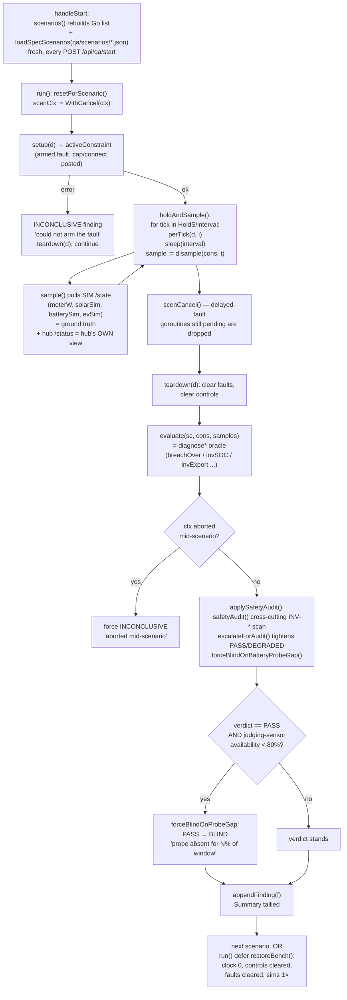

### Why this matters for a junior engineer

**Ground truth is the sims, not the hub, because the entire suite exists to catch the hub lying to itself.** If `diagnoseStale` judged "is the meter reading changing" from the hub's own reported grid power, a hub that has gone blind on a frozen sensor and is still confidently reporting the old (now-wrong) value would grade itself compliant. Every oracle that certifies a PASS reads the device sim's `/state` (`d.meterW`, `d.solarSim`, `d.batterySim`, `d.evSim`) for what actually happened physically, and only uses the hub's `/status` to judge what the hub *believed* or *did* (adopted a control, flagged a source stale, posted CannotComply). The gap between those two views is exactly what most diagnosers are built to surface.

**BLIND protects against a harness that wasn't watching, not a hub that misbehaved.** A dead judging sensor for most of a hold window is functionally identical, from `breachOver`'s point of view, to a device that never breached — both read as "no breach this tick". `forceBlindOnProbeGap` exists so that outcome is never reported as a certified PASS; it is reported as "the harness admits it wasn't watching," which is a fundamentally different, and much more actionable, finding for whoever is triaging a campaign report. It never touches a FAIL or DEGRADED, because those verdicts were reached from readings the sensor *did* deliver.

**Adding a scenario as JSON is the fast, low-risk path; writing Go is for real decision logic.** The JSON vocabulary can sequence HTTP POSTs to the sims/hub/gridsim/MQTT broker, post a constraint, wait a tick, and select one of the already-reviewed `diagnose*` oracles. It cannot branch, loop, or compute a value from a sample mid-run — that stays Go, because a spec-authoring model must never accidentally become a rules engine that needs the same code review rigor as a Go diagnoser (`scenariospec.go:13-18`).

### Adding a scenario: the checklist

1. **Pick an oracle, or write one.** Check `oracleRegistry` (`scenariospec.go:224-237`) and `qa/scenarios/README.md`'s "Registered so far" list first. If an existing `diagnose*` already expresses the judgment you need (a constraint cap, SoC envelope, disconnect back-feed, malformed-resource survivability, transport-fault safety, stale-control expiry), you don't need new Go at all.
2. **If no oracle fits, write one in Go** — a new `diagnose*` function with signature `func(sc *mayScenario, cons *activeConstraint, s []maySample) mayFinding`, reusing `breachOver`/`scanSamples`/`invSOC`/`invExport`/etc. so it can never disagree with the shared invariants — then register it in `oracleRegistry` (parameterized oracles follow `buildDiagnoseSurvival`'s pattern, `scenariospec.go:260-273`). This step needs a rebuild.
3. **Write the JSON spec** under `qa/scenarios/` following the schema in `qa/scenarios/README.md` — `setup`/`per_tick`/`teardown` action lists from the fixed vocabulary, a `"constraint"` block (or direct `post_cap`/`post_connect` in setup) if the oracle needs one, and `"oracle": {"name": "..."}`.
4. **The `"id"` must be unique across every Go scenario and every other spec file** — a collision is a load-time error naming the file, and that one spec is skipped; it never silently shadows the ID it collided with (`scenariospec.go:830-838`).
5. **It's re-read fresh on every `POST /api/qa/start`** (`scenarios():3070-3089`, `main.go:31` `-scenario-dir`, default `qa/scenarios`) — no `go build`, no dashboard restart, for the JSON path. Only engine/oracle changes (`scenariospec.go`, any `diagnose*` func, `mayhem.go`'s run loop) need a rebuild.
6. **Validate before trusting a live run**: `go test ./cmd/dashboard/...` compiles every file in `qa/scenarios/` as part of CI, and `python3 scripts/mayhem.py --list` shows the scenario's source tag (`[go]`/`[spec]`) and `[extended]` status alongside its ID.
7. **Run it in isolation first**: `python3 scripts/mayhem.py --dashboard http://localhost:8080 --only <id>` — `--only` always runs, bypassing the `Extended` default-run filter (`filterExtended`, `mayhem.go:281-299`), so a long-hold scenario under development isn't silently excluded from your test.

---

## IX-F — The Mobile App: Dart architecture internals

*(scope: `packages/lexa_core/lib/src/` and `app/lib/`, repo `~/projects/lexa-app`. All paths below are relative to that repo root; line numbers are as read.)*

### F.1 The shape of the thing

`lexa_core` is a pure-Dart package (no Flutter import) that the `app/` package depends on. This split is the whole architecture in one sentence: **everything that talks to the network, the hub's TLS cert, or a BLE peripheral lives in `lexa_core` behind interfaces; everything that draws a widget lives in `app`.** A junior engineer's mental model should be: `lexa_core` = "what can go wrong and how we recover", `app` = "how we render the result and wire it into Riverpod".

Five files carry almost all of the interesting logic:

- `packages/lexa_core/lib/src/api/lexa_api.dart` — the `LexaApi` interface (55 lines, 8 methods)
- `packages/lexa_core/lib/src/api/api_client.dart` — `LexaApiClient`, the real implementation
- `packages/lexa_core/lib/src/transport/pinned_client.dart` — the TLS-pinned HTTP transport
- `packages/lexa_core/lib/src/transport/retry.dart` — bounded exponential backoff
- `packages/lexa_core/lib/src/repo/hub_repository.dart` — the polling engine + last-good cache
- `packages/lexa_core/lib/src/ble/{session,protocol,messages,provisioning_client}.dart` — the sec1 BLE commissioning stack
- `app/lib/src/providers.dart` — the Riverpod graph that wires all of the above into the widget tree

---

### F.2 `LexaApi` — the interface that makes everything testable

`lexa_api.dart` is an `abstract interface class` — no implementation, no fields, just a contract:

```dart
// packages/lexa_core/lib/src/api/lexa_api.dart:21-55
abstract interface class LexaApi {
  /// `GET /status` — full system snapshot.
  Future<StatusSnapshot> getStatus();

  /// `GET /site` — identity: serial, fw, commissioned, tz.
  Future<SiteInfo> getSite();

  /// `GET /devices` — device map + scan result + pending OCPP stations.
  Future<DevicesResponse> getDevices();

  /// `GET /telemetry/recent?minutes=N` — per-device sample ring, N ≤ 15.
  Future<TelemetryRecent> getTelemetryRecent({int minutes});

  /// `GET /mode` — null while the hub's mode manager doesn't exist yet
  /// (503 — docs/HUB_API.md gaps).
  Future<ModeStatus?> getMode();

  /// `GET /plan` — 24 h plan/forecast series on a 5-minute grid
  /// (fw gapclose, GAP-7). Null before the optimizer has produced its
  /// first schedule (503 — API_CONTRACT.md), matching [getMode].
  Future<PlanResponse?> getPlan();

  /// `GET /scan` — modbus scan progress + latest result.
  Future<ScanState> getScan();

  /// `POST /scan` — triggers a modbus commissioning scan (202 Accepted).
  Future<ScanAccepted> postScan();

  /// `GET /logs` — cold SSE stream; listening opens the connection,
  /// cancelling the subscription closes it.
  Stream<LogEvent> streamLogs();

  /// `POST /intent` — submit an intent; 202 maps to `IntentOutcome.pending`.
  Future<IntentResult> postIntent(IntentRequest intent);
}
```

The doc comment on the class (`lexa_api.dart:10-20`) states the design rule explicitly: `HubRepository` and every Riverpod provider depend on `LexaApi`, **never** on `LexaApiClient`. That's the entire trick behind fake-based testing in this codebase — because Dart interfaces are structural at the call site (any class that `implements LexaApi` type-checks wherever `LexaApi` is expected), tests write a plain in-memory class instead of standing up a TLS server. `packages/lexa_core/test/hub_repository_test.dart:9-60` does exactly this:

```dart
// packages/lexa_core/test/hub_repository_test.dart:9-59
class _FakeLexaApi implements LexaApi {
  Object? statusResponse;
  Object? telemetryResponse;
  int statusCalls = 0;
  ...
  @override
  Future<StatusSnapshot> getStatus() {
    statusCalls++;
    final r = statusResponse;
    if (r is HubException) return Future.error(r);
    return Future.value(r as StatusSnapshot? ?? defaultStatus());
  }
  ...
  @override
  Future<DevicesResponse> getDevices() => throw UnimplementedError();
  @override
  Future<ModeStatus?> getMode() => throw UnimplementedError();
  ...
}
```

Setting `statusResponse = const HubUnreachableException('down')` and calling `getStatus()` returns a `Future.error` with that exact exception — no socket, no timers except the ones the test injects, no wolfSSL-equivalent TLS machinery. The same pattern shows up app-side in `app/test/dashboard/fakes.dart:64` (`FakeLexaApi implements LexaApi`), used across widget tests for `now_widget_test.dart`, `ev_screen_test.dart`, `battery_widget_test.dart`, etc. — the whole widget-test suite runs with zero real HTTP.

`LexaApiClient` (`packages/lexa_core/lib/src/api/api_client.dart:21-161`) is the one production implementation. Two shapes are worth internalizing because they recur everywhere the hub's optimizer hasn't caught up with a feature yet:

**The 503 → null convention.** `getMode()` and `getPlan()` both special-case an unauthenticated-looking 503 into a typed `null` instead of throwing:

```dart
// packages/lexa_core/lib/src/api/api_client.dart:51-68
/// Returns null while the hub's mode manager doesn't exist yet (503 —
/// docs/HUB_API.md gaps). Real errors still throw.
@override
Future<ModeStatus?> getMode() async {
  final (status, body) = await _send('GET', '/mode');
  if (status == 503) return null;
  return ModeStatus.fromJson(_decodeObject(status, body));
}

/// Returns null before the optimizer has produced its first schedule
/// (503 — API_CONTRACT.md), exactly like [getMode]. Real errors still
/// throw.
@override
Future<PlanResponse?> getPlan() async {
  final (status, body) = await _send('GET', '/plan');
  if (status == 503) return null;
  return PlanResponse.fromJson(_decodeObject(status, body));
}
```

This is a case where a 5xx does *not* mean "transient failure, retry me" — it means "this route legitimately has no content yet." Every other non-2xx still goes through `_throwFor` → `HubHttpException`. A junior engineer's instinct is often "5xx is always an error"; this codebase deliberately overrides that for two specific routes because the hub's contract documents 503 as the well-defined "not-yet-provisioned" state, not a fault.

**The 202 → `IntentOutcome.pending` mapping.** `postIntent` treats 200 and 202 identically at the transport layer — both decode the body as an `IntentResult` — and it's the *model*, not the client, that encodes the semantic difference:

```dart
// packages/lexa_core/lib/src/api/api_client.dart:110-120
@override
Future<IntentResult> postIntent(IntentRequest intent) async {
  final (status, body) =
      await _send('POST', '/intent', jsonBody: intent.toJson());
  if (status != 200 && status != 202) {
    _throwFor(status, body);
  }
  return IntentResult.fromJson(_decodeObject(status, body));
}
```

```dart
// packages/lexa_core/lib/src/models/intents.dart:113-134
enum IntentOutcome {
  applied, clamped, rejected, expired, duplicate,

  /// 202: the hub accepted the intent but no result arrived within 3 s.
  /// Normal against real hardware until the hub's intent consumers ship.
  pending,
  unknown;

  static IntentOutcome parse(String? s) => switch (s) {
        'applied' => applied,
        'clamped' => clamped,
        'rejected' => rejected,
        'expired' => expired,
        'duplicate' => duplicate,
        'pending' => pending,
        _ => unknown,
      };
}
```

So the *hub* — not the client — decides `outcome: "pending"` inside the 202 body; the Dart layer merely trusts the wire value. `IntentRequest` itself (`models/intents.dart:7-50`) is a closed set of named factory constructors (`mode`, `evGoal`, `reserve`, `chargeNow`, `tariff`) matching the hub's whitelist 1:1 — there's no generic "send arbitrary kind" constructor, so a junior engineer adding a new intent type has to touch this file, not just pass a string.

---

### F.3 `PinnedHttpClient` — HTTPS-only is structural, not policy

`packages/lexa_core/lib/src/transport/pinned_client.dart` wraps `dart:io`'s `HttpClient` and replaces certificate-chain trust with a single SHA-256 comparison, mirroring the hub's own reference client (`lexa-hub/cmd/lexactl/trust.go`, per the doc comment at `pinned_client.dart:9-17`).

Construction normalizes and validates the fingerprint up front:

```dart
// packages/lexa_core/lib/src/transport/pinned_client.dart:18-57
class PinnedHttpClient {
  PinnedHttpClient({
    required String fingerprint,
    this.timeout = const Duration(seconds: 5),
  }) : fingerprint = _normalizeFingerprint(fingerprint) {
    _client = HttpClient()
      ..connectionTimeout = timeout
      ..badCertificateCallback = _verify;
  }

  final String fingerprint;
  final Duration timeout;
  static const Duration bodyReadCap = Duration(seconds: 30);

  late final HttpClient _client;
  bool _closed = false;
  String? _lastPresented;

  static String _normalizeFingerprint(String fp) {
    final normalized = fp.replaceAll(RegExp(r'[\s:]'), '').toLowerCase();
    if (!RegExp(r'^[0-9a-f]{64}$').hasMatch(normalized)) {
      throw ArgumentError.value(fp, 'fingerprint',
          'must be 64 hex chars (sha256 of the certificate DER)');
    }
    return normalized;
  }

  bool _verify(X509Certificate cert, String host, int port) {
    final presented = sha256.convert(cert.der).toString();
    _lastPresented = presented;
    return presented == fingerprint;
  }
```

`_verify` is `dart:io`'s `badCertificateCallback` — the hook `HttpClient` calls when the platform's own X.509 chain validation *fails* (which it always will here, since the hub's cert is self-signed). Returning `true` only when `sha256(leaf DER) == fingerprint` means: chain-of-trust validation is bypassed entirely, and identity is instead "this exact byte string, and nothing else." This is TOFU pinning (trust-on-first-use, delivered out-of-band by BLE per ADR-0002), not CA-based trust.

The https-only refusal lives in `_guard`, the shared wrapper both `send` and `sendStream` run through:

```dart
// packages/lexa_core/lib/src/transport/pinned_client.dart:126-135
Future<T> _guard<T>(
    String method, Uri url, Future<T> Function() action) async {
  if (_closed) {
    throw const HubUnreachableException('client already closed');
  }
  if (url.scheme != 'https') {
    throw HubUnreachableException(
        'refusing non-TLS URL "$url": pinning requires https');
  }
```

Why this counts as *structural* rather than *policy*: there is no `allowInsecure` flag, no environment check, no call site that can opt out — every request, from every caller (`LexaApiClient._send`, `.streamLogs`), funnels through `_guard`, and `_guard` throws before opening a socket if the scheme isn't `https`. A policy would be "we choose not to call `http://` in this code" — enforceable by review discipline, breakable by one careless line. A structural guarantee is "the transport itself cannot open a plaintext connection to the hub." Upstream of this, `app/lib/src/providers.dart:78-93`'s `dartDefineHubConfig()` reinforces the same idea one layer up: a `--dart-define` config that parses to a non-`https` `Uri` is treated as "not configured" (returns `null`) rather than handed to the transport to reject later — fail closed at every layer, not just the last one.

The rest of `_guard` (`pinned_client.dart:136-167`) is the full taxonomy mapping, and it disambiguates pin mismatch from generic TLS failure carefully:

```dart
// packages/lexa_core/lib/src/transport/pinned_client.dart:137-149
_lastPresented = null;
try {
  return await action();
} on TimeoutException {
  throw HubTimeoutException('$method $url exceeded ${timeout.inSeconds}s');
} on HandshakeException catch (e) {
  final presented = _lastPresented;
  if (presented != null && presented != fingerprint) {
    throw PinMismatchException(expected: fingerprint, presented: presented);
  }
  throw HubUnreachableException('TLS handshake failed', e);
}
```

`_lastPresented` is reset to `null` at the top of every `_guard` call, "so a `HandshakeException` is only attributed to a pin mismatch when *this* connection actually presented a bad leaf" (comment at line 136). Without that reset, a stale fingerprint from a previous request could misattribute an unrelated handshake failure (e.g. a mid-handshake network drop) as a security-relevant pin mismatch.

Timeouts are layered three ways: `connectionTimeout` on the `HttpClient` itself (line 24), a `.timeout(timeout)` wrapped around `openUrl` and around `.close()` in `_open` (lines 110-120, with `request.abort()` in the `onTimeout` callback to actually free the socket rather than leak it), and a hard, timeout-independent `bodyReadCap` of 30 seconds on reading the response body (line 38, "SECURITY.md rule 8: 30 s hard max") — this cap deliberately does **not** apply to `sendStream`, since `/logs` is meant to run indefinitely (line 80-81).

---

### F.4 `RetryPolicy` — transient-vs-terminal, equal-jitter backoff

`packages/lexa_core/lib/src/transport/retry.dart` classifies every `HubException` into "worth retrying" or "hand it to the caller immediately":

```dart
// packages/lexa_core/lib/src/transport/retry.dart:64-66
/// Whether [error] is a transient transport failure worth retrying.
static bool isRetryable(Object error) =>
    error is HubUnreachableException || error is HubTimeoutException;
```

Everything else — `PinMismatchException`, `UnauthorizedException`, `HubHttpException`, `HubProtocolException` — is excluded on purpose, and the doc comment spells out *why* for each (`retry.dart:19-24`): a pin mismatch means the hub's identity changed and retrying would silently paper over a potential MITM ("SECURITY.md rule 1"); a 401 means the token is wrong and hammering the hub with the same bad token accomplishes nothing; a 4xx/5xx the hub meant to send and a malformed body are both facts about *this* request, not the network.

The delay math is equal jitter — cap the exponential curve, then scale by a uniform `[0.5, 1.0]` factor so retries never collapse to zero and never exceed the cap:

```dart
// packages/lexa_core/lib/src/transport/retry.dart:73-82
Duration delayFor(int attempt) {
  if (attempt < 1) {
    throw ArgumentError.value(attempt, 'attempt', 'must be >= 1');
  }
  final exponential =
      baseDelay.inMicroseconds * math.pow(factor, attempt - 1);
  final capped = math.min(exponential, maxDelay.inMicroseconds.toDouble());
  final jittered = capped * (0.5 + _random.nextDouble() / 2);
  return Duration(microseconds: jittered.round());
}
```

Defaults: 500 ms base, factor 2, 30 s cap (`retry.dart:32-34`). `execute<T>` (lines 89-98) is the retry-loop wrapper used for one-shot calls that want in-call retrying; `HubRepository`, notably, does **not** use `execute` — it only calls `delayFor` directly (see F.5), because a polling loop already *is* a retry loop and doesn't want a second nested one blocking a poll tick.

`RetryPolicy` takes injectable `SleepFn` and `math.Random` in its constructor specifically so tests can fake the clock and de-randomize jitter — the same dependency-injection pattern shows up in `HubRepository`'s `Clock`/`TimerFactory` next.

---

### F.5 `HubRepository` — the polling engine

`packages/lexa_core/lib/src/repo/hub_repository.dart` (455 lines) is the single busiest file in `lexa_core`. Its job: poll `GET /status` on a timer, poll `GET /telemetry/recent` every Nth tick, and expose two broadcast streams that never throw and never stop delivering *something* — degrading gracefully instead of leaving the UI blank.

**Cadence.** `PollingProfile` (`hub_repository.dart:20-31`) is `active: 5s` / `idle: 15s`. The effective interval is:

```dart
// packages/lexa_core/lib/src/repo/hub_repository.dart:319-320
Duration get _interval =>
    _foreground && !_liveHint ? profile.active : profile.idle;
```

`_liveHint` is set by `setLiveHint(bool)` (line 281) when the `/logs` SSE stream is healthy — "the SSE stream proves the hub is up, so polling can relax" (doc comment, line 277) — so a healthy SSE connection drops the app back to the *idle* cadence even while foregrounded, saving battery/bandwidth without losing liveness.

**Last-good snapshot + rising `dataAge`.** `HubSnapshot` (lines 37-64) always carries `isStale` and `dataAge`; a failed poll doesn't stop emissions, it re-emits the cached snapshot with `isStale: true` and a freshly recomputed age:

```dart
// packages/lexa_core/lib/src/repo/hub_repository.dart:390-407
void _onTransientFailure(HubException error) {
  if (_disposed) return;
  _consecutiveFailures++;
  _pollsSinceTelemetry = telemetryEvery;
  final cached = _lastSnapshot;
  if (cached != null) {
    final stale = HubSnapshot(
      status: cached.status,
      telemetry: cached.telemetry,
      fetchedAt: cached.fetchedAt,
      isStale: true,
      dataAge: _clock().difference(cached.fetchedAt),
    );
    _lastSnapshot = stale;
    _snapshots.add(stale);
  }
  _setConnection(HubConnection(
    cached == null
        ? HubConnectionState.unreachable
        : HubConnectionState.degraded,
    message: error.message,
    lastGoodAt: cached?.fetchedAt,
  ));
  var delay = _backoff.delayFor(_consecutiveFailures);
  if (delay > maxBackoff) delay = maxBackoff;
  _schedule(delay);
}
```

Note the state split: `unreachable` (no cache exists at all) vs. `degraded` (cache exists, served stale) — this is the "surface-but-don't-block" rule from SECURITY.md (comment, line 35). `maxBackoff` is a hard 60 s ceiling *independent of whatever `RetryPolicy` the caller injected* (line 184, 416) — the constructor's default `RetryPolicy` even sets `maxAttempts: 1` deliberately, with a comment "only `delayFor` is used — no in-call retries" (line 158), confirming `HubRepository` treats `RetryPolicy` purely as a delay-curve calculator, not as its own retry loop.

**Pause-on-401 / stop-on-pin-mismatch.** These get their own catch clauses in `_poll`:

```dart
// packages/lexa_core/lib/src/repo/hub_repository.dart:332-350
Future<void> _poll() async {
  if (_disposed || _pollInFlight) return;
  _pollInFlight = true;
  try {
    final status = await _api.getStatus();
    if (_disposed) return;
    await _maybeFetchTelemetry();
    if (_disposed) return;
    _onSuccess(status);
  } on PinMismatchException catch (e) {
    _onPinMismatch(e);
  } on UnauthorizedException catch (e) {
    _onUnauthorized(e);
  } on HubException catch (e) {
    _onTransientFailure(e);
  } finally {
    _pollInFlight = false;
  }
}
```

Both `_onUnauthorized` and `_onPinMismatch` call `_stopTimer()` (lines 440-443) — no `_schedule` call follows, so polling genuinely halts rather than backing off. The only way out is `restart()` (lines 253-262), called explicitly after the token or pin has been corrected (e.g. re-provisioning). This is why `hubRepositoryProvider` in `providers.dart` tears down and rebuilds the whole `HubRepository` on any config change rather than trying to "fix" a stopped one in place — restart semantics only make sense against the *same* hub identity.

**The exposed streams**:

```dart
// packages/lexa_core/lib/src/repo/hub_repository.dart:216-228
Stream<HubSnapshot> get snapshots => _snapshots.stream;
Stream<HubConnection> get connections => _connections.stream;
HubSnapshot? get lastSnapshot => _lastSnapshot;
HubConnection get connection => _connection;
```

Both are `StreamController.broadcast()` (lines 200-201) — meaning **no replay**: a subscriber that attaches after the first emission gets nothing until the next one. This single fact is why `providers.dart`'s `_seeded()` helper exists (see F.7) — it's not incidental, it's a documented contract: "the streams are broadcast and do not replay: late subscribers should seed from `lastSnapshot` / `connection` first" (doc comment, line 136-137).

---

### F.6 The sec1 BLE handshake

ADR-0002's "LEXA Provision v1" protocol hands the app a hub's IP, TLS fingerprint, and bearer token over Bluetooth LE, encrypted end-to-end so the token never crosses the wire in plaintext even before HTTPS is available. Three files implement it: `session.dart` (crypto primitives), `protocol.dart`/`messages.dart` (framing and wire messages), `provisioning_client.dart` (the app-side state machine).

**Key derivation.** `SessionCrypto.deriveKey` (`session.dart:104-117`) runs X25519 ECDH between the two ephemeral keypairs, then HKDF-SHA256 with the **PoP** (proof-of-possession setup code from the device label) as the HKDF *salt*, not as key material directly:

```dart
// packages/lexa_core/lib/src/ble/session.dart:104-117
Future<void> deriveKey({
  required List<int> peerPublicKey,
  required String pop,
}) async {
  final shared = await _x25519.sharedSecretKey(
    keyPair: _keyPair,
    remotePublicKey: SimplePublicKey(peerPublicKey, type: KeyPairType.x25519),
  );
  _key = await _hkdf.deriveKey(
    secretKey: shared,
    nonce: utf8.encode(pop), // HKDF salt
    info: utf8.encode(sec1HkdfInfo),
  );
}
```

`sec1HkdfInfo = 'lexa-prov-v1'` (line 26) domain-separates this key from any other HKDF use in the system. The result is a 16-byte AES-128 key (`sec1KeyLength = 16`, line 29).

**The nonce counter is the tamper-evidence mechanism.** The nonce is never sent on the wire — both sides derive it locally from a direction byte plus a strictly-incrementing per-direction counter:

```dart
// packages/lexa_core/lib/src/ble/session.dart:131-140
/// Builds the 12-byte nonce `direction ‖ 0x000000 ‖ counter (8B BE)`.
static Uint8List nonceFor({required int direction, required int counter}) {
  final nonce = Uint8List(12);
  nonce[0] = direction;
  for (var i = 0; i < 8; i++) {
    nonce[11 - i] = (counter >> (8 * i)) & 0xff;
  }
  return nonce;
}
```

`SessionRole` (lines 42-53) fixes which direction byte (`0x01` app→hub, `0x02` hub→app) each side uses for sending vs. receiving, so the two 8-byte counters (`_sendCounter`, `_receiveCounter`, lines 92-93) never collide even though both start at 0. `encrypt` increments `_sendCounter` only *after* a successful AES-GCM seal (line 149); `decrypt` increments `_receiveCounter` only *after* a successful, authenticated open (line 183) — so the counter never advances on a failed attempt, and the *next* expected value is always exactly "one more than the last message this session actually accepted."

That's what makes replay, reorder, and tampering all collapse into the same detectable failure. A replayed message reuses a counter value strictly less than `_receiveCounter`; the nonce it was originally encrypted under won't match `nonceFor(direction, _receiveCounter)` (the *current* expected value), so AES-GCM's authentication tag fails to verify — not because the attacker forged a new tag (they didn't need to; they replayed a genuinely valid one), but because a valid tag from counter *N* is being checked against the nonce for counter *M ≠ N* and GCM's tag is bound to the nonce it was produced under. A reordered message has the same mismatch. A bit-flipped (tampered) message fails the same GCM tag check for the ordinary integrity reason. All three converge on one code path:

```dart
// packages/lexa_core/lib/src/ble/session.dart:161-185
Future<Uint8List> decrypt(List<int> message) async {
  final key = _checkUsable();
  if (message.length < sec1TagLength) {
    _aborted = true;
    throw const SessionAbortedException('ciphertext shorter than GCM tag');
  }
  final nonce =
      nonceFor(direction: role.receiveDirection, counter: _receiveCounter);
  final box = SecretBox(
    message.sublist(0, message.length - sec1TagLength),
    nonce: nonce,
    mac: Mac(message.sublist(message.length - sec1TagLength)),
  );
  final List<int> clear;
  try {
    clear = await _aesGcm.decrypt(box, secretKey: key);
  } on SecretBoxAuthenticationError {
    _aborted = true;
    throw SessionAbortedException(
        'message failed authentication for expected counter '
        '$_receiveCounter — replayed, reordered, tampered, or wrong key');
  }
  _receiveCounter++;
  return Uint8List.fromList(clear);
}
```

And critically — one failed `decrypt` **permanently poisons the session**: `_aborted = true` is set before the throw, and `_checkUsable()` (lines 187-196) refuses every subsequent `encrypt`/`decrypt` call with `SessionAbortedException('session already aborted')`. There is no "skip this one bad message and keep going" path. `ProvisioningController` respects this at the state-machine level too: after a *client-side* join timeout (which desyncs the receive counter because a `status` event arrived after the deadline and was dropped undecrypted), it doesn't try to resume — it throws away the whole session and re-establishes a fresh one (`provisioning_controller.dart:282-289`, comment: "ADR-0002 aborts on any counter skew"). Re-provisioning always means a brand-new X25519 handshake; there is no session-resume concept in this protocol by design.

**The five-step handshake**, driven from `ProvisioningClient.establishSession` (`provisioning_client.dart:119-159`):

```dart
// packages/lexa_core/lib/src/ble/provisioning_client.dart:119-159
Future<void> establishSession(String pop) async {
  if (_established) throw StateError('session already established');
  final session = await SessionCrypto.generate(SessionRole.app);
  _session = session;
  try {
    await _send(ProvisionUuids.session, HelloApp(pub: await session.publicKeyBytes()),
        encrypt: false);
    final hello = await _receive(ProvisionUuids.session,
        timeout: opTimeout, what: 'hub hello', allowPlaintext: true);
    if (hello is! HelloHub) {
      throw ProvisioningProtocolException('expected hub hello, got "${hello.op}"');
    }
    await session.deriveKey(peerPublicKey: hello.pub, pop: pop);
    await _send(ProvisionUuids.session, Confirm(challenge: hello.challenge),
        encrypt: true);
    final reply = await _receive(ProvisionUuids.session,
        timeout: opTimeout, what: 'session confirmation', allowPlaintext: true);
    if (reply is! Ok) {
      throw ProvisioningProtocolException('expected ok, got "${reply.op}"');
    }
    _established = true;
  } catch (_) {
    _session = null;
    rethrow;
  }
}
```

The `Confirm` message echoes the hub's random 8-byte `challenge` **encrypted** — since only a party who correctly derived `K` (which requires knowing the PoP) can produce a valid ciphertext for it, this proves PoP knowledge without ever transmitting the PoP itself. If the codes don't match, the hub can't decrypt/verify and replies in plaintext with `{"op":"err","code":"pop_mismatch"}`; `_receive` special-cases this into `PopMismatchException` (lines 302-304), and by design a wrong PoP and a MITM'd key exchange produce the *identical* app-visible error — "indistinguishable by design" (`ProvisioningException` doc comment, line 34).

Framing sits under all of this: every message is JSON → UTF-8 bytes → (optionally) AES-GCM → chunked into GATT-MTU-sized pieces with a 2-byte header (`flags | seq`, `protocol.dart:126-166`), reassembled on the other end by `FrameReassembler` (`protocol.dart:171-207`), which rejects out-of-order sequence numbers and oversized messages with `FormatException`.

```mermaid
sequenceDiagram
    participant App as App (central)
    participant Hub as Hub (peripheral)
    Note over App,Hub: GATT connect + info read done out-of-band (BLE stack)
    App->>App: SessionCrypto.generate(app)<br/>ephemeral X25519 keypair
    App->>Hub: HelloApp{pub} — plaintext, session char
    Hub->>Hub: generate ephemeral X25519 keypair<br/>+ random 8B challenge
    Hub-->>App: HelloHub{pub, challenge} — plaintext
    App->>App: deriveKey(peerPub=hub.pub, pop)<br/>K = HKDF-SHA256(X25519(shared), salt=pop, info="lexa-prov-v1")
    Hub->>Hub: deriveKey(peerPub=app.pub, pop) — same K if PoP matches
    App->>Hub: Confirm{challenge} — AES-128-GCM, nonce(dir=app→hub, ctr=0)
    alt PoP matches
        Hub->>Hub: decrypt OK, verify challenge echo
        Hub-->>App: Ok{} — AES-128-GCM, nonce(dir=hub→app, ctr=0)
        App->>App: _established = true
    else PoP mismatch / tampered
        Hub-->>App: Err{code:"pop_mismatch"} — plaintext (no shared K)
        App->>App: throw PopMismatchException
    end
    Note over App,Hub: session established — every further message<br/>increments the sender's per-direction counter;<br/>a decrypt failure (replay/reorder/tamper) sets<br/>_aborted=true and poisons the session permanently
    App->>Hub: ScanRequest{} (encrypted, ctr++)
    Hub-->>App: WifiScanResult{aps[]} (encrypted, ctr++)
    App->>Hub: Join{ssid, psk} (encrypted, ctr++)
    loop until terminal
        Hub-->>App: StateMessage{state: joining|joined|failed} (encrypted, ctr++)
    end
    App->>Hub: Done{} (encrypted, fire-and-forget)
```

---

### F.7 The Riverpod provider graph

`app/lib/src/providers.dart` is the seam between `lexa_core`'s pure-Dart repository and the widget tree. Its own module doc comment (lines 5-19) states the dependency chain in prose; the providers below realize it exactly.

`profileRepositoryProvider` is a `Provider<ProfileRepository>` that deliberately `throw`s if never overridden (line 98-102) — it exists purely as an injection point that `LexaApp`'s root `ProviderScope` overrides with the real instance, keeping constructor-injection working through Riverpod.

```dart
// app/lib/src/providers.dart:109-118
final activeProfileProvider = Provider<HubProfile?>((ref) {
  final repository = ref.watch(profileRepositoryProvider);
  void onChanged() => ref.invalidateSelf();
  repository.addListener(onChanged);
  ref.onDispose(() => repository.removeListener(onChanged));
  if (!repository.isLoaded) {
    unawaited(repository.load().catchError((_) {}));
  }
  return repository.activeProfile;
});
```

```dart
// app/lib/src/providers.dart:128-132
final hubConfigProvider = Provider<HubConnectionConfig?>((ref) {
  final profile = ref.watch(activeProfileProvider);
  if (profile != null) return HubConnectionConfig.fromProfile(profile);
  return ref.watch(dartDefineHubConfigProvider);
});
```

`hubConfigProvider` resolves to `null` only when *neither* a stored profile *nor* a valid `--dart-define` config exists — that `null` propagates downstream and every dependent provider short-circuits to "not configured" rather than crashing.

```dart
// app/lib/src/providers.dart:238-280 (abbreviated)
final hubRepositoryProvider = Provider<HubRepository?>((ref) {
  final config = ref.watch(hubConfigProvider);
  if (config == null) return null;
  final api = ref.watch(hubApiFactoryProvider)(config);
  final seed =
      ref.read(cachedSnapshotSeedProvider).unwrapPrevious().valueOrNull;
  final repository = ref.watch(hubRepositoryFactoryProvider)(api, seed);
  ref.onDispose(repository.dispose);
  ...
  repository.setForeground(ref.read(appForegroundProvider));
  ref.listen(appForegroundProvider,
      (_, foreground) => repository.setForeground(foreground));
  repository.start();
  return repository;
});
```

The `unwrapPrevious().valueOrNull` on `cachedSnapshotSeedProvider` (line 247) is called out explicitly in the doc comment above it as *the* footgun this code exists to avoid:

```dart
// app/lib/src/providers.dart:242-246
// unwrapPrevious matters: on a hub switch the seed FutureProvider reloads
// as AsyncLoading.copyWithPrevious carrying the PREVIOUS config's value —
// a bare valueOrNull would seed hub B's poller with hub A's cached data
// (and keep showing it indefinitely if hub B is unreachable).
```

Riverpod's `AsyncValue.copyWithPrevious` is normally a *feature* — it lets a loading state keep showing the last good value instead of flashing a spinner. Here it's a trap: `cachedSnapshotSeedProvider` is a `FutureProvider<HubSnapshot?>` that reloads whenever `hubConfigProvider` changes (a user switches active hub). Riverpod's default rebuild behavior carries the *old* config's resolved value forward as `AsyncLoading`'s `.value` until the new future resolves. A plain `ref.read(cachedSnapshotSeedProvider).valueOrNull` would read that stale carried-forward value and hand hub B's brand-new `HubRepository` a seed snapshot that actually belongs to hub A — and if hub B then turns out unreachable, the UI would show hub A's numbers under hub B's name, indefinitely, with no way to tell it's wrong. `.unwrapPrevious()` strips that carry-forward semantics before `.valueOrNull` is read, so a reloading provider reads as genuinely absent (`null`) rather than falsely "still hub A's value." The comment calls this pattern out by name specifically so nobody "fixes" it back to a bare `valueOrNull` later.

The second footgun-guard is `_seeded()`:

```dart
// app/lib/src/providers.dart:301-316
Stream<T?> _seeded<T>(Ref ref, T? seed, Stream<T> source) {
  final controller = StreamController<T?>();
  controller.add(seed);
  final subscription = source.listen(
    controller.add,
    onError: controller.addError,
    onDone: controller.close,
  );
  ref.onDispose(() {
    unawaited(subscription.cancel());
    if (!controller.isClosed) unawaited(controller.close());
  });
  return controller.stream;
}
```

Recall from F.5 that `HubRepository.snapshots`/`.connections` are broadcast streams with no replay. `_seeded` immediately pushes `seed` (`repository.lastSnapshot` / `.connection`, synchronously readable) into a fresh `StreamController` before subscribing to the real stream — so a `StreamProvider` built on top of `_seeded` never has an empty first frame. `hubSnapshotProvider` and `hubConnectionProvider` (lines 320-332) are thin wrappers around exactly this:

```dart
// app/lib/src/providers.dart:320-332
final hubSnapshotProvider = StreamProvider<HubSnapshot?>((ref) {
  final repository = ref.watch(hubRepositoryProvider);
  if (repository == null) return Stream<HubSnapshot?>.value(null);
  return _seeded(ref, repository.lastSnapshot, repository.snapshots);
});

final hubConnectionProvider = StreamProvider<HubConnection?>((ref) {
  final repository = ref.watch(hubRepositoryProvider);
  if (repository == null) return Stream<HubConnection?>.value(null);
  return _seeded(ref, repository.connection, repository.connections);
});
```

The doc comment above `_seeded` (lines 298-300) explains the *second* half of the same class of bug: because `StreamProvider` also uses `copyWithPrevious` while reloading, an unseeded provider on a hub switch would keep rendering the *previous hub's* last emission until the new stream produces its first event — again, potentially forever, if the new hub never answers.

Downstream widgets never touch `HubRepository` directly for reads; they `ref.watch(hubSnapshotProvider)` / `ref.watch(hubConnectionProvider)`, both nullable-safe by construction.

```mermaid
flowchart TD
    PR["profileRepositoryProvider<br/>(overridden at root ProviderScope)"] --> AP["activeProfileProvider<br/>invalidates on repo notifyListeners()"]
    DD["dartDefineHubConfigProvider<br/>(--dart-define fallback)"] --> HC
    AP --> HC["hubConfigProvider<br/>profile wins, else dart-define, else null"]
    HC --> SS["cachedSnapshotSeedProvider (FutureProvider)<br/>secure-storage last-good snapshot"]
    HC --> HAF["hubApiFactoryProvider(config)<br/>builds LexaApiClient"]
    HAF --> HA["hubApiProvider<br/>one-shot client (intents, /site, /logs)"]
    HAF --> HR
    SS -. "unwrapPrevious().valueOrNull<br/>(avoids stale-hub seed footgun)" .-> HR
    HRF["hubRepositoryFactoryProvider"] --> HR["hubRepositoryProvider<br/>builds+starts HubRepository, disposes old one"]
    FG["appForegroundProvider<br/>(AppLifecycleState.resumed)"] -.-> HR
    HR --> HSN["hubSnapshotProvider<br/>StreamProvider, _seeded(lastSnapshot, .snapshots)"]
    HR --> HCN["hubConnectionProvider<br/>StreamProvider, _seeded(connection, .connections)"]
    HR --> RC["rediscoveryCoordinatorProvider<br/>mDNS heal on move (unit 1.16)"]
    HSN --> UCV["unsupportedContractVersionProvider<br/>status.contractVersion > supportedContractVersion?"]
    HSN --> WIDGETS["dashboard widgets (Now/Solar/Battery/EV tabs)"]
    HCN --> WIDGETS
    HA --> PLAN["hubPlanProvider (autoDispose)<br/>GET /plan"]
    HA --> WIDGETS
```

---

### F.8 The contract-version guard

`packages/lexa_core/lib/src/api/contract.dart` is 17 lines and one constant:

```dart
// packages/lexa_core/lib/src/api/contract.dart:17
const int supportedContractVersion = 1;
```

The hub advertises its contract major on three surfaces that "can never disagree" (comment, lines 7-10): the `X-Lexa-Contract-Version` response header on every route, the `contract_version` field in `GET /status`/`GET /site`, and an mDNS TXT record. `mockhub`'s `withContractVersion` middleware (`tools/mockhub/handlers.go:36-42`) mirrors this and `contract_test.go:14-48` pins that *every* route — including `/healthz` and error responses — carries the header, so the app can read the version before even authenticating.

The app-side guard reads only the JSON field, off the already-flowing `hubSnapshotProvider`:

```dart
// app/lib/src/providers.dart:394-399
final unsupportedContractVersionProvider = Provider<int?>((ref) {
  final version =
      ref.watch(hubSnapshotProvider).valueOrNull?.status.contractVersion;
  if (version == null || version <= supportedContractVersion) return null;
  return version;
});
```

Note what counts as "fine": `null` (pre-contract firmware — "still v1-shaped," comment line 16 of `contract.dart`) and anything `<= supportedContractVersion`. Only a version *strictly greater* than what this build understands trips the provider to non-null — per the contract doc, "should warn the user to update rather than trust the parse" (comment, lines 12-13). Somewhere in the widget tree a consumer watches `unsupportedContractVersionProvider` and renders the "update the app" banner when it's non-null; the mechanism itself is this one four-line derived provider sitting on top of data the app was already polling for other reasons — no extra request, no extra poll.

---

### F.9 Extending the app: where things go

A concrete walkthrough for adding a new hub endpoint, say `GET /reserve/history` (a hypothetical reserve-change audit log):

1. **`LexaApi` (`lexa_api.dart`)** — add the abstract method signature, matching the existing doc-comment style (route, status-code quirks if any):
   ```dart
   Future<ReserveHistory> getReserveHistory();
   ```
2. **Model (`models/`)** — new file (or extend `status.dart`'s pattern) with `factory ReserveHistory.fromJson(...)` and, if the app ever needs to persist or round-trip it, a matching `toJson()`. Follow the null-tolerant parsing style used throughout (`json['x'] as T? ?? default`, `optTime`, `optDouble` from `models/json_util.dart`) — every model in this codebase treats missing/malformed wire fields as recoverable, never as a parse-time crash.
3. **`LexaApiClient` (`api_client.dart`)** — implement it, reusing `_getJson`/`_send`/`_decodeObject`; decide up front whether a non-2xx status has special meaning (503-as-null, like `getMode`/`getPlan`) or should fall through to the default `_throwFor`.
4. **`mockhub` (`tools/mockhub/`)** — add the route in `handlers.go`'s `registerRoutes` (wrapped in the same `read`/`write` + `withContractVersion` middleware chain everything else uses), implement the handler against `sim.go`'s in-memory state, and make sure the response shape matches the real hub's `docs/HUB_API.md` exactly — mockhub's entire value is being close enough to unblock app development without hardware, per `main.go`'s own top-of-file comment.
5. **Wire-contract test (`tools/mockhub/*_test.go`)** — add a case to (or a new file alongside) `contract_test.go` asserting the JSON shape and the `X-Lexa-Contract-Version` header, following `TestContractVersionField`'s pattern (`contract_test.go:52-61`): hit the route, assert both the version-advertisement invariant and the specific fields the new model's `fromJson` depends on. This is the test that actually catches drift between the Dart model and the Go handler — everything upstream of it (fakes, widget tests) only proves the Dart side is internally consistent, never that it matches the real (or mock) hub's wire format.
6. **Provider (`providers.dart`)**, only if the data needs to be reactive/shared — follow `hubPlanProvider`'s pattern (`FutureProvider.autoDispose`, reading `hubApiProvider`, returning `null` when unconfigured) rather than routing a one-off fetch through `HubRepository`, which is reserved for the always-polled `status`/`telemetry` pair.
7. **Fakes** — add the new method to `_FakeLexaApi` (`packages/lexa_core/test/hub_repository_test.dart`) and `FakeLexaApi` (`app/test/dashboard/fakes.dart`) so existing `implements LexaApi` fakes keep compiling; Dart's `implements` is checked exhaustively, so the compiler itself forces every fake to acknowledge the new method (even if only with `throw UnimplementedError()`) — which is precisely the safety net that makes the `LexaApi` interface worth having in the first place.

---

## IX-G — Cross-Repository Data & Type Flow

This is the "how do the pieces actually connect" chapter. The LEXA system is four Git repositories — `lexa-hub` (the DERMS brain), `csip-tls-test` (the test bench + utility simulator), `lexa-proto` (shared wire-format types), and `lexa-app` (the Flutter/Dart phone app) — and a single value routinely crosses three or four of them before it does anything useful. A junior engineer's first question is always "where does this number *go*?" This section answers that literally, tracing two concrete round-trips hop-by-hop and then documenting the three structural tricks that make the crossings safe (or unsafe): the **alias-extraction pattern**, the **Envelope universal wrapper**, and the **pin/vendor lockstep** — plus the two places the contract is hand-mirrored and can silently drift.

Three ideas recur, so meet them once here:

- **Alias-extraction.** A type physically lives in `lexa-proto` but is re-exported by each consumer with `type X = lexa-proto....X`. Because Go type aliases are *identity*, not a copy, both repos share one type and every old call site keeps compiling. This is how `Measurements` and the whole SunSpec/CSIP model set are shared without a fork.
- **The Envelope.** Every inter-service MQTT message in `lexa-hub` embeds `bus.Envelope` by value, adding one `"v"` schema-version field. A single generic decode pipeline — `CheckVersion → json.Unmarshal → Finite()` — gates every message before a handler sees it.
- **Pin + vendor.** `lexa-proto` has no hosted remote, so both consumers commit a `proto.pin` SHA and a `vendor/lexa-proto/` tree; CI cross-checks the two pins.

---

### Journey 1 — A DERControl's journey, utility → device

A grid operator wants a solar inverter to cap export at 40 kW. That intent starts as IEEE 2030.5 XML in the simulator and ends as an `int16` in a Modbus holding register. It crosses **three repos** and changes type at least a dozen times.

```mermaid
flowchart TD
  A["adminCtrlReq{ExpLimW *int64}<br/>gridsim admin.go"] -->|buildBase / apFromWatts| B["model.DERControlBase<br/>lexa-proto/csipmodel"]
  B -->|xml.MarshalIndent| C["application/sep+xml bytes<br/>gridsim server.go:367"]
  C -->|HTTPS mTLS wire| D["walker fetchAndParse<br/>xml.Unmarshal"]
  D --> E["model.DERControlList → DERControlBase<br/>lexa-proto/csipmodel"]
  E -->|scheduler.Evaluate| F["scheduler.ActiveControl{Base model.DERControlBase}<br/>lexa-hub northbound"]
  F -->|publish.ToActiveControl / apW| G["bus.ActiveControl{ExpLimW *float64}<br/>lexa-hub/internal/bus"]
  G -->|MQTT retained lexa/csip/control| H["onCSIPControl → busToCSIPControl<br/>orchestrator.CSIPControlState"]
  H -->|engine.executePlan| I["orchestrator.SolarCommand{CurtailToW}"]
  I -->|ApplySolarCommand| J["bus.DesiredState{CeilingW *float64}<br/>MQTT retained lexa/desired/solar/*"]
  J -->|setDesired → reconcile Write| K["solarFieldsToControl / activePowerFromWatts<br/>model.DERControlBase"]
  K -->|registry.ApplyControlTo → inverter.ApplyControl| L["derbase.Base.ApplyControl<br/>lexa-proto/derbase"]
  L -->|View.SetFloat encode int16+scale| M["[]uint16 registers"]
  M -->|Reader.WriteModel → Transport.WriteHolding| N["Modbus wire"]
```

**Hop 1 — the request becomes a CSIP model struct (bench, csip-tls-test).** The gridsim admin API takes a JSON body and builds the canonical model type. Note that watts are *scaled into the power-of-ten multiplier* here — the same MTR-1 discipline the whole system depends on:

```go
// csip-tls-test/sim/gridsim/admin.go:414
func buildBase(req adminCtrlReq) model.DERControlBase {
	b := model.DERControlBase{OpModConnect: req.Connect, OpModEnergize: req.Energize}
	b.OpModExpLimW = apFromWatts(req.ExpLimW)   // 40000 W → {Value:4000, Multiplier:1}
	...
}
// admin.go:443 — apFromWatts scales down until Value fits int16
```

`model.DERControlBase` is defined once, in the shared module, at `lexa-proto/csipmodel/resources.go:269`. Its `OpModExpLimW` is a `*ActivePower` (`resources.go:255`: `{Multiplier int8; Value int16}`).

**Hop 2 — struct becomes XML on the wire (bench).** The gridsim's generic `serveXML` marshals whatever resource lives at the requested path:

```go
// csip-tls-test/sim/gridsim/server.go:361
func (s *Server) serveXML(w http.ResponseWriter, resource interface{}) {
	data, malformed := s.malformedXML(resource)
	if !malformed {
		data, err = xml.MarshalIndent(resource, "", "  ")   // server.go:367
	}
	w.Header().Set("Content-Type", ContentType)             // "application/sep+xml", server.go:42
	...
}
```

The `xml:"urn:ieee:std:2030.5:ns DERControlList"` XMLName tags on every root type (`resources.go:314`) put the mandatory namespace on the wire — the critical invariant that keeps the far side from silently unmarshalling into a zero-value struct.

**Hop 3 — XML becomes a model struct again (brain, lexa-hub).** The hub's northbound walker fetches over mTLS and unmarshals back into the *same shared type*:

```go
// lexa-hub/internal/northbound/discovery/walker.go:402
func (w *Walker) fetchDERControlList(ctx context.Context, path string) (*model.DERControlList, error) {
	var r model.DERControlList
	return &r, w.fetchAndParse(ctx, path, &r)   // fetchAndParse does the xml.Unmarshal
}
```

This is the payoff of the shared module: gridsim *marshals* and the hub *unmarshals* the byte-identical `lexa-proto/csipmodel` type. There is no translation layer to drift.

**Hop 4 — the scheduler resolves which control is active (brain).** The northbound scheduler runs the IEEE 2030.5 event state machine (primacy, supersession, randomization, fail-closed hold) and returns the winner wrapped in its own type, whose `Base` field is still the shared `model.DERControlBase`:

```go
// lexa-hub/internal/northbound/scheduler/scheduler.go:49
type ActiveControl struct {
	Base   model.DERControlBase   // the parameters to apply
	Source string                 // "event" | "default"
	MRID   string
	ValidUntil int64
	Held bool; ImplausibleReject bool   // fail-closed machinery (scheduler.go:71,83)
}
```

**Hop 5 — model struct becomes a bus message (brain).** The scheduler's result is flattened into a JSON bus message. This is where the `*ActivePower{Value,Multiplier}` finally collapses into a plain `*float64` watt value, via `apW`:

```go
// lexa-hub/internal/northbound/publish/publish.go:314
func ToActiveControl(ac *scheduler.ActiveControl, clockOffset int64) bus.ActiveControl {
	msg := bus.ActiveControl{Envelope: bus.Envelope{V: bus.ActiveControlV}, Source: "none", ...}
	if ac.Base.OpModExpLimW != nil {
		w := apW(ac.Base.OpModExpLimW); msg.ExpLimW = &w   // publish.go:329
	}
	...
}
// apW = float64(ap.Value) * math.Pow10(int(ap.Multiplier))  — publish.go:347
```

`bus.ActiveControl` (defined `lexa-hub/internal/bus/messages.go:46`) is published *retained* on `bus.TopicCSIPControl` (`"lexa/csip/control"`).

**Hop 6 — bus message becomes optimizer state (brain).** The hub subscribes through the versioned decode pipeline (Journey 3) and converts to an orchestrator type:

```go
// lexa-hub/cmd/hub/main.go:790
mqttutil.SubscribeDecodeErr(mc, bus.TopicCSIPControl, func(topic string, msg bus.ActiveControl) { ... })
// → cmd/hub/state.go:366 onCSIPControl → state.go:814 busToCSIPControl → orchestrator.CSIPControlState
```

**Hop 7-8 — optimizer emits a command, actuator emits a desired document (brain).** The engine plans, produces an `orchestrator.SolarCommand`, and the *desired-publishing actuator* turns it into the AD-013 retained document — the single wire contract between the brain and the hardware driver:

```go
// lexa-hub/cmd/hub/desired.go:272 (battery shown; solar is the twin at desired.go:467)
doc := bus.DesiredState{
	Envelope:    bus.Envelope{V: bus.DesiredStateV},
	DeviceClass: bus.DesiredClassBattery,
	DeviceID:    a.device,
	Source:      "economic",
	MRID:        cmd.MRID,
}
if a.haveSetpoint { w := a.setpointW; doc.SetpointW = &w }
// published retained on bus.DesiredTopic(class, device) = "lexa/desired/{class}/{device}"
```

`bus.DesiredState` (`lexa-hub/internal/bus/desired.go:27`) carries the "no opinion vs explicit zero" semantics: `nil SetpointW` means *leave it alone*, `&0` means *idle the pack* (that distinction *is* the SOC-reserve enforcement).

**Hop 9-10 — desired document becomes a model struct on the driver side (brain, cmd/modbus).** The Modbus service's reconciler shell consumes the retained document and, when a corrective write is needed, converts the reconcile fields *back* into a `model.DERControlBase` — re-applying the multiplier scaling:

```go
// lexa-hub/cmd/modbus/reconcile_solar.go:274  setDesired(doc bus.DesiredState, ...)
// → reconcile_solar.go:391 applyActionLocked:
ctrl := solarFieldsToControl(action.Fields)   // reconcile_solar.go:472
// → returns model.DERControlBase with OpModMaxLimW = activePowerFromWatts(v)  (main.go:507)
```

**Hop 11-15 — model struct becomes registers on the wire (all in lexa-proto now).** The reconciler calls into the shared device layer, which is where every remaining transformation lives:

```go
// lexa-hub/internal/southbound/registry/registry.go:83
func (reg *Registry) ApplyControlTo(name string, ctrl model.DERControlBase) error { ... return target.Device.ApplyControl(ctrl) }
// lexa-hub/internal/southbound/inverter/inverter.go:97
func (inv *Inverter) ApplyControl(ctrl model.DERControlBase) error { return inv.Base.ApplyControl(ctrl, tag) }
```

`derbase.Base.ApplyControl` (`lexa-proto/derbase/derbase.go:207`) is the CSIP→SunSpec brain: it maps `OpModExpLimW` to `SetWMaxLimPctW` (a % of nameplate), which calls `View.SetFloat`, which finally does the `int16 + scale-factor` encoding — the crossing from engineering value to raw register word:

```go
// lexa-proto/sunspec/layout.go:321
func (v View) SetFloat(name string, val float64) {
	...
	scaled := math.Round(val / math.Pow10(int(sf)))
	switch f.Type {
	case Tint16, Tsunssf:
		v.setReg(o, uint16(int16(clamp(scaled, math.MinInt16, math.MaxInt16))))   // layout.go:337
	...
	}
}
```

`Reader.WriteModel` (`lexa-proto/sunspec/reader.go:57`) then hands the `[]uint16` to `modbus.Transport.WriteHolding` (`lexa-proto/modbus/transport.go:96`), which is the actual Modbus write. The value is now on the wire as an `int16` register.

**Type translation table — Journey 1:**

| Hop | Repo | Package | Concrete type | Transforming function | file:line |
|----|------|---------|---------------|----------------------|-----------|
| 1 | csip-tls-test | gridsim | `adminCtrlReq` → `model.DERControlBase` | `buildBase` / `apFromWatts` | admin.go:414 / :443 |
| 2 | csip-tls-test | gridsim | `model.DERControlBase` → `[]byte` (sep+xml) | `serveXML` / `xml.MarshalIndent` | server.go:361 / :367 |
| 3 | lexa-hub | northbound/discovery | XML → `model.DERControlList` | `fetchDERControlList` / `fetchAndParse` | walker.go:402 |
| 4 | lexa-hub | northbound/scheduler | `model.DERControlBase` → `scheduler.ActiveControl` | `Scheduler.Evaluate` | scheduler.go:49 |
| 5 | lexa-hub | northbound/publish | `scheduler.ActiveControl` → `bus.ActiveControl` | `ToActiveControl` / `apW` | publish.go:314 / :347 |
| 6 | lexa-hub | cmd/hub | `bus.ActiveControl` → `orchestrator.CSIPControlState` | `onCSIPControl` / `busToCSIPControl` | state.go:366 / :814 |
| 7 | lexa-hub | orchestrator | → `orchestrator.SolarCommand` | `engine.executePlan` | engine.go:968 |
| 8 | lexa-hub | cmd/hub | `SolarCommand` → `bus.DesiredState` | `ApplySolarCommand` | desired.go:444/467 |
| 9 | lexa-hub | cmd/modbus | `bus.DesiredState` → reconcile `Action` | `setDesired` | reconcile_solar.go:274 |
| 10 | lexa-hub | cmd/modbus | `Action.Fields` → `model.DERControlBase` | `solarFieldsToControl` / `activePowerFromWatts` | reconcile_solar.go:472 / main.go:507 |
| 11 | lexa-hub | southbound/registry | dispatch `model.DERControlBase` | `ApplyControlTo` | registry.go:83 |
| 12 | lexa-hub→lexa-proto | southbound/inverter → derbase | `model.DERControlBase` → SunSpec calls | `Inverter.ApplyControl` → `Base.ApplyControl` | inverter.go:97 / derbase.go:207 |
| 13 | lexa-proto | sunspec | engineering value → `int16`+scale in `[]uint16` | `View.SetFloat` | layout.go:321 |
| 14 | lexa-proto | sunspec/modbus | `[]uint16` → Modbus wire | `Reader.WriteModel` → `Transport.WriteHolding` | reader.go:57 / transport.go:96 |

The single most important takeaway: watts get scaled into an `ActivePower` multiplier **twice** (gridsim `apFromWatts`, modbus `activePowerFromWatts`) and decoded to a `float64` **twice** (`apW`, and inside `derbase`), yet there is never a bespoke DTO — every crossing rides the shared `lexa-proto` types, so a schema change happens in exactly one file.

---

### Journey 2 — A measurement's journey, device → brain → app, and THE ALIAS

Now the reverse trip: the inverter reports 3.84 kW; the number has to reach a Dart widget on a phone. The star of this journey is the **alias-extraction pattern** — the same `Measurements` type shared by `lexa-proto`, `lexa-hub`, *and* `csip-tls-test` without a fork.

```mermaid
flowchart TD
  A["[]uint16 registers (Modbus wire)"] -->|sunspec.Parse701| B["sunspec.ACMeasurement<br/>lexa-proto/sunspec"]
  B -->|derbase.ReadMeasurementsM701| C["derbase.Measurements<br/>lexa-proto/derbase"]
  C -->|type Measurements = derbase.Measurements| D["device.Measurements (ALIAS)<br/>lexa-hub AND csip-tls-test"]
  D -->|inverter.ReadMeasurements| E["device.Measurements"]
  E -->|cmd/modbus main| F["bus.Measurement{VoltageV,W,Hz *float64}<br/>MQTT QoS0 lexa/measurements/{device}"]
  F -->|onMeasurement| G["deviceSnap{W,V float64}<br/>orchestrator state"]
  G -->|/status handler| H["statusResp / evseJSON JSON"]
  H -->|HTTP GET /status| I["StatusSnapshot.fromJson<br/>lexa-app Dart"]
```

**Hop 1-2 — registers to engineering values (lexa-proto).** `sunspec.Parse701` (`lexa-proto/sunspec/der1547.go:61`) decodes the raw register block into a typed `ACMeasurement`; `derbase` lifts that into the shared `Measurements`:

```go
// lexa-proto/derbase/derbase.go:154
func ReadMeasurementsM701(regs []uint16) Measurements {
	m := sunspec.Parse701(regs)
	...
	return Measurements{W: m.W, V: v, Hz: m.Hz, VA: m.VA, Var: m.Var, PF: m.PF, TmpCab: m.TmpCab, SOC: math.NaN()}
}
```

`derbase.Measurements` (`derbase.go:133`) is a flat struct of `float64` fields where `math.NaN()` means "this device doesn't report it." Its doc (`derbase.go:109-117`) explicitly states *why* it lives in `derbase` and not in the hub: "derbase is what constructs it from raw SunSpec registers."

**Hop 3 — THE ALIAS, verbatim, in both consumer repos.** This is the crux of the section. `derbase.Measurements` is re-exported by each repo's `device` package with a one-line type alias, so `device.Measurements{...}` literals and method signatures across both codebases keep compiling against the shared type:

```go
// lexa-hub/internal/southbound/device/device.go:39
type Measurements = derbase.Measurements
```
```go
// csip-tls-test/internal/southbound/device/device.go:57
type Measurements = derbase.Measurements
```

These are byte-identical alias declarations in two independent repositories. Because a Go alias is type *identity* (not a named subtype), `lexa-hub`'s `device.Measurements`, `csip-tls-test`'s `device.Measurements`, and `lexa-proto`'s `derbase.Measurements` are literally the same type at compile time. `csip-tls-test`'s own `internal/southbound/CLAUDE.md` names the pattern outright: "`device.Measurements` is a type alias to `lexa-proto/derbase.Measurements` (mirrors the identical trick lexa-hub's own `device` package uses)." This is how a device driver written for the bench and the product hub's driver read the exact same measurement struct without a shared internal package.

**Hop 4-5 — device read becomes a bus message (brain).** The concrete `Inverter` returns the aliased type, and `cmd/modbus` flattens it onto the bus. Note the *pointer* fields: a `nil` `*float64` is the "device didn't report it" convention, and note the plausibility gate that withholds a suspect `W` rather than publishing a value the device can't physically produce:

```go
// lexa-hub/internal/southbound/inverter/inverter.go:62
func (inv *Inverter) ReadMeasurements() (device.Measurements, error) { ... }
// lexa-hub/cmd/modbus/main.go:387
msg := bus.Measurement{Envelope: bus.Envelope{V: bus.MeasurementV}, Device: upd.Name, Ts: now}
if !math.IsNaN(m.W) { if wPlausible { msg.W = &m.W } }   // main.go:388-399
if !math.IsNaN(m.V) { msg.VoltageV = &m.V }              // main.go:419
```

`bus.Measurement` (`lexa-hub/internal/bus/messages.go:21`) carries a subtle field-naming lesson: the voltage field is `VoltageV`/`"voltage_v"`, deliberately **not** `V`/`"v"`, because the embedded `Envelope`'s own `V`/`"v"` (schema version) would collide — Go's JSON encoder resolves an embedded-vs-own key clash by depth and the shallower field silently wins, which would have dropped the version stamp entirely (`messages.go:8-20`).

**Hop 6 — bus message becomes optimizer state (brain).**

```go
// lexa-hub/cmd/hub/state.go:338
func (r *MQTTSystemReader) onMeasurement(_ string, msg bus.Measurement) {
	if msg.W != nil { ... snap.W = newW }          // state.go:342-347
	if msg.VoltageV != nil { snap.V = *msg.VoltageV } // state.go:349-350
}
```

**Hop 7-8 — state becomes JSON, then a Dart model (brain → app).** The hub's `/status` handler marshals the snapshot into `statusResp` (`lexa-hub/cmd/api/handlers.go:18`), and the app parses it:

```dart
// lexa-app/packages/lexa_core/lib/src/models/status.dart:40
evseStations: objectList(json['evse_stations']).map(EvseStation.fromJson).toList(...)
// lexa-app/.../models/evse.dart:30
currentA: optDouble(json['current_a']),
```

**Type translation table — Journey 2:**

| Hop | Repo | Package | Concrete type | Transforming function | file:line |
|----|------|---------|---------------|----------------------|-----------|
| 1 | lexa-proto | sunspec | `[]uint16` → `ACMeasurement` | `Parse701` | der1547.go:61 |
| 2 | lexa-proto | derbase | `ACMeasurement` → `derbase.Measurements` | `ReadMeasurementsM701` | derbase.go:154 |
| 3 | lexa-hub / csip-tls-test | southbound/device | `derbase.Measurements` ≡ `device.Measurements` | `type Measurements = derbase.Measurements` | device.go:39 / :57 |
| 4 | lexa-hub | southbound/inverter | → `device.Measurements` | `Inverter.ReadMeasurements` | inverter.go:62 |
| 5 | lexa-hub | cmd/modbus | `device.Measurements` → `bus.Measurement` | main poll loop | main.go:387 |
| 6 | lexa-hub | cmd/hub | `bus.Measurement` → `deviceSnap` | `onMeasurement` | state.go:338 |
| 7 | lexa-hub | cmd/api | snapshot → `statusResp` JSON | `/status` handler | handlers.go:18 |
| 8 | lexa-app | lexa_core | JSON → `StatusSnapshot`/`EvseStation` | `fromJson` | status.dart:40 / evse.dart:30 |

---

### Journey 3 — The bus Envelope contract (the universal wrapper)

Every hop 5-9 in the two journeys above passed through the same gate. `bus.Envelope` is one field:

```go
// lexa-hub/internal/bus/envelope.go:25
type Envelope struct {
	V int `json:"v,omitempty"`
}
```

`omitempty` is load-bearing: a struct whose `V` is zero serializes with *no* `"v"` key at all, which is exactly how a legacy pre-versioning publisher looks — so "v absent" (v0/legacy) and "v present" (v1+) stay distinguishable on the wire (`envelope.go:16-21`). Every message family gets its own constant, all born at 1 (`envelope.go:36-74`: `MeasurementV`, `ActiveControlV`, `DesiredStateV`, …), so schemas version independently.

**Every inter-service message embeds it by value.** Look at three real payloads from the journeys above — the embed is the first field each time:

```go
// lexa-hub/internal/bus/messages.go:21,46 ; desired.go:27
type Measurement   struct { Envelope; Device string; W *float64 ...; VoltageV *float64 ... }
type ActiveControl struct { Envelope; Source string; ExpLimW *float64; ImpLimW *float64 ... }
type DesiredState  struct { Envelope; DeviceClass string; SetpointW *float64; CeilingW *float64 ... }
```

Publishers stamp the family constant on send (`bus.Envelope{V: bus.ActiveControlV}` — publish.go:315, desired.go:273).

**The decode pipeline — `CheckVersion → Unmarshal → Finite` — runs once, generically, for all of them.** `mqttutil.SubscribeDecodeErr` is the single choke point every subscriber uses:

```go
// lexa-hub/internal/mqttutil/mqttutil.go:545
func SubscribeDecodeErr[T any](client mqtt.Client, topic string, handler func(string, T), onErr func(...)) error {
	h := func(_ mqtt.Client, m mqtt.Message) {
		if verr := bus.CheckVersion(m.Topic(), m.Payload(), bus.SupportedV(m.Topic())); verr != nil {
			if ve, ok := verr.(*bus.VersionError); ok { bus.RejectAndAlarm(ve) }
			return                                            // 1. version gate
		}
		var v T
		if err := json.Unmarshal(m.Payload(), &v); err != nil {
			bus.RecordDecodeFailure(m.Topic(), err); ...; return   // 2. unmarshal
		}
		if fv, ok := any(v).(interface{ Finite() error }); ok {
			if err := fv.Finite(); err != nil {
				bus.RecordDecodeFailure(m.Topic(), err); ...; return   // 3. finite gate
			}
		}
		handler(m.Topic(), v)
	}
	...
}
```

`CheckVersion` (`envelope.go:130`) peeks only at `struct{ V int }`, accepts legacy v0 while `LegacyV0Accepted` is true, and rejects `v > supported`. Step 3 is the safety-critical one: `ActiveControl.Finite()` (`finite.go:85`) rejects a NaN/±Inf `ExpLimW`/`ImpLimW`/`MaxLimW`/`FixedW` so a non-finite value **can never be adopted as a live limit** — the whole message is dropped and last-known-good holds. This is why a NaN watt in a corrupted retained control fails closed rather than opening an export cap.

---

### Journey 4 — The hub↔app wire contract (and where it silently drifted)

The hub↔app boundary is the one place with **no shared type** — Go on one side, Dart on the other. The contract is hand-mirrored across four artifacts, and the audit's job is to measure how far they can drift before anyone notices.

The hub advertises a single major version and pins the v1 shapes as embedded golden fixtures:

```go
// lexa-hub/internal/apicontract/version.go:35
const Version = 1
// lexa-hub/internal/apicontract/fixtures.go:16 — //go:embed http_v1/*.json
```

CI turns the golden file into a live-handler regression gate: `cmd/api/contract_test.go:123` drives the real `/status` handler through `httptest` and asserts `apicontract.Conform(golden, body)` returns zero mismatches (`conform.go:58`), plus `got.ContractVersion == apicontract.Version`. On the app side the expectation is one constant:

```dart
// lexa-app/packages/lexa_core/lib/src/api/contract.dart:17
const int supportedContractVersion = 1;
```

The catch — and this is the teaching point — is that the constant is only *advertised*: `api_client.dart:34` (`getStatus`) decodes unconditionally and never actually compares `supportedContractVersion` against the hub's version. So the contract's *field names* are the real interface, and they are mirrored **by hand in four places**: the hub struct tag, the golden fixture, the Dart parser, and the mockhub.

**The drift the audit found — `current_A` vs `current_a`.** The EVSE current field was originally emitted by the hub in the bench's capital-with-unit convention (`current_A`), while the Dart app reads the lowercase MQTT-bus convention (`current_a`). The app's EVSE-current display parsed `null` and showed **blank** — a real, shipped, silent drift, because JSON tolerates unknown keys and Dart's `optDouble(json['current_a'])` just returns null when only `current_A` is present. Here is the same field at all four layers today:

```go
// lexa-hub/cmd/api/handlers.go:183 — hub struct: capital tag
CurrentA float64 `json:"current_A"`
// handlers.go:208 — additive fix: a custom MarshalJSON ALSO emits the lowercase alias
func (e evseJSON) MarshalJSON() ([]byte, error) {
	type alias evseJSON
	return json.Marshal(struct{ alias; CurrentALower float64 `json:"current_a"` ... }{alias(e), e.CurrentA, ...})
}
```
```json
// lexa-hub/internal/apicontract/http_v1/status.json:33-36 — golden fixture carries BOTH
"current_A": 16, "max_current_A": 32, "current_a": 16, "max_current_a": 32,
```
```dart
// lexa-app/packages/lexa_core/lib/src/models/evse.dart:30 — app reads lowercase ONLY
currentA: optDouble(json['current_a']),
```
```go
// lexa-app/tools/mockhub/handlers.go:213-214 — mockhub mirrors BOTH, pinned by contract_test.go:76
"current_A": currentA, "max_current_A": maxCurrentA,
"current_a": currentA, "max_current_a": maxCurrentA,
```

| Layer | Spelling emitted / read | file:line |
|-------|------------------------|-----------|
| Hub handler struct | emits **both** (`current_A` tag + `current_a` via `MarshalJSON`) | handlers.go:183 / :208 |
| Golden fixture | contains **both** | status.json:33-36 |
| Dart model | reads **`current_a`** only | evse.dart:30 |
| mockhub | emits **both** | handlers.go:213 |

The drift is now *resolved additively*: three of the four layers ship both spellings so the app's lowercase read always finds a value. The lesson for a junior engineer is structural, not cosmetic: because the four artifacts are hand-mirrored with no shared type, a single-side rename produces a *blank field, not a crash or a test failure* — the JSON decodes fine on both ends, it just carries no value. The only durable defenses are the golden-fixture CI gate (which catches a hub handler drifting from `status.json`) and the mockhub `contract_test.go` (which pins the dual keys) — and neither one can see the Dart side, which is why the capital `current_A` survives only as a vestigial bench-compatibility alias while lowercase `current_a` is the de-facto canonical spelling used by `/telemetry/recent` and the entire MQTT bus.

---

### Journey 5 — The pin/vendor mechanism (one SHA, two repos, in lockstep)

`lexa-proto` has no hosted Git remote (AD-003(c)), so the two consumers can't `go get` it. Lockstep is enforced by a committed SHA plus a committed vendor tree.

**Identical pins.** Both files are one line, byte-for-byte identical:

```
lexa-hub/proto.pin      : 6922865d83a74263213e33b2a94eda9eb0adb205
csip-tls-test/proto.pin : 6922865d83a74263213e33b2a94eda9eb0adb205
# diff of the two → exit=0
```

**go.mod: placeholder require + local replace.** The SHA lives *only* in `proto.pin`; go.mod uses a sibling-path replace, and Go's vendor mode resolves imports from `vendor/`:

```
lexa-hub/go.mod:29       lexa-proto v0.0.0
lexa-hub/go.mod:32       replace lexa-proto => ../lexa-proto
csip-tls-test/go.mod:26  lexa-proto v0.0.0
csip-tls-test/go.mod:29  replace lexa-proto => ../lexa-proto
```

`vendor/modules.txt` in both repos carries the `# lexa-proto v0.0.0 => ../lexa-proto` / `## explicit; go 1.26` marker that tells the toolchain to satisfy `lexa-proto/*` from the vendored tree (lexa-hub modules.txt:90-97, csip-tls-test:79-86).

**The two vendored trees and the source are byte-identical** — the thing that guarantees the shared types really are shared:

```
diff -r lexa-hub/vendor/lexa-proto  csip-tls-test/vendor/lexa-proto             → exit=0 (empty)
diff  lexa-proto/derbase/derbase.go lexa-hub/vendor/lexa-proto/.../derbase.go   → exit=0 (empty)
```

**CI resolves the "how can one repo's CI see the other?" paradox by checking out the peer.** `scripts/check-proto-pin.sh` (the single implementation, in csip-tls-test) is invoked by a `proto-pin` job in *both* repos; each job does a second `actions/checkout` of the peer repo (via a read-only PAT) and byte-compares the two `proto.pin` files on the runner's filesystem:

```yaml
# csip-tls-test/.github/workflows/ci.yml:347 (lexa-hub/.github/workflows/ci.yml:372 is the mirror)
  proto-pin:
    steps:
      - uses: actions/checkout@v4                 # this repo
      - uses: actions/checkout@v4                 # peer repo, RO token
        with: { repository: dsizzle83/lexa-hub, path: lexa-hub }
      - run: bash scripts/check-proto-pin.sh --self . --product lexa-hub --verify-vendor
```

Inside the script, the enforcing check is a plain string compare of the two SHAs (`check-proto-pin.sh:189`: `if [[ "$SELF_SHA" != "$PRODUCT_SHA" ]]`). The `--verify-vendor` path (regenerate vendor from the pinned SHA and `diff -rq` against the committed tree) only bites on a desktop where `../lexa-proto/.git` exists — in hosted CI it degrades to a no-op because there is no lexa-proto to fetch. So the ground-truth CI enforcement is **pin-vs-pin string equality**, made possible by cross-checkout; the committed vendor tree is what lets CI build at all. (Caveat for a future engineer: lexa-hub's job depends on a `CSIP_TLS_TEST_RO_TOKEN` secret the script header flags as possibly-not-yet-created — a missing token fails at *checkout*, not on a real pin mismatch.)

---

### Journey 6 — The two forks: one deliberate, one unmonitored

The system contains two copies of CSIP client logic that *look* like duplication. One is a designed feature; the other is an accident nobody guards. Knowing which is which is essential before you "helpfully" unify them.

**Claim A — `csip-tls-test/internal/csipref` is a deliberate, divergent referee (AD-003(f)).** It is a second, independently-written reading of the 2030.5 spec, kept *out of sync on purpose* so the conformance suite exercises the hub through a different implementation — if the bench's walker and the hub's walker silently agreed on the same misreading, no test would catch it (the self-confirmation hazard). The diffs are large and the files are not even the same set:

```
diff csipref/discovery/walker.go   northbound/discovery/walker.go    → exit=1  (315 vs 561 lines)
diff csipref/scheduler/scheduler.go northbound/scheduler/scheduler.go → exit=1  (250 vs 530 lines)
```

They differ *structurally*, not cosmetically: the hub's `Fetcher.Get` takes a `context.Context` (cancellation, TASK-070) that the referee's `Get(path string)` lacks; the hub scheduler has `failClosed`/`plausibleControl`/`ImplausibleReject` machinery the 250-line referee simply doesn't. And the intent is documented in code so no one "fixes" it:

```go
// csip-tls-test/internal/csipref/discovery/walker.go:15-28 (present ONLY in csipref)
// # Referee independence (internal/csipref, TASK-082 / AD-003(f))
// ... it is NOT the lexa-hub product's walker, and it must never be synced or
// unified with it. ... Bug-for-bug parity with the product walker is not a goal;
// spec-for-spec independence is.
```

CI treats it accordingly — `ci.yml:193` runs `go test ./internal/csipref/...` in isolation; nothing ever diffs it against the hub.

**Claim B — `csip/{identity,dnssd}` vs `northbound/{identity,dnssd}` is a byte-identical, UNMONITORED fork.** These are literal copies — same package names, same bytes, no version guard:

```
diff -r csip-tls-test/internal/csip/identity  lexa-hub/internal/northbound/identity  → exit=0 (empty)
diff -r csip-tls-test/internal/csip/dnssd     lexa-hub/internal/northbound/dnssd     → exit=0 (empty)
```

Identical byte sizes (`identity.go` 2931, `cert.go` 1700, `browse.go` 3289) and the same LFDI/SFDI derivation line-for-line (`FromCertificateDER` / `sfdiFromLFDI`, both at `identity.go:55-76`). The safety-critical detail: a `grep` across `scripts/` and `.github/` of **both** repos finds *no* cross-repo sync tooling for these packages — every hit is unrelated runtime provisioning. Contrast this directly with Journey 5: the `lexa-proto` code is CI-gated by `check-proto-pin.sh`, but these two byte-identical trees would drift apart completely silently. If you fix an SFDI checksum bug in one repo's `identity.go`, nothing on earth tells you the other repo still has the bug.

| | Claim A (csipref walker/scheduler) | Claim B (identity/dnssd) |
|---|---|---|
| diff | non-empty, exit=1 (315↔561, 250↔530) | empty, exit=0 (byte-identical) |
| intent | documented "never sync" referee, AD-003(f) | none — silent duplication |
| guard | tested in isolation, deliberately not diffed | **none** (unlike proto.pin) |
| verdict | deliberate, divergent | accidental, unmonitored |

---

### What ties it together

Three patterns carry the whole system across its repo boundaries. **Alias-extraction** (`type Measurements = derbase.Measurements`, byte-identical in both repos) makes `lexa-proto` the single source of truth for wire types, so a DERControl or a Measurement rides the *same* Go struct on the utility-sim, brain, and driver sides — the pin/vendor mechanism just guarantees all three see the identical bytes of that struct. **The Envelope** wraps every inter-service message and funnels all of them through one versioned `CheckVersion → Unmarshal → Finite` gate, so schema evolution and NaN-rejection are solved once, generically. And where no shared type is possible — the **hub↔app HTTP boundary** — the contract is hand-mirrored in four places, defended by golden fixtures and the mockhub, but still able to drift into a *blank field* (the real `current_A`/`current_a` incident) because a JSON rename crashes nothing. The same "shared vs mirrored" split explains the two forks: `csipref` is a mirror kept divergent on purpose (and documented so), while `identity`/`dnssd` are mirrors that were supposed to be shared and simply never got a guard. When you touch any value in this system, ask first: is this a *shared* type (change it in `lexa-proto`, bump the pin) or a *mirrored* one (change it in every hand-copy, and pray a test notices)?

# Appendices

## Appendix A — Port and node map

| Node | IP | Hardware | SSH | Services / ports |
|---|---|---|---|---|
| Desktop | 69.0.0.20 | amd64 workstation | dmitri@ | gridsim mTLS 11111 + admin 11112; dashboard 8080 (transient user units) |
| **Hub (dev kit)** | 69.0.0.2 | Digi ConnectCore 93 (i.MX93) | **root@** | lexa-api 9100 (HTTPS); OCPP CSMS 8887; mosquitto 1883; metrics 9101–9107 |
| Hub (standby) | 69.0.0.1 | Raspberry Pi 4 | dmitri@ | disabled warm standby (pre-2026-07-07 hub) |
| solar-pi | 69.0.0.10 | Raspberry Pi | dmitri@ | modsim: Modbus 5020 / simapi 6020 |
| battery-pi | 69.0.0.11 | Raspberry Pi | dmitri@ | batsim: 5021 / 6021 |
| meter-pi | 69.0.0.12 | Raspberry Pi 5 | dmitri@ | metersim (linked): 5022 / 6022 |
| ev-pi | 69.0.0.14 | Raspberry Pi | dmitri@ | evsim: simapi 6024 → dials hub 8887 |

Hub metrics ports: 9101 hub · 9102 northbound · 9103 modbus · 9104 ocpp · 9105 telemetry · 9106 cloudlink · 9107 provision.

## Appendix B — Glossary

- **CSIP** — Common Smart Inverter Profile; the utility-interoperability profile of IEEE 2030.5 the hub implements northbound.
- **DERMS** — Distributed Energy Resource Management System; the product category.
- **DER** — Distributed Energy Resource; a solar inverter, battery, EV charger, or meter.
- **LFDI / SFDI** — Long/Short Form Device Identifier; the hub's utility-facing identity, derived from its client certificate (LFDI = leftmost 160 bits of SHA-256 over the full DER certificate; SFDI = leftmost 36 bits + a checksum digit). Reissuing the certificate changes the identity.
- **MUP** — Mirror Usage Point; the 2030.5 telemetry-reporting mechanism (the hub POSTs meter readings to it).
- **mTLS** — mutual TLS; both peers present certificates. The CSIP path pins exactly `ECDHE-ECDSA-AES128-CCM-8` on TLS 1.2 (cipher suite `0xC0AE`), which is why it uses wolfSSL via cgo rather than Go's `crypto/tls`.
- **OCPP** — Open Charge Point Protocol; the EV-charger protocol. The hub is the CSMS (server). Security Profile 2 = TLS + Basic Auth.
- **SunSpec** — the register-model standard for Modbus DER devices (models 1, 103, 121/123, 701–714, 802, 201x). Watt fields are int16 and must be scaled into a multiplier register, never raw-cast.
- **Primacy** — the 2030.5 priority of a DER program; lower number wins when programs conflict.
- **Desired document** — the retained MQTT message that is the hub's *sole* command path to a device (AD-013); the device reconciles toward it.
- **Reconcile** — the loop that makes a device's actual state match its desired document, verifying by read-back and re-asserting on reconnect.
- **Tier 0 / 1 / 2** — the protection hierarchy: edge interlock (in the device service) / fast safety reflex (1 s) / economic optimizer (15 s).
- **Constraint stack (R4)** — the tier-arbitrated control core that supersedes the legacy rule cascade; active on all five axes on the deployed hub.
- **INV-\*** — the named safety invariants (INV-SOC, INV-EXPORT, INV-CONNECT, INV-EXPIRED, …) that the Mayhem QA engine grades against.
- **Mayhem** — the bench's adversarial hostile-QA engine; 69 fault-injection scenarios with a PASS/DEGRADED/FAIL/BLIND/INCONCLUSIVE verdict taxonomy.
- **BLIND** — a Mayhem verdict meaning the judging sensor answered too few samples to certify a pass; the harness declines to certify what it didn't measure.
- **Bench Replay** — the HIL cost simulator that injects a synthetic 92-day season into the real sims and warps the hub's CSIP clock to measure cost/compliance.
- **FAST / STOCK** — the two hub-timing modes (3 s/5 s/2 s vs 15 s/20 s/10 s tick/discovery/poll intervals); FAST is the bench resting state, STOCK is the product shipping cadence and the release-gate mode.
- **proto.pin** — the one-line commit SHA at each consumer repo's root that pins the shared `lexa-proto` version; a CI job fails on mismatch between the two consumers.
- **sec1** — the app↔hub BLE commissioning handshake ("LEXA Provision v1"): X25519 + HKDF-SHA256 + AES-128-GCM, PoP-bound, replay-aborting.
- **PoP** — proof-of-possession; the setup code that salts the commissioning key exchange.
- **AD-00x / TASK-0xx / MTR-x / GS-x / OCPP-x** — audit and refactor-program tags cited inline at the code they govern; the shared cross-repo vocabulary.

## Appendix C — Cross-repository document index

The authoritative docs, by repository, for a reader who wants primary sources.

**lexa-hub**
- `docs/ADR-0001-distributed-vs-monolith.md` — the topology decision (essential).
- `docs/API_CONTRACT.md` — the :9100 wire contract (authoritative; the app defers to it).
- `docs/OPERATIONS.md`, `docs/HEALTHCHECK.md`, `docs/JOURNAL_FORENSICS.md` — ops and forensics.
- `docs/CERT_ROTATION_RUNBOOK.md` — cert rotation (note M2: currently inoperable on a hardened unit).
- `docs/FLASH_BUDGET.md`, `docs/ECOSYSTEM_ROADMAP.md`, `docs/DEVICE_ROADMAP*.md` — sizing and forward plans.
- `docs/extension/00_PROGRESS.md` — the extension campaign + the Mender→SWUpdate OTA pivot.
- `docs/V1RC_FINDINGS.md`, `AD-016-draft.md`, `DEVKIT.md`.

**csip-tls-test**
- `CLAUDE.md` — the accurate repo map (with the two stale figures this handbook corrects: "six services," "~59 scenarios").
- `docs/BENCH.md` — bench topology (the "dev-kit caveats" section is stale post-2026-07-08 flash).
- `docs/HARNESS_REVIEW.md`, `CONFORMANCE_REPORT.md` — the 2026-06 audits.
- `docs/refactor/` — the 11-document, 82-task V1.0 refactor playbook + `FINAL_REPORT.md` + `02_ARCHITECTURE_DECISIONS.md` (the AD-00x register).
- `docs/QA_*.md`, `docs/QA_GAPS_20260701.md`, `docs/qa-spec-migration.md` — QA reports and blind-spot analysis.
- `docs/REPLAY_RUNBOOK.md`, `qa/scenarios/README.md`.

**lexa-proto**
- `README.md` / `CLAUDE.md` — package map (README is stale on hosting and consumption status; CLAUDE.md is accurate).

**lexa-app**
- `docs/adr/ADR-0001-flutter-over-capacitor.md`, `docs/adr/ADR-0002-ble-commissioning-protocol.md`.
- `docs/HUB_API.md` (defers to lexa-hub's contract), `docs/LEXA_HUB_GAPS.md` (the cross-repo work order), `docs/SECURITY.md`, `docs/TESTING.md`, `docs/ROADMAP.md` (Phase-3 table is stale).

**meta-lexa**
- The Yocto layer: `dey-image-lexa.bb`, the kernel defconfig (netem + BT), `lexa-hub-fw.bb` (bakes prebuilt hub binaries — note the pin can lag hub HEAD), and the bench-only baked-SSH-key recipe (marked never-ship).

## Appendix D — Open uncertainties (what this handbook could not fully verify)

Stated plainly, so no reader mistakes inference for fact:

1. **Runtime behavior of the HIGH findings.** H1/H2/H6 and the cert-rotation block (M2) are reasoned from static reads and one live config check; they were not reproduced by fault injection. The behavioral oracle (Mayhem) exists to test exactly these, but was not run for this audit.
2. **The product cloud.** The on-box `cloudlink` agent is complete, but there is no product cloud backend in any repository read; the cloud contract, the downlink→intent path, and the fleet story could not be verified against a real service.
3. **The final OTA end-state.** The SWUpdate pivot is recorded as owner-approved and hardware-proven, but the actual `.swu`/SWUpdate recipe lives in `meta-lexa`/a separate build tree not exhaustively read; the signing story and the `/etc/lexa` data-partition migration are not fully confirmable here.
4. **Cross-repo CI credentials.** Whether the reverse PAT (`CSIP_TLS_TEST_RO_TOKEN`) and branch protection exist yet is not visible from the filesystem; the lexa-hub proto-pin job may still fail at checkout rather than on a real mismatch.
5. **On-device app behavior.** The app's BLE/mDNS platform glue can only be validated on hardware; only the protocol logic is exhaustively tested.
